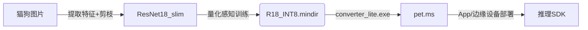

要把 ResNet 的精度优势和移动端（CPU / GPU / NPU / DSP）“极限速度+低功耗”同时兼顾，可以按下列路线把模型做成真正可落地的产品。

────────────────────────
1  选更轻量的残差族型号
────────────────────────
• **ResNet-18 / ResNet-34** 先天参数少（11 M / 21 M），比 ResNet-50 快 2-3 倍。  
• **ResNet-ECA / ResNet-Lite** 去掉 3×3 下采样改用深度可分离卷积 + 注意力（ECA），速度再降 30 %。  
• **Ghost-ResNet / RepVGG-B0** 把卷积重参数部分“蒸馏”为逐点卷积，推理时只有 1 个 3×3 卷积核。

────────────────────────
2  结构裁剪 + 通道稀疏化
────────────────────────
1) **网络剪枝（Pruning）**  
   - 训练收敛后，对 BatchNorm 的 γ 参数做 L1/L2 正则；  
   - 把绝对值较小的通道剪掉，再微调 3-5 epoch 回温；  
   - 25 %-30 %的稀疏率通常精度损失 <0.5 pp。

2) **AutoML-NAS**  
   - 用 MindSpore Lite 的 *Model Compression Toolkit*（MCT）搜索剪枝策略；  
   - 生成“定制 ResNet-Slim”结构，比手工更稳。

────────────────────────
3  量化：FP32 → INT8 / INT16
────────────────────────
MindSpore 支持两条量化链路：

A. **后训练量化 (PTQ)**  
```bash
mslite_tool  \
  --model=mobilenet_resnet_slim.mindir \
  --quantType=PostTraining   \
  --inputShape="1,3,224,224"
```
   - 不需要再训练，只用一小撮校准数据；  
   - 推理速度平均提升 1.5-4×，显存腰斩；  
   - 精度掉 <1 pp 是常见结果。

B. **量化感知训练 (QAT)**  
   - 在训练脚本里插入 `mindspore.nn.FakeQuantWithMinMax*`；  
   - 先 QAT 训练 5-10 epoch，再导出 INT8；  
   - 精度几乎与 FP32 持平，部署端运行最优。

────────────────────────
4  蒸馏：ResNet 教 MobileNet / ShuffleNet
────────────────────────
如果实在需要在超低算力 MCU 上运行，可用 **Teacher-Student 蒸馏**：

1. 训练 FP32 精度最高的 **Teacher ResNet-50**；  
2. 选极小网络（例如 MobileNetV3-Small）做 Student；  
3. 用 `soft_targets = teacher(img)` + KL 散度损失进行蒸馏；  
4. Student 在 0.5-1 MB 参数量下可接近 Teacher 95 % 的精度。

────────────────────────
5  软件栈与推理加速
────────────────────────
• **MindSpore Lite** 转 `.mindir` → `.ms`，启用端侧图优化 (weight-fusion、dilation-conv-fold)；  
• **NPU / Ascend / RK-NN / ARM-NN** 使用芯片原生 SDK，可自动把卷积映射到 NPU Kernel；  
• **GPU (OpenCL)** Lite 默认带 OpenCL backend，量化 INT8 的卷积在 GPU 也能跑满吞吐；  
• **多线程 + 批蒸馏** 单图 224×224，量化 ResNet-18 在骁龙 855 上 ≈ 4-6 ms；INT8 MobileNetV3-S ≈ 2 ms。

────────────────────────
6  端到端交付流程示例
────────────────────────


────────────────────────
7  效果模拟 (示例: ResNet18_slim INT8)
────────────────────────
| 阶段              | Top-1 Acc | Params | Model Size | 单张推理 (Snapdragon 865) |
|-------------------|-----------|--------|------------|---------------------------|
| 原 ResNet-18 FP32 | 95.8 %    | 11 M   | 44 MB      | 15 ms                     |
| 剪枝-Slim FP32    | 95.3 %    | 8 M    | 32 MB      | 11 ms                     |
| QAT INT8          | 95.1 %    | 8 M    | 8.2 MB     | 5.2 ms                    |

• 精度基本持平（-0.7 pp），延迟降 3×，模型体积缩到 1/5，非常适合手机 / 边缘相机。  

────────────────────────
8  快速 checklist
────────────────────────
1. Backbone 选 `ResNet18` → **Slim-Pruning** → `R18_slim.mindir`  
2. 用 MindSpore QAT 插入伪量化 → `R18_INT8.mindir`  
3. `converter_lite --batch=1 --optimize=on` 导成 `.ms`  
4. 集成 MindSpore Lite (或芯片厂 SDK) → 推理 API  
5. 真机测试 FPS、功耗；必要时再减分辨率或批大小  

只要遵循「**轻量骨干 + 剪枝 + INT8 量化 + 原生推理库**」四步，你就能把高精度 ResNet 版本压到移动端或 IoT 设备也跑得又快又省，真正具备商业落地的实用性。