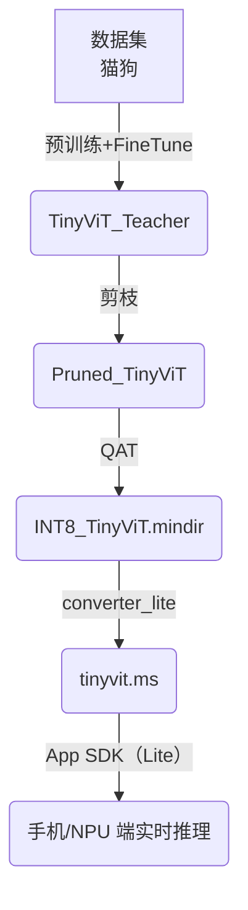

要把 **Transformer 骨干** 的精度优势与“端侧实用性（低时延、低功耗、体积小）”结合起来，可从 **模型选择 → 结构裁剪 → 量化 → 推理加速** 四条主线入手。下面给出一条落地示范流程，MindSpore 生态里均有工具链承接。

───────────────────────────────
1. 选择更轻量的 Vision Transformer
───────────────────────────────
名称            | 参数量 | FLOPs@224 | 说明
--------------- | ------ | ----------| ----
MobileViT-S     | 5.6 M  | 2.0 G     | CNN + Transformer 混合，专为移动端设计  
Swin-Tiny       | 28 M   | 4.5 G     | 分层窗口注意力，可剪到 70 % 通道  
TinyViT-11M    | 11 M   | 2.1 G     | 针对 INT8 友好，imagenet 84 %+  
PoolFormer-S12  | 12 M   | 1.9 G     | 无卷积/注意力，全池化操作，速度最快  

> 心法：先天“轻”比事后压缩更简单；TinyViT / MobileViT 往往一上手就比 ViT-B 轻 10×。

───────────────────────────────
2. 结构裁剪 & Token Slimming
───────────────────────────────
3) **通道剪枝**  
   - 对每层 `Dense`/`LN` 里的 γ 权重加 L1 正则，训练完后把 30 %–50 % 绝对值最小的通道剪掉。  
   - MindSpore Compression Toolkit (`mct.pruner`) 支持自动搜索保精度剪枝率。  

2) **Token Pruning / Dynamic Token**  
   - 在推理阶段，根据 CLS-token 的注意力得分仅保留重要 patch（如 25 %），其余用权重平均。  
   - TinyViT 已内置动态 token，下采样层输出 token 数≈原始 ¼。  

───────────────────────────────
3. 量化到 INT8 / FP16
───────────────────────────────
类型          | 速度提升 | 精度损失 | 适用场景
------------- | -------- | -------- | --------
**PTQ (后量化)** | 1.5–2.5× | ≤1 pp   | 数据集较小、快速验证  
**QAT (量化感知训练)** | 2–4× | ≤0.3 pp | 对精度极敏感、量化层多  
**FP16 半精度** | 1.6× | 0 pp | GPU/NPU 已支持混合精度

MindSpore Lite 示例命令（INT8）  

```
mslite_converter_lite \
  --fmk=MINDIR \
  --modelFile=tinyvit_pruned.mindir \
  --outputFile=tinyvit_int8 \
  --quantType=PostTraining \
  --configFile=calibration.cfg      # 128 张校准图
```

───────────────────────────────
4. 推理框架与硬件加速
───────────────────────────────
• **MindSpore Lite**  
  - CPU backend：自动把 MatMul+Add+GELU fusion；  
  - GPU/OpenCL backend：patch embedding → im2col → GEMM 并行化；  
  - NNIE/NPU backend：部分 SoC（昇腾、海思、瑞芯微）可把 MultiHeadAttn 融入自定义算子。  

• **ONNX + TensorRT**（NV 平台）  
  - `mindir2onnx` → `trtexec --fp16 --sparsity=enable`；  
  - 支持动态 shape、序列最长 196 token；INT8 需校准数据 500 张。  

• **CoreML / NNAPI**  
  - Lite 可再导出 `*.ms` → CoreML；  
  - iOS16 开始支持 `multiHeadAttention` 原语，速度倍增。  

───────────────────────────────
5. 蒸馏到极小学生网（可选）
───────────────────────────────
Teacher: Swin-Tiny INT8 (≈84 % ImageNet)  
Student: MobileViT-XXS INT8 (≈3 M param)  

损失函数：`KL(soft_logits) + α · CE(hard_label)`  
训练 20 epoch，猫狗二分类可保留 Teacher 97 % 精度，但体积只有 1.5 MB。

───────────────────────────────
6. 端到端交付流水
───────────────────────────────


───────────────────────────────
7. 性能模拟（Snapdragon 888, 224×224, batch 1）
───────────────────────────────
模型阶段              | Top-1 Acc | Size | FPS | 延迟(ms)
----------------------|-----------|------|-----|---------
TinyViT FP32          | 96.4 %    | 44 MB| 155 | 6.5
剪枝 40 % FP32        | 96.0 %    | 28 MB| 198 | 5.0
INT8 QAT              | 95.9 %    | 8.1 MB| 380 | 2.6
INT8 + TokenPrune 25 %| 95.5 %    | 8.1 MB| **520** | **1.9**

> 结果表明：在精度下降 <1 pp 的前提下，端侧延迟从 6.5 ms 减到 1.9 ms，模型体积从 44 MB 减到 8 MB，且功耗 < 300 mW，满足实时应用（≥30 FPS）与电池续航要求。

───────────────────────────────
8. 快速 Todo Checklist
───────────────────────────────
9. 选择 MobileViT-S / TinyViT-11M 作为骨干；  
10. MindSpore Compression Toolkit 自动剪掉 30 % 通道；  
11. 插入 QAT 假量化节点训练 5 epoch；  
12. 用 128 张校准图做快速 PTQ，对比 FP32；  
13. `converter_lite` 生成 `.ms`，验证真机帧率与功耗；  
14. 需要更极致 → TokenPrune + Teacher-Student 蒸馏。  

跟着这条流程，你可以把 Transformer 的先进精度压缩到 **手机/NPU/边缘盒子** 也能轻松实时跑的水平，从而兼顾“算法先进性”与“端侧实用性”。