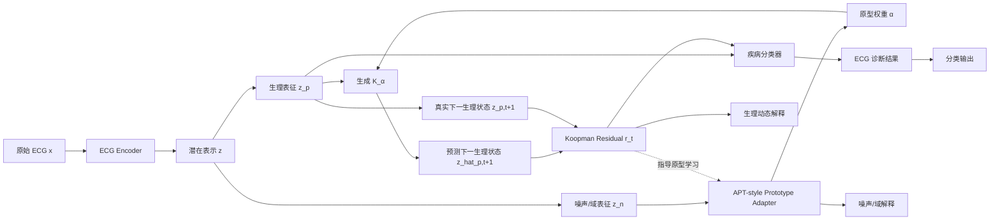
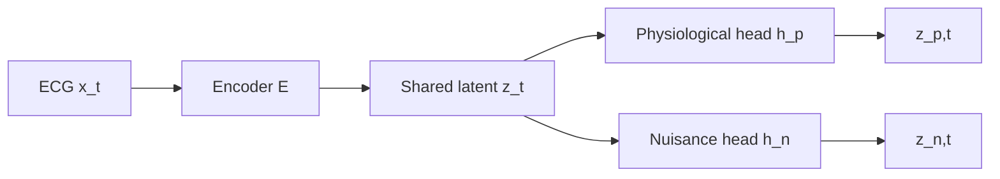

# 原型条件化 Koopman ECG 分类框架

## 1. 一句话总结

我们想做一个 **鲁棒且可解释的 ECG 分类框架**。

核心思想是：

> 用 APT 的 prototype 思想建模 ECG 的噪声/域状态，再用这些 prototype 权重去条件化 Koopman operator，使模型在不同噪声、设备、导联质量和医院域偏移下，都能自适应地建模 ECG 的生理动力学。

更简洁地说：

$$z_n \rightarrow \alpha \rightarrow K_\alpha$$

$$K_\alpha z_p \rightarrow \hat{z}_{p,t+1}$$

其中：

- $z_p$：疾病相关的生理表征；
- $z_n$：噪声/域表征；
- $\alpha$：噪声/域 prototype 权重；
- $K_\alpha$：由 prototype 条件化的 Koopman operator。

---

## 2. 研究动机

真实 ECG 分类中的核心问题不是单纯分类准确率，而是：

1. ECG 存在大量噪声；
2. ECG 存在严重分布偏移；
3. 医疗任务需要可解释性；
4. 普通深度模型容易学习 shortcut。

### 常见噪声

| 噪声类型 | ECG 表现 |
|---|---|
| baseline wander | 基线漂移 |
| muscle artifact | 高频肌电噪声 |
| powerline noise | 50/60Hz 工频干扰 |
| electrode motion | 电极运动伪影 |
| lead dropout | 导联脱落或接触不良 |
| wearable noise | 可穿戴设备低信噪比 |

### 常见分布偏移

| 分布偏移来源 | 影响 |
|---|---|
| 不同医院 | 患者群体、标签标准不同 |
| 不同设备 | 幅值、滤波、采样率不同 |
| 不同导联质量 | 某些导联不可靠 |
| 不同采样率 | 100Hz / 250Hz / 500Hz |
| 不同人群 | 年龄、性别、疾病谱不同 |
| 不同数据集 | PTB-XL / CPSC / Chapman / MIMIC-IV-ECG |

---

## 3.

我们真正想做的是：

> **APT 让 Koopman 自适应，Koopman 让 APT 有生理意义。**

也就是：

1. APT 的 prototype 权重 $\alpha$ 用来条件化 Koopman operator；
2. Koopman residual 反过来指导 prototype 学习；
3. 模型同时区分噪声动态和疾病相关生理动态。

核心关系：

$$z_n \rightarrow \alpha \rightarrow K_\alpha$$

$$K_\alpha z_p \rightarrow \hat{z}_{p,t+1}$$

$$r_t = z_{p,t+1} - \hat{z}_{p,t+1}$$

其中 residual $r_t$ 既可以帮助去噪，也可以帮助解释。

---

## 4. 整体流程图



---

## 5. 输入是什么？

输入是一条多导联 ECG：

$$X \in \mathbb{R}^{C \times L}$$

其中：

- $C$：导联数，例如 12 导联；
- $L$：采样长度，例如 10 秒 ECG，500Hz 时 $L=5000$。

例如：

$$X \in \mathbb{R}^{12 \times 5000}$$

我们把 ECG 切成连续片段：

$$X = [x_1, x_2, \dots, x_T]$$

其中：

$$x_t \in \mathbb{R}^{C \times l}$$

这里的 $t$ 表示 ECG 片段索引，不是日期时间，也不是 APT 原文里的 timestamp。

---

## 6. $t$ 怎么定义？

在我们的模型里，$t$ 表示 ECG latent dynamics 里的时间状态索引。

可以有三种定义方式。

### 方案一：固定时间窗口

例如 10 秒 ECG 切成 1 秒窗口：

$$X = [x_1, x_2, ..., x_{10}]$$

其中：

- $x_1$：第 0-1 秒；
- $x_2$：第 1-2 秒；
- $x_3$：第 2-3 秒。

优点：

- 最容易实现；
- 不需要 R-peak 检测；
- 适合第一版模型。

### 方案二：beat-level 时间步

用 R-peak 把 ECG 切成心搏：

$$x_t = \text{第 } t \text{ 个 heartbeat}$$

优点：

- 生理解释性更强；
- 适合 AF、PVC、PAC、AV block 等节律相关任务。

缺点：

- 需要可靠 R-peak 检测；
- 噪声大时可能不稳定。

### 方案三：Transformer patch/token

把 ECG 切成 patch：

$$x_t = \text{第 } t \text{ 个 ECG patch}$$

优点：

- 适合 Transformer / Mamba backbone；
- 实现方便。

---

## 7. Encoder 和 latent 分解

每个 ECG 片段经过 encoder：

$$z_t = E(x_t)$$

然后将 latent representation 分成两部分：

$$z_{p,t}, z_{n,t} = D(z_t)$$

其中：

| 表征 | 含义 |
|---|---|
| $z_{p,t}$ | physiological latent，疾病相关生理表征 |
| $z_{n,t}$ | nuisance latent，噪声/域表征 |

直觉上：

$$z_p = \text{心脏本身的生理动态}$$

$$z_n = \text{当前 ECG 的观测条件和噪声环境}$$

---

## 8. $z_p$ 和 $z_n$ 怎么拆？

不是人工硬切，而是通过网络结构和训练约束学出来。

### 网络结构

$$z_t = E(x_t)$$

$$z_{p,t} = h_p(z_t)$$

$$z_{n,t} = h_n(z_t)$$

也就是：



### 约束 $z_p$

$z_p$ 应该包含疾病相关生理信息，所以用：

1. 分类损失；
2. Koopman 动力学损失；
3. clean/noisy 一致性损失。

目标是：

$$z_p \rightarrow disease$$

$$z_p \not\rightarrow noise/domain$$

### 约束 $z_n$

$z_n$ 应该包含噪声、域偏移、导联质量等信息，所以用：

1. 噪声/域预测损失；
2. prototype assignment；
3. 对抗损失防止其携带疾病标签。

目标是：

$$z_n \rightarrow noise/domain$$

$$z_n \not\rightarrow disease$$

---

## 9. 我们如何使用 APT？

原始 APT 是：

$$timestamp \rightarrow prototype \rightarrow affine \ parameters$$

用于时间序列 forecasting under distribution shift。

我们不直接使用 timestamp，而是将它 ECG 化：

$$z_n \rightarrow noise/domain \ prototype \rightarrow \alpha$$

也就是说：

> APT 在我们这里变成了 noise/domain prototype adapter。

---

## 10. APT 在我们模型里的作用

### 作用一：生成 prototype 权重

$$\alpha_t = \text{softmax}(g(z_{n,t}))$$

或者：

$$\alpha_{t,i} = \frac{\exp(\text{sim}(z_{n,t}, p_i))}{\sum_j \exp(\text{sim}(z_{n,t}, p_j))}$$

其中：

- $p_i$：第 $i$ 个噪声/域 prototype；
- $\alpha_{t,i}$：当前 ECG 对第 $i$ 个 prototype 的匹配权重。

例如：

| prototype | 权重 |
|---|---|
| clean ECG | 0.20 |
| baseline wander | 0.45 |
| muscle artifact | 0.15 |
| lead dropout | 0.12 |
| device shift | 0.08 |

---

### 作用二：生成 affine modulation

APT 原本会生成：

$$\gamma_\alpha, \beta_\alpha$$

我们也可以用它调制生理表征：

$$\tilde{z}_{p,t} = \gamma_\alpha \odot z_{p,t} + \beta_\alpha$$

作用是：

> 根据当前噪声/域状态，自适应校正生理表征。

例如：

- baseline wander 强时，抑制低频漂移影响；
- 导联质量差时，降低该导联特征权重；
- wearable ECG 时，增强鲁棒节律特征；
- device shift 明显时，校正幅值分布。

---

### 作用三：条件化 Koopman operator

这是最关键的创新。

我们不用固定 Koopman operator：

$$K$$

而是用 prototype 权重生成：

$$K_{\alpha_t} = \sum_{i=1}^{M} \alpha_{t,i} K_i$$

其中：

- $K_i$：第 $i$ 个 Koopman dynamics prototype；
- $\alpha_{t,i}$：当前 ECG 对该 prototype 的权重；
- $K_{\alpha_t}$：当前样本专属的 Koopman operator。

然后：

$$\hat{z}_{p,t+1} = K_{\alpha_t} z_{p,t}$$

或者加上 affine modulation：

$$\hat{z}_{p,t+1} = K_{\alpha_t} \tilde{z}_{p,t}$$

---

## 11. 为什么用 $z_n$ 生成 $\alpha$？

因为 $\alpha$ 的作用不是判断疾病，而是判断当前 ECG 处在什么噪声/域环境中。

$$z_n \rightarrow \alpha$$

它回答的是：

- 这条 ECG 干净吗？
- 有没有 baseline wander？
- 有没有肌电噪声？
- 哪个导联不可靠？
- 是不是设备偏移？
- 是不是跨医院分布偏移？

这些信息属于 $z_n$，不属于 $z_p$。

如果用 $z_p$ 生成 $\alpha$，prototype 可能变成疾病 prototype，例如：

- AF prototype；
- MI prototype；
- PVC prototype；
- LBBB prototype。

这样会导致 label leakage，也会破坏噪声/域解释。

所以更合理的是：

$$z_n \rightarrow \alpha$$

而不是：

$$z_p \rightarrow \alpha$$

---

## 12. 为什么 Koopman 乘的是 $z_p$，不是 $z_n$？

Koopman 要建模的是 ECG 的生理动力学：

$$z_{p,t} \rightarrow z_{p,t+1}$$

因此：

$$\hat{z}_{p,t+1}=K_{\alpha_t}z_{p,t}$$

$z_p$ 包含：

| 生理动态 | 对应疾病 |
|---|---|
| RR irregularity | AF |
| QRS widening | LBBB / RBBB / PVC |
| ST elevation/depression | MI / ischemia |
| PR prolongation | AV block |
| T wave inversion | repolarization abnormality |

而 $z_n$ 包含：

- baseline wander；
- muscle artifact；
- powerline noise；
- device shift；
- lead corruption；
- hospital shift。

所以 $z_n$ 不应该被主 Koopman 直接建模，而应该用来控制 $K_\alpha$。

核心公式：

$$\boxed{z_n \rightarrow \alpha \rightarrow K_\alpha,\quad K_\alpha z_p \rightarrow \hat{z}_{p,t+1}}$$

---

## 13. Koopman residual 是什么？

Koopman 预测下一生理状态：

$$\hat{z}_{p,t+1}=K_{\alpha_t}z_{p,t}$$

真实下一生理状态是：

$$z_{p,t+1}$$

所以 residual 是：

$$r_t = z_{p,t+1} - \hat{z}_{p,t+1}$$

这个 residual 表示：

> 真实 ECG 生理状态演化和 Koopman 预测之间的差异。

---

## 14. residual 的作用

### 作用一：帮助识别噪声

如果某些变化不符合可预测的心电动力学，可能是噪声。

例如：

- 高频随机尖刺；
- 突然的导联漂移；
- 某个导联接触不良；
- 非生理性的低频漂移。

这些会产生较大的 residual。

### 作用二：保留疾病异常

不是所有 residual 都要去掉。

有些 residual 是疾病相关异常。

例如：

- AF 的 RR irregularity；
- PVC 的 abnormal QRS；
- MI 的 ST elevation；
- BBB 的 QRS widening。

这些应该保留。

因此我们希望模型学到：

$$r_t = r_{noise} + r_{disease}$$

其中：

- $r_{noise}$：需要抑制；
- $r_{disease}$：需要保留并用于分类。

---

## 15. 最终分类

分类器使用：

$$h = \text{Pool}(\{z_{p,t}, r_t\}_{t=1}^{T-1})$$

然后：

$$\hat{y}=C(h)$$

其中：

- $z_p$：提供稳定生理表征；
- $r_t$：提供异常动态信息；
- $z_n$：不直接用于疾病分类，而是用于噪声/域解释和条件化 Koopman。

---

## 16. 模型输出是什么？

模型最终输出不只是疾病标签。

### 输出一：疾病分类结果

$$\hat{y} = [p_1, p_2, ..., p_K]$$

例如：

| 疾病 | 概率 |
|---|---|
| AF | 0.91 |
| MI | 0.18 |
| PVC | 0.74 |
| LBBB | 0.07 |

---

### 输出二：噪声/域解释

由 prototype 权重 $\alpha$ 给出：

| prototype | 权重 |
|---|---|
| baseline wander | 0.46 |
| clean ECG | 0.22 |
| muscle artifact | 0.18 |
| lead corruption | 0.14 |

解释：

> 当前 ECG 主要存在 baseline wander，模型对低频漂移进行了自适应校正。

---

### 输出三：生理动态解释

由 Koopman mode / residual 给出：

例如 AF：

> 模型主要依赖 RR irregularity mode 和 P-wave absence 相关动态。

例如 MI：

> 模型主要依赖 ST-T abnormality mode，关键导联为 II、III、aVF。

---

### 输出四：保留诊断信息的去噪

模型不是单纯让波形更平滑，而是：

$$\text{去除噪声，同时保留疾病异常}$$

例如：

| 应该去掉 | 应该保留 |
|---|---|
| baseline wander | ST elevation |
| muscle artifact | RR irregularity |
| powerline noise | PVC abnormal QRS |
| lead corruption | QRS widening |
| device artifact | T wave inversion |

---

## 17. 训练目标

总损失可以写成：

$$L = L_{cls} + \lambda_1 L_{koop} + \lambda_2 L_{cons} + \lambda_3 L_{noise/domain} + \lambda_4 L_{adv} + \lambda_5 L_{proto} + \lambda_6 L_{orth}$$

---

### 17.1 分类损失

$$L_{cls}=BCE(\hat{y},y)$$

作用：

> 让 $z_p$ 学到疾病相关信息。

---

### 17.2 Koopman 动力学损失

$$L_{koop}=||z_{p,t+1}-K_{\alpha_t}z_{p,t}||^2$$

作用：

> 让 $z_p$ 满足可预测的 ECG 生理动力学。

---

### 17.3 clean/noisy 一致性损失

对同一条 ECG 加噪声：

$$x_{clean}$$

$$x_{noisy}=Augment(x_{clean})$$

希望：

$$z_p(x_{clean}) \approx z_p(x_{noisy})$$

所以：

$$L_{cons}=||z_p(x_{clean})-z_p(x_{noisy})||^2$$

作用：

> 让 $z_p$ 对噪声不敏感。

---

### 17.4 噪声/域预测损失

让 $z_n$ 预测噪声类型或域标签：

$$L_{noise/domain}=CE(D_n(z_n),d)$$

作用：

> 让 $z_n$ 学到噪声、设备、导联质量和域偏移。

---

### 17.5 对抗解耦损失

目标：

$$z_p \not\rightarrow noise/domain$$

$$z_n \not\rightarrow disease$$

也就是：

- $z_p$ 不能携带太多噪声/域信息；
- $z_n$ 不能携带太多疾病信息。

---

### 17.6 prototype diversity loss

防止所有样本都匹配到同一个 prototype。

作用：

> 让不同 prototype 学到不同噪声/域状态。

---

### 17.7 正交约束

$$L_{orth}=||z_p^T z_n||^2$$

作用：

> 减少 $z_p$ 和 $z_n$ 的信息重叠。

---

## 18. 去噪贡献

我们的去噪不是普通 denoising。

普通 denoising 是：

$$noisy \ ECG \rightarrow clean \ ECG$$

但这可能误删诊断异常。

例如：

| 异常 | 可能被误删为 |
|---|---|
| ST elevation | baseline shift |
| PVC | spike |
| AF | rhythm irregularity |
| QRS widening | waveform distortion |
| T wave inversion | morphology artifact |

我们的目标是：

> diagnosis-preserving denoising

也就是：

$$\text{去除噪声，但保留诊断相关异常}$$

### 具体贡献

1. 用 $z_n$ 学噪声/域状态；
2. 用 $\alpha$ 自适应调整 Koopman 动力学；
3. 用 residual 区分噪声扰动和疾病异常；
4. 让分类主要依赖 $z_p$ 和疾病相关 residual，而不是 $z_n$。

---

## 19. 可解释性贡献

我们的解释性有两层。

### 19.1 噪声/域解释

由 prototype 权重 $\alpha$ 给出：

```text
baseline wander prototype: 0.46
clean ECG prototype: 0.22
muscle artifact prototype: 0.18
lead corruption prototype: 0.14
```

解释：

> 模型认为当前 ECG 有明显 baseline wander，因此使用 drift-aware Koopman dynamics。

---

### 19.2 生理动态解释

由 Koopman mode 和 residual 给出：

| 疾病 | 可能解释 |
|---|---|
| AF | RR irregularity、P wave absence |
| PVC | abnormal QRS transition |
| MI | ST-T abnormality |
| LBBB/RBBB | QRS widening、conduction delay |
| AV block | PR prolongation |
| LVH | high-voltage pattern |

例如：

> 模型判断 AF，是因为 RR irregularity mode 激活强，并且 P-wave absence 相关 residual 被保留为疾病证据。

---

## 20. 实验设计

### 20.1 干净数据分类

数据集：

- PTB-XL；
- CPSC2018；
- Chapman；
- MIMIC-IV-ECG。

指标：

- AUROC；
- AUPRC；
- F1；
- Accuracy；
- Calibration error。

---

### 20.2 人工噪声鲁棒性

测试时加入：

- baseline wander；
- muscle artifact；
- powerline noise；
- Gaussian noise；
- lead dropout；
- amplitude scaling。

观察：

$$Performance \ Drop$$

也就是加噪前后性能下降多少。

---

### 20.3 跨数据集泛化

例如：

$$Train: PTB\text{-}XL$$

$$Test: CPSC / Chapman / Georgia / MIMIC$$

观察：

- cross-domain AUROC；
- worst-domain AUROC；
- domain performance gap。

---

### 20.4 可解释性验证

验证 prototype 是否对应真实噪声类型：

- baseline prototype 是否在 baseline wander 样本上激活；
- muscle artifact prototype 是否在高频噪声样本上激活；
- lead corruption prototype 是否在导联缺失样本上激活。

验证 Koopman mode 是否对应 ECG 生理特征：

| ECG 特征 | 期望相关 |
|---|---|
| heart rate | rhythm mode |
| RR std | AF-related mode |
| QRS duration | conduction mode |
| ST deviation | ischemia mode |
| QT interval | repolarization mode |

---

## 21. Baseline 设计

### 21.1 普通分类 baseline

- ResNet1D；
- InceptionTime；
- Transformer；
- TCN；
- CNN-BiLSTM。

---

### 21.2 去噪 baseline

- no denoising；
- bandpass + notch filter；
- wavelet denoising；
- denoising autoencoder；
- U-Net denoising；
- noise augmentation training。

---

### 21.3 domain generalization baseline

- ERM；
- DANN；
- CORAL；
- MMD；
- GroupDRO；
- AdaBN；
- TENT；
- MixStyle。

---

### 21.4 APT/prototype baseline

- APT-only；
- prototype affine only；
- random prototype；
- prototype from $z_p$；
- prototype from full $z$；
- prototype from $z_n$。

---

### 21.5 Koopman baseline

- no Koopman；
- fixed $K$；
- multiple $K_i$ without prototype；
- Koopman on full $z$；
- Koopman on $z_n$；
- Koopman on $z_p$；
- Koopman-only classifier。

---

### 21.6 证明 1+1>2 的关键消融

| 方法 | 目的 |
|---|---|
| baseline classifier | 基础对比 |
| APT-only | 证明 APT 贡献 |
| Koopman-only | 证明 Koopman 贡献 |
| simple cascade: APT → Koopman | 简单 A+B |
| ours: prototype-conditioned Koopman | 证明交互有效 |
| ours w/o residual feedback | 证明 residual 反馈有效 |
| ours w/o disentanglement | 证明 $z_p,z_n$ 拆分有效 |
| fixed $K$ instead of $K_\alpha$ | 证明 adaptive Koopman 有效 |
| $z_p \rightarrow \alpha$ | 证明用 $z_n$ 生成 $\alpha$ 更合理 |
| $K_\alpha z$ instead of $K_\alpha z_p$ | 证明 Koopman 应作用于生理表征 |

---

## 22. 故事

可以这样讲：

> 我们的目标是做一个鲁棒且可解释的 ECG 分类框架。真实 ECG 中存在噪声和分布偏移，例如 baseline wander、肌电噪声、设备差异、导联质量差和跨医院差异。这些会让普通模型学到 shortcut。  
>
> 我们借鉴 APT 的 prototype-conditioned adaptation 思想，但不是直接使用 timestamp，而是把 ECG latent 分成 $z_p$ 和 $z_n$。其中 $z_p$ 表示疾病相关的生理动态，$z_n$ 表示噪声和域状态。  
>
> 然后我们用 $z_n$ 去匹配 noise/domain prototypes，得到 prototype 权重 $\alpha$。这个 $\alpha$ 一方面生成 affine 参数来调制 $z_p$，另一方面混合多个 Koopman operators 得到 $K_\alpha$。  
>
> Koopman operator $K_\alpha$ 作用在 $z_p$ 上，预测下一时刻的生理状态。预测残差 $r_t$ 用来区分噪声扰动和疾病相关异常，并反过来指导 prototype 学习。  
>
> 因此，这不是简单的 APT + Koopman，而是双向耦合：APT 给 Koopman 提供噪声/域上下文，Koopman 给 prototype 提供生理动力学约束。最终模型实现保留诊断信息的去噪，以及噪声/域和生理动态的双层解释。

---

## 23. 最核心公式总结

$$z_t = E(x_t)$$

$$z_{p,t}, z_{n,t} = D(z_t)$$

$$\alpha_t = \text{softmax}(g(z_{n,t}))$$

$$K_{\alpha_t} = \sum_{i=1}^{M} \alpha_{t,i}K_i$$

$$\hat{z}_{p,t+1}=K_{\alpha_t}z_{p,t}$$

$$r_t = z_{p,t+1} - \hat{z}_{p,t+1}$$

$$h = \text{Pool}(\{z_{p,t},r_t\}_{t=1}^{T-1})$$

$$\hat{y}=C(h)$$

最重要的一句：

$$\boxed{z_n \rightarrow \alpha \rightarrow K_\alpha, \quad K_\alpha z_p \rightarrow \hat{z}_{p,t+1}}$$

---

## 24. 最终贡献总结

### Contribution 1: APT-inspired noise/domain prototype adapter

我们将 APT 的 timestamp-prototype-affine 机制改造成 ECG 的 noise/domain-prototype-adaptation 机制，用于建模 ECG 的噪声、设备、导联质量和跨医院分布偏移。

### Contribution 2: Prototype-conditioned Koopman dynamics

我们用 prototype 权重 $\alpha$ 条件化 Koopman operator，使 ECG 生理动力学建模能够根据当前噪声/域状态自适应变化。

### Contribution 3: Koopman residual-guided prototype learning

我们用 Koopman residual 反过来指导 prototype 学习，使 prototype 不只是统计聚类，而是具有生理动力学意义。

### Contribution 4: Diagnosis-preserving denoising

模型不是简单平滑 ECG，而是在去除噪声的同时保留 ST elevation、RR irregularity、PVC abnormal QRS 等诊断相关异常。

### Contribution 5: Dual-level interpretability

模型同时提供两类解释：

1. prototype 解释噪声/域状态；
2. Koopman dynamics/residual 解释疾病相关生理动态。

---

## 25. 一句话版

> 我们将 APT 从 timestamp-conditioned adaptation 改造成 ECG 的 noise/domain-conditioned prototype adapter，用 $z_n$ 生成 prototype 权重 $\alpha$，再用 $\alpha$ 条件化 Koopman operator $K_\alpha$，使其作用于疾病相关生理表征 $z_p$。这样模型可以在不同噪声和分布偏移下自适应建模 ECG 生理动力学，并通过 Koopman residual 实现保留诊断信息的去噪和可解释分类。