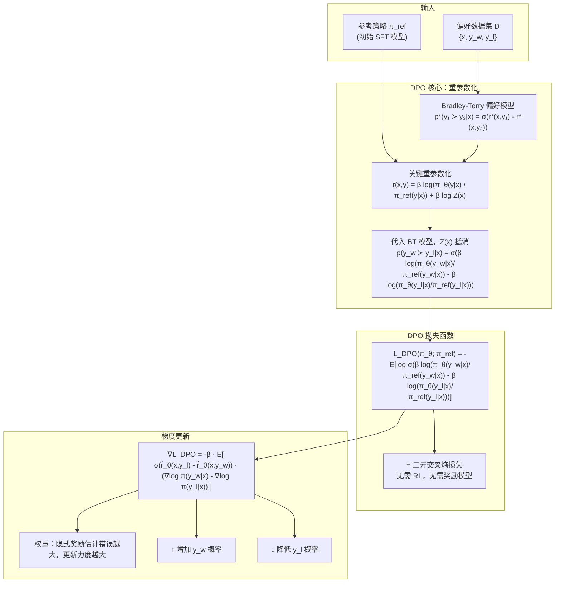
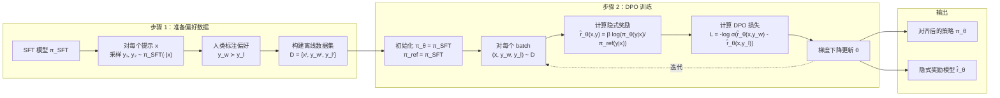
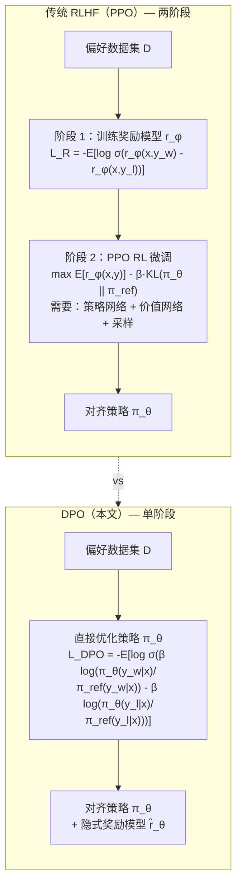
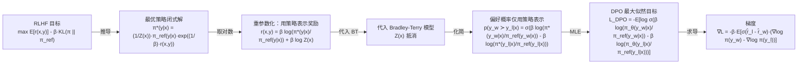
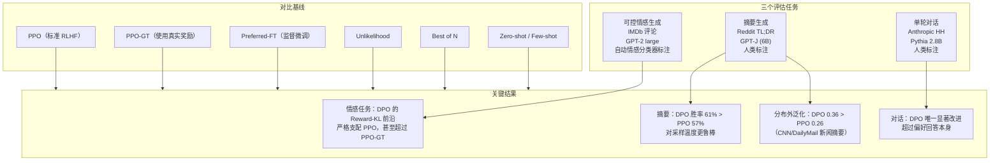
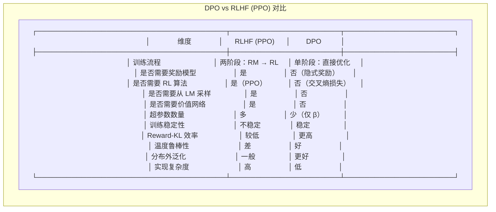

# DPO 架构图

## 图 1：DPO 核心思想总览

---

## 图 2：DPO 训练流程

---

## 图 3：DPO vs RLHF（PPO）架构对比

---

## 图 4：数学公式推导链

---

## 图 5：DPO 梯度权重机制详解

```mermaid
flowchart TB
    subgraph Case1["情况 1：模型已正确排序"]
        A1["r̂_θ(x,y_w) >> r̂_θ(x,y_l)"]
        B1["σ(r̂_l - r̂_w) ≈ 0"]
        C1["梯度权重 ≈ 0"]
        D1["几乎不更新<br/>（模型已经做对了）"]
        A1 --> B1 --> C1 --> D1
    end

    subgraph Case2["情况 2：模型排序错误"]
        A2["r̂_θ(x,y_w) << r̂_θ(x,y_l)"]
        B2["σ(r̂_l - r̂_w) ≈ 1"]
        C2["梯度权重 ≈ β"]
        D2["大力更新<br/>（模型做错了，需要纠正）"]
        A2 --> B2 --> C2 --> D2
    end

    subgraph Case3["情况 3：模型不确定"]
        A3["r̂_θ(x,y_w) ≈ r̂_θ(x,y_l)"]
        B3["σ(r̂_l - r̂_w) ≈ 0.5"]
        C3["梯度权重 ≈ 0.5β"]
        D3["适度更新<br/>（模型分不清，需要学习）"]
        A3 --> B3 --> C3 --> D3
    end
```

---

## 图 6：DPO 实验设置与结果

---

## 图 7：DPO 与 RLHF 详细对比

---

## 关键符号说明

| 符号                                                                                  | 含义                                             |
| ----------------------------------------------------------------------------------- | ---------------------------------------------- |
| $$x$$                                                                               | 提示（prompt）                                     |
| $$y_w$$                                                                             | 人类偏好的回答（winning response）                      |
| $$y_l$$                                                                             | 人类不偏好的回答（losing response）                      |
| $$\pi_\theta$$                                                                      | 正在优化的策略（语言模型）                                  |
| $$\pi_{\text{ref}}$$                                                                | 参考策略（初始 SFT 模型）                                |
| $$r(x,y)$$                                                                          | 奖励函数                                           |
| $$\hat{r}_\theta(x,y) = \beta \log\frac{\pi_\theta(y\|x)}{\pi_{\text{ref}}(y\|x)}$$ | 隐式奖励（由策略定义）                                    |
| $$\beta$$                                                                           | KL 散度约束系数                                      |
| $$\sigma$$                                                                          | logistic 函数 $$\sigma(z) = \frac{1}{1+e^{-z}}$$ |
| $$Z(x)$$                                                                            | 配分函数（partition function）                       |
| $$D_{KL}$$                                                                          | KL 散度                                          |

---

## 核心公式总结

**Bradley-Terry 偏好模型：**

$$p^*(y_1 \succ y_2 | x) = \frac{\exp(r^*(x, y_1))}{\exp(r^*(x, y_1)) + \exp(r^*(x, y_2))} = \sigma(r^*(x, y_1) - r^*(x, y_2))$$

**RLHF 目标：**

$$\max_{\pi_\theta} \mathbb{E}_{x\sim D, y\sim\pi_\theta(y|x)}[r_\phi(x, y)] - \beta \cdot D_{KL}(\pi_\theta(y|x) \parallel \pi_{\text{ref}}(y|x))$$

**最优策略闭式解：**

$$\pi^*(y|x) = \frac{1}{Z(x)} \pi_{\text{ref}}(y|x) \exp\left(\frac{1}{\beta} r(x, y)\right)$$

**DPO 重参数化：**

$$r(x, y) = \beta \log\frac{\pi^*(y|x)}{\pi_{\text{ref}}(y|x)} + \beta \log Z(x)$$

**DPO 损失函数：**

$$L_{DPO}(\pi_\theta; \pi_{\text{ref}}) = -\mathbb{E}_{(x,y_w,y_l)\sim D} \left[ \log \sigma\left( \beta \log\frac{\pi_\theta(y_w|x)}{\pi_{\text{ref}}(y_w|x)} - \beta \log\frac{\pi_\theta(y_l|x)}{\pi_{\text{ref}}(y_l|x)} \right) \right]$$

**DPO 梯度：**

$$\nabla_\theta L_{DPO} = -\beta \cdot \mathbb{E}_{(x,y_w,y_l)\sim D} \left[ \sigma(\hat{r}_\theta(x, y_l) - \hat{r}_\theta(x, y_w)) \left( \nabla_\theta \log \pi(y_w|x) - \nabla_\theta \log \pi(y_l|x) \right) \right]$$

---

Written by LLM-for-Zotero.
