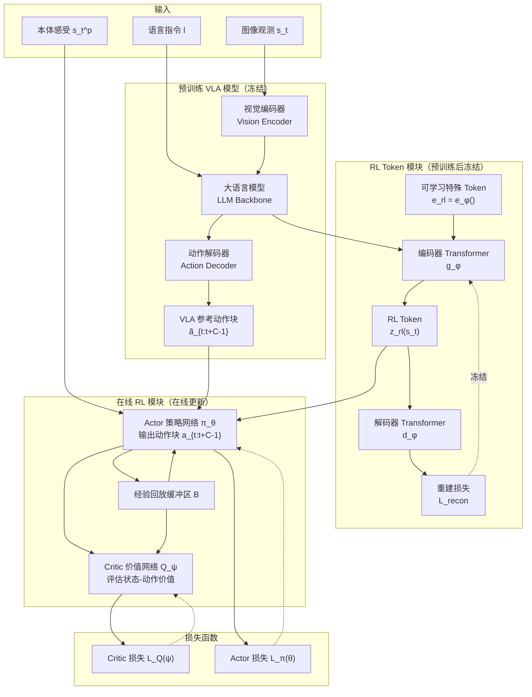
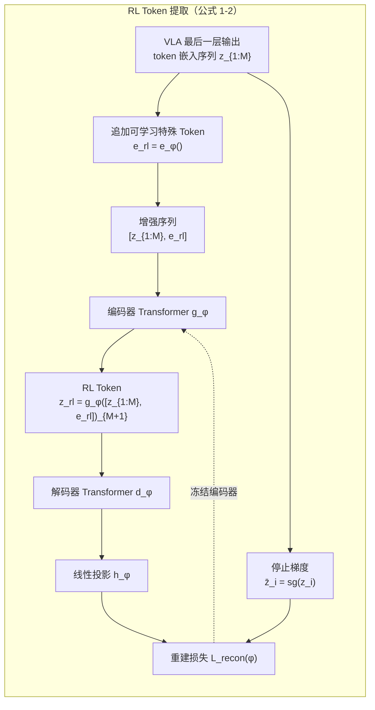
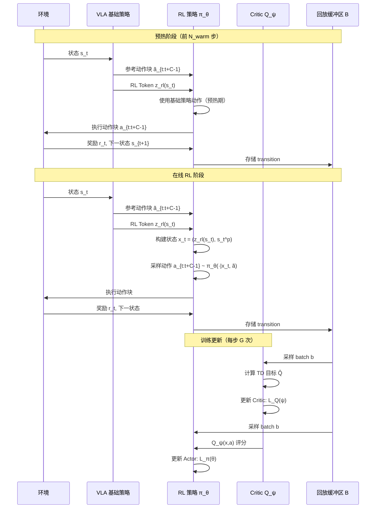
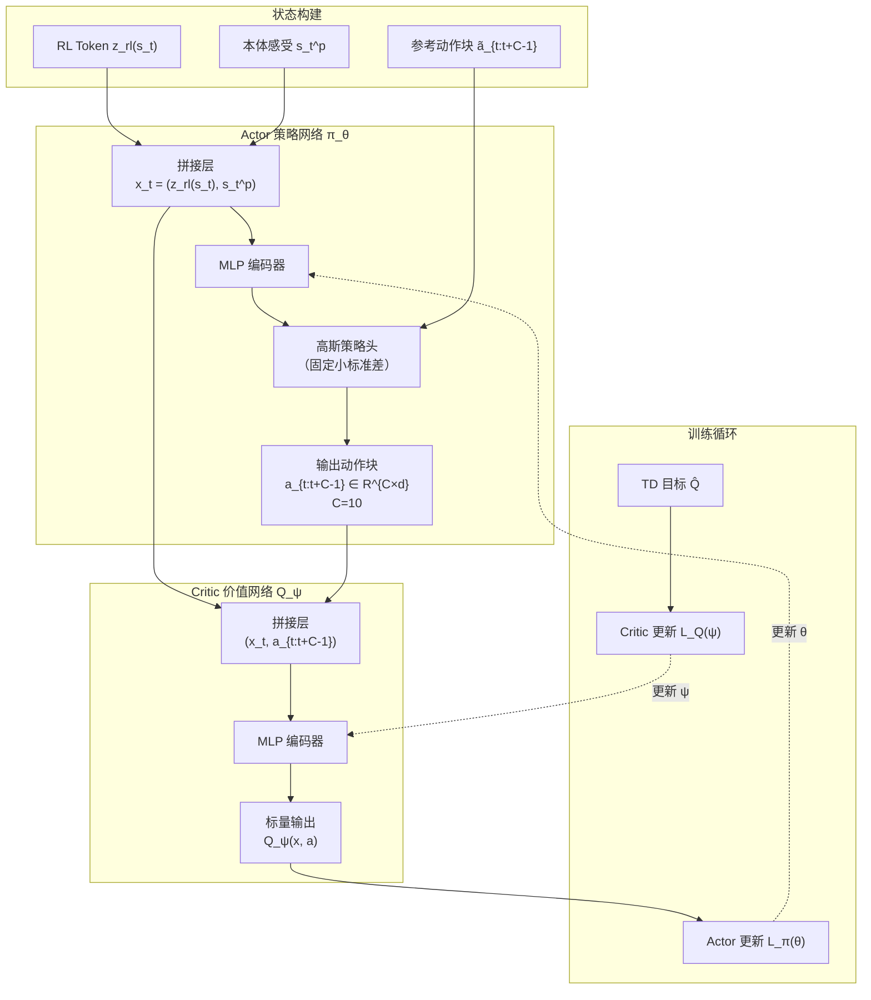
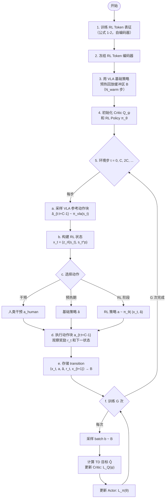

# RL Token 架构图

> 论文：RL Token: Bootstrapping Online RL with Vision-Language-Action Models — Xu et al. (Physical Intelligence)

---

## 一、整体架构总览

### 对应公式

**公式 1 — RL Token 提取**

$$
z_{\text{rl}} = g_\phi\left([z_{1:M}, e_{\text{rl}}]\right)_{M+1}
$$

**公式 2 — 重建损失（自编码器训练）**

$$
\mathcal{L}_{\text{recon}}(\phi) = \mathbb{E}_{s,l}\left[\sum_{i=1}^{M} \|h_\phi(d_\phi(z_{\text{rl}}))_i - \bar{z}_i\|_2^2\right]
$$

其中 $\bar{z}_i = \text{sg}(z_i)$ 为停止梯度。

**公式 3 — Critic 损失（TD 学习）**

$$
\mathcal{L}_Q(\psi) = \mathbb{E}_{b \sim \mathcal{B}}\left[ \left(\hat{Q} - Q_\psi(x, a)\right)^2 \right]
$$

**公式 4 — TD 目标**

$$
\hat{Q} = \sum_{t'=1}^{C} \gamma^{t'-1} r_{t'} + \gamma^C \mathbb{E}_{a' \sim \pi_\theta} Q_{\psi'}(x', a')
$$

**公式 5 — Actor 损失（含 BC 正则化）**

$$
\mathcal{L}_\pi(\theta) = \mathbb{E}_{\substack{s \sim \mathcal{B} \\ a_{1:C} \sim \pi_\theta \\ \tilde{a}_{1:C} \sim \pi_{\text{vla}}(\cdot|s,l)}} \left[ -\underbrace{Q_\psi(x, a_{1:C})}_{\text{最大化 Q 值}} + \beta \underbrace{\|a_{1:C} - \tilde{a}_{1:C}\|_2^2}_{\text{BC 正则化项}} \right]
$$

---

## 二、RL Token 提取与训练

### 对应公式

**RL Token 提取**

$$
z_{\text{rl}} = g_\phi\left([z_{1:M}, e_{\text{rl}}]\right)_{M+1}
$$

**重建损失**

$$
\mathcal{L}_{\text{recon}}(\phi) = \mathbb{E}_{s,l}\left[\sum_{i=1}^{M} \|h_\phi(d_\phi(z_{\text{rl}}))_i - \bar{z}_i\|_2^2\right], \quad \bar{z}_i = \text{sg}(z_i)
$$

---

## 三、在线 RL 训练流程

### 对应公式

**TD 目标**

$$
\hat{Q} = \sum_{t'=1}^{C} \gamma^{t'-1} r_{t'} + \gamma^C \mathbb{E}_{a' \sim \pi_\theta} Q_{\psi'}(x', a')
$$

**Critic 更新**

$$
\mathcal{L}_Q(\psi) = \mathbb{E}_{b \sim \mathcal{B}}\left[ \left(\hat{Q} - Q_\psi(x, a)\right)^2 \right]
$$

**Actor 更新**

$$
\mathcal{L}_\pi(\theta) = \mathbb{E}_{b \sim \mathcal{B}}\left[ -Q_\psi(x, a) + \beta\|a - \tilde{a}\|_2^2 \right]
$$

---

## 四、Actor-Critic 网络结构

### 对应公式

**状态构建**

$$
x_t = (z_{\text{rl}}(s_t), s_t^p)
$$

**Actor 输出**

$$
a_{t:t+C-1} \sim \pi_\theta(\cdot | x_t, \tilde{a}_{t:t+C-1}), \quad a_{t:t+C-1} \in \mathbb{R}^{C \times d}, \; C=10
$$

**Critic 输出**

$$
Q_\psi(x, a) \in \mathbb{R}
$$

**Actor 损失**

$$
\mathcal{L}_\pi(\theta) = \mathbb{E}_{b \sim \mathcal{B}}\left[ -Q_\psi(x, a) + \beta\|a - \tilde{a}\|_2^2 \right]
$$

**Critic 损失**

$$
\mathcal{L}_Q(\psi) = \mathbb{E}_{b \sim \mathcal{B}}\left[ \left(\hat{Q} - Q_\psi(x, a)\right)^2 \right]
$$

---

## 五、关键公式汇总

### 公式 1 — RL Token 提取

$$
z_{\text{rl}} = g_\phi\left([z_{1:M}, e_{\text{rl}}]\right)_{M+1}
$$

### 公式 2 — 重建损失（自编码器训练）

$$
\mathcal{L}_{\text{recon}}(\phi) = \mathbb{E}_{s,l}\left[\sum_{i=1}^{M} \|h_\phi(d_\phi(z_{\text{rl}}))_i - \bar{z}_i\|_2^2\right]
$$

其中 $\bar{z}_i = \text{sg}(z_i)$ 为停止梯度。

### 公式 3 — Critic 损失（TD 学习）

$$
\mathcal{L}_Q(\psi) = \mathbb{E}_{b \sim \mathcal{B}}\left[ \left(\hat{Q} - Q_\psi(x, a)\right)^2 \right]
$$

### 公式 4 — TD 目标

$$
\hat{Q} = \sum_{t'=1}^{C} \gamma^{t'-1} r_{t'} + \gamma^C \mathbb{E}_{a' \sim \pi_\theta} Q_{\psi'}(x', a')
$$

### 公式 5 — Actor 损失（含 BC 正则化）

$$
\mathcal{L}_\pi(\theta) = \mathbb{E}_{\substack{s \sim \mathcal{B} \\ a_{1:C} \sim \pi_\theta \\ \tilde{a}_{1:C} \sim \pi_{\text{vla}}(\cdot|s,l)}} \left[ -\underbrace{Q_\psi(x, a_{1:C})}_{\text{最大化 Q 值}} + \beta \underbrace{\|a_{1:C} - \tilde{a}_{1:C}\|_2^2}_{\text{BC 正则化项}} \right]
$$

---

## 六、训练算法伪码

### 对应公式

**动作选择策略**

$$
a_{t:t+C-1} \leftarrow \begin{cases}
a_{\text{human}} & \text{if intervention} \\
\tilde{a}_{t:t+C-1} & \text{if } t < N_{\text{warm}} \\
\sim \pi_\theta(\cdot | x_t, \tilde{a}) & \text{otherwise}
\end{cases}
$$

**存储的 transition**

$$
\langle x_t, a_{t:t+C-1}, \tilde{a}, r_t, x_{t+1} \rangle
$$

---

## 七、组件职责总结

| 组件 | 参数规模 | 是否冻结 | 职责 |
|------|----------|----------|------|
| **VLA 基础模型** | 860M | ✅ 冻结 | 提供视觉-语言理解和动作先验 |
| **RL Token 编码器 $g_\phi$** | 轻量 | ✅ 冻结（预训练后） | 将 VLA 高维表征压缩为紧凑 RL 状态 |
| **RL Token 解码器 $d_\phi$** | 轻量 | ✅ 冻结（预训练后） | 重建训练中监督编码器学习 |
| **Actor $\pi_\theta$** | 小型 MLP | ❌ 在线更新 | 输出动作块，学习改进 VLA 动作 |
| **Critic $Q_\psi$** | 小型 MLP | ❌ 在线更新 | 评估状态-动作价值，指导 Actor 更新 |

---

Written by LLM-for-Zotero.
