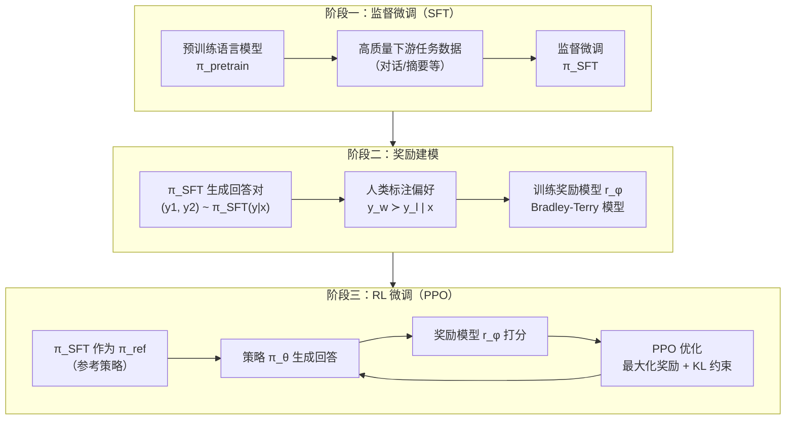
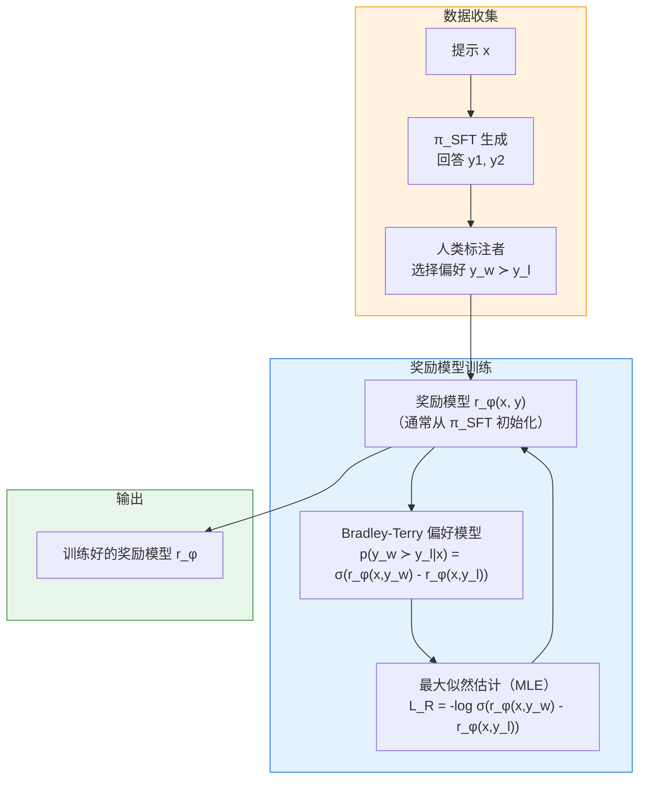
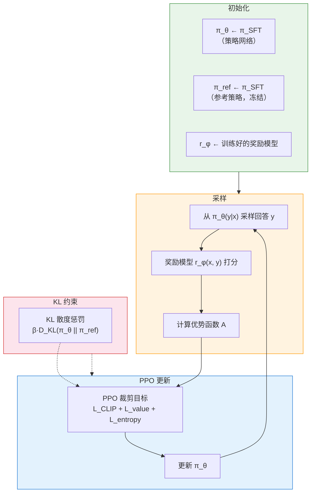
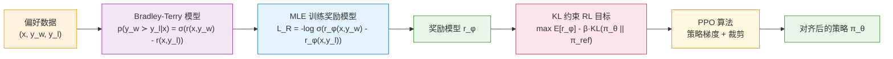
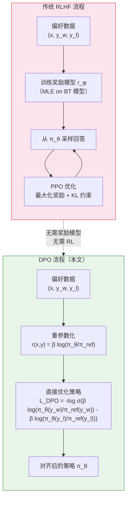

# RLHF 完整架构图

> 基于 Rafailov et al., *Direct Preference Optimization: Your Language Model is Secretly a Reward Model* (NeurIPS 2023)

---

## 一、RLHF 三阶段总览

---

## 二、阶段一：监督微调（SFT）详解

**数学公式：**

$$L_{SFT}(\theta) = -\mathbb{E}_{(x,y)\sim D_{SFT}} \left[ \log \pi_\theta(y|x) \right]$$

---

## 三、阶段二：奖励建模详解

### Bradley-Terry 偏好模型

$$p^*(y_1 \succ y_2 | x) = \frac{\exp(r^*(x, y_1))}{\exp(r^*(x, y_1)) + \exp(r^*(x, y_2))}$$

### 奖励模型损失函数

$$L_R(r_\phi, D) = -\mathbb{E}_{(x,y_w,y_l)\sim D} \left[ \log \sigma(r_\phi(x, y_w) - r_\phi(x, y_l)) \right]$$

其中 $\sigma$ 是 logistic 函数：$\sigma(z) = \frac{1}{1 + e^{-z}}$

---

## 四、阶段三：RL 微调（PPO）详解

### RL 优化目标

$$\max_{\pi_\theta} \mathbb{E}_{x\sim D, y\sim\pi_\theta(y|x)} \left[ r_\phi(x, y) \right] - \beta \cdot D_{KL}\left( \pi_\theta(y|x) \parallel \pi_{\text{ref}}(y|x) \right)$$

### PPO 实际使用的奖励函数

$$r(x, y) = r_\phi(x, y) - \beta(\log \pi_\theta(y|x) - \log \pi_{\text{ref}}(y|x))$$

其中：
- $r_\phi(x, y)$：奖励模型的分数
- $\beta(\log \pi_\theta(y|x) - \log \pi_{\text{ref}}(y|x))$：KL 惩罚项（每个 token 的即时惩罚）
- $\beta$：控制偏离参考策略的程度

---

## 五、完整数学公式流程

### 完整公式链

**Step 1 — Bradley-Terry 偏好模型：**

$$p^*(y_w \succ y_l | x) = \frac{\exp(r^*(x, y_w))}{\exp(r^*(x, y_w)) + \exp(r^*(x, y_l))}$$

**Step 2 — 奖励模型 MLE 损失：**

$$L_R(r_\phi, D) = -\mathbb{E}_{(x,y_w,y_l)\sim D} \left[ \log \sigma(r_\phi(x, y_w) - r_\phi(x, y_l)) \right]$$

**Step 3 — KL 约束的 RL 目标：**

$$\max_{\pi_\theta} \mathbb{E}_{x\sim D, y\sim\pi_\theta(y|x)} \left[ r_\phi(x, y) \right] - \beta \cdot D_{KL}\left( \pi_\theta(y|x) \parallel \pi_{\text{ref}}(y|x) \right)$$

**Step 4 — PPO 实际优化目标（含裁剪）：**

$$L^{CLIP}(\theta) = \mathbb{E} \left[ \min\left( \frac{\pi_\theta(y|x)}{\pi_{\text{old}}(y|x)} A, \text{clip}\left( \frac{\pi_\theta(y|x)}{\pi_{\text{old}}(y|x)}, 1-\epsilon, 1+\epsilon \right) A \right) \right]$$

---

## 六、DPO vs RLHF 对比架构

### DPO 损失函数

$$L_{DPO}(\pi_\theta; \pi_{\text{ref}}) = -\mathbb{E}_{(x,y_w,y_l)\sim D} \left[ \log \sigma\left( \beta \log\frac{\pi_\theta(y_w|x)}{\pi_{\text{ref}}(y_w|x)} - \beta \log\frac{\pi_\theta(y_l|x)}{\pi_{\text{ref}}(y_l|x)} \right) \right]$$

---

## 七、关键符号说明

| 符号 | 含义 | 说明 |
|------|------|------|
| $\pi_{\text{pretrain}}$ | 预训练语言模型 | 无监督训练的基座模型 |
| $\pi_{\text{SFT}}$ | 监督微调后的模型 | 在高质量数据上 SFT 后的基础模型 |
| $\pi_{\text{ref}}$ | 参考策略 | 通常 = $\pi_{\text{SFT}}$，在 RL 阶段冻结 |
| $\pi_\theta$ | 正在优化的策略 | RL 阶段被训练的模型 |
| $r^*(x, y)$ | 真实奖励函数 | 人类心目中的理想评分（不可观测） |
| $r_\phi(x, y)$ | 参数化的奖励模型 | 从偏好数据中学习到的近似奖励 |
| $\beta$ | KL 散度系数 | 控制策略偏离参考策略的程度 |
| $y_w$ | 偏好回答 | 人类标注者更喜欢的回答 |
| $y_l$ | 非偏好回答 | 人类标注者不喜欢的回答 |
| $D_{KL}$ | KL 散度 | 衡量两个概率分布之间的差异 |
| $\sigma$ | Logistic 函数 | $\sigma(z) = 1/(1+e^{-z})$ |

---

## 八、RLHF 各阶段计算成本对比

| 阶段 | 所需资源 | 训练时间 | 稳定性 |
|------|---------|---------|-------|
| **SFT** | 标准 GPU 训练 | 较短 | 稳定 |
| **奖励建模** | 标准 GPU 训练 | 较短 | 稳定 |
| **PPO RL 微调** | 需要从 LM 采样 + 价值函数网络 | 较长 | 不稳定，需大量调参 |
| **DPO（替代方案）** | 仅需前向传播计算 log-prob | 较短 | 稳定，几乎无需调参 |

---

*基于 Rafailov et al., "Direct Preference Optimization: Your Language Model is Secretly a Reward Model", NeurIPS 2023.*

---

Written by LLM-for-Zotero.
