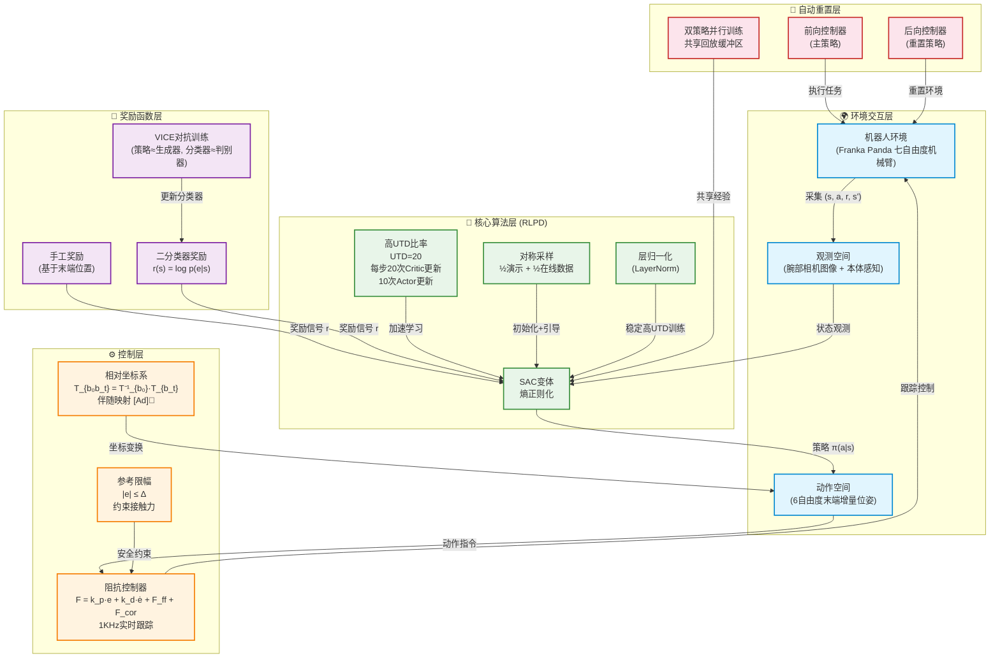

# SERL: A Software Suite for Sample-Efficient Robotic Reinforcement Learning

## SERL五大组件关系图



## 五大组件功能说明

| 组件 | 颜色 | 核心功能 | 关键公式/参数 |
|------|------|----------|--------------|
| **🌍 环境交互层** | 蓝色 | 定义MDP：状态、动作、转移概率 | 观测 = 图像 + 本体感知；动作 = 6D delta pose |
| **⚙️ 控制层** | 橙色 | 阻抗控制跟踪 + 参考限幅保护 + 相对坐标变换 | F = k_p·e + k_d·ė + F_ff + F_cor；\|e\| ≤ Δ；[Ad]伴随映射 |
| **🎯 奖励函数层** | 紫色 | 提供学习信号：手工奖励或分类器奖励 | r(s) = log p(e\|s)；VICE对抗训练 |
| **🧠 核心算法层** | 绿色 | RLPD算法：SAC + 高UTD + 对称采样 + LayerNorm | L_Q = E[(Q - (r + γQ̄))²]；L_π = -E[Q + αH(π)] |
| **🔄 自动重置层** | 红色 | 前向-后向双策略并行训练，无需人工重置 | 前向策略 + 后向策略共享缓冲区 |

## 核心数据流

```
环境交互 → 采集(s, a, r, s') → 存入回放缓冲区
    ↓
对称采样(½演示 + ½在线) → RLPD更新(UTD=20)
    ↓
策略输出动作 → 相对坐标变换 → 参考限幅 → 阻抗控制器跟踪
    ↓
机器人执行 → 采集新transition → 循环
```

## 关键设计理念

> The implementation of RL algorithms, particularly for real-world robotic systems, presents a very large design space, and it is the challenge of navigating this design space, rather than limitations of algorithms per se, that limit adoption.

(Luo 等, 2025)

SERL的核心贡献不是发明新算法，而是**将五个组件精心整合为一个开箱即用的系统**，每个组件的设计选择都经过验证，共同实现了20-50分钟训练、100%成功率的惊人效果。

---

Written by LLM-for-Zotero.
