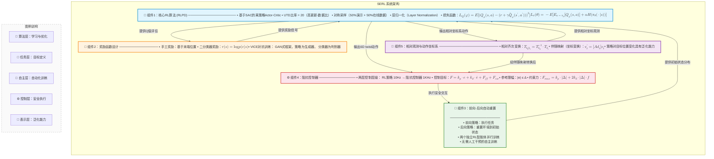

# SERL: A Software Suite for Sample-Efficient Robotic Reinforcement Learning

## SERL 五大组件关系图

## 组件间关系说明

| 关系 | 方向 | 说明 |
|------|------|------|
| **RLPD → 奖励函数** | 双向 | RLPD需要奖励信号来优化策略；奖励函数依赖RLPD的Q值来评估状态 |
| **RLPD → 阻抗控制器** | 单向 | RLPD输出6D twist动作，由阻抗控制器以1KHz频率跟踪执行 |
| **RLPD → 前向-后向重置** | 双向 | 前向策略执行任务，后向策略重置环境，两者共享RLPD算法框架 |
| **RLPD → 相对坐标系** | 双向 | 策略接收相对坐标观测，输出相对坐标系动作 |
| **相对坐标系 → 阻抗控制器** | 单向 | 相对坐标系动作经伴随映射转换后，发送给阻抗控制器执行 |

## 核心设计理念

> The implementation of RL algorithms, particularly for real-world robotic systems, presents a very large design space, and it is the challenge of navigating this design space, rather than limitations of algorithms per se, that limit adoption.

(Luo 等, 2025)

SERL的核心贡献不是提出新算法，而是**精心选择并整合这五个组件**，使它们在真实世界机器人RL中协同工作，实现 **20-50分钟训练、100%成功率** 的惊人效果。

---

Written by LLM-for-Zotero.
