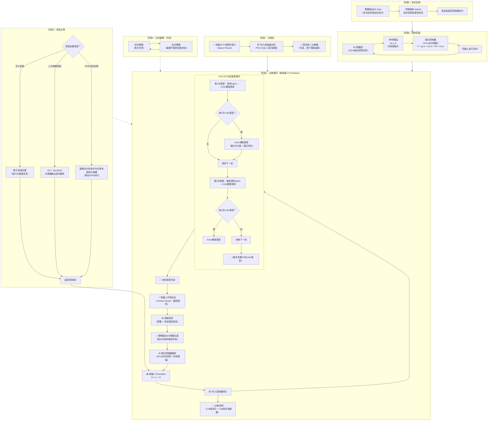

# SERL: A Software Suite for Sample-Efficient Robotic Reinforcement Learning

## SERL工作流程图

## 流程说明

### 阶段1：初始化
- 使用Space Mouse收集**20个遥操作演示**，存入回放缓冲区作为先验数据
- 可选：预训练一个二分类器用于后续奖励函数

### 阶段2：训练循环（核心）
- 机器人每执行一个动作，收集1个transition `(s, a, r, s')`
- **对称采样**：每个batch中128条来自演示数据 + 128条来自在线缓冲区
- **UTD=20**：每收集1个transition，Critic更新20次，Actor更新10次（每2次Critic更新做1次Actor更新）
- 每次更新都**重新从缓冲区采样**一个新的batch

### 阶段3：奖励计算
三种奖励函数可选：
1. **手工奖励**：基于末端位置（适用于PCB插装等可量化任务）
2. **二分类器奖励**：`r(s) = log p(e|s)`，分类器输出成功概率的对数
3. **VICE对抗训练**：策略访问的状态作为负样本加入分类器训练，形成GAN式对抗

### 阶段4：自动重置
- **前向策略**：执行目标任务
- **后向策略**：将环境重置到初始状态
- 两个策略并行训练，无需人工干预

### 阶段5：坐标变换
- 策略输出6D twist（在当前末端坐标系中）
- 通过**伴随映射（Adjoint mapping）** 变换到基坐标系

### 阶段6：控制层级
- **RL策略层**：10Hz输出控制目标
- **参考限幅**：`|e| ≤ Δ`，约束接触力，防止碰撞损坏
- **阻抗控制器**：1KHz实时跟踪，弹簧-阻尼模型

## 关键公式

### Critic损失函数
$$L_Q(\phi) = \mathbb{E}\left[(Q_\phi(s, a) - (r + \gamma Q_{\bar{\phi}}(s', a')))^2\right]$$

### Actor损失函数
$$L_\pi(\theta) = -\mathbb{E}_s\left[\mathbb{E}_{a\sim\pi_\theta}[Q_\phi(s, a)] + \alpha\mathcal{H}(\pi_\theta(\cdot|s))\right]$$

### 分类器奖励
$$r(s) = \log p(e|s)$$

### 阻抗控制目标
$$F = k_p \cdot e + k_d \cdot \dot{e} + F_{ff} + F_{cor}$$

### 参考限幅
$$|e| \leq \Delta$$

### 伴随映射
$$\mathfrak{v}'^{(i)}_t = [Ad^{(i)}_t] \mathfrak{v}^{(i)}_t$$

---

Written by LLM-for-Zotero.
