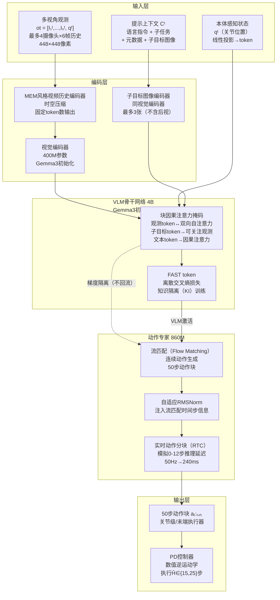
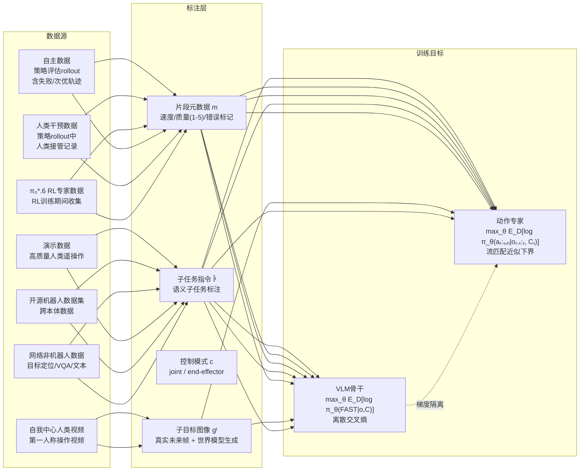
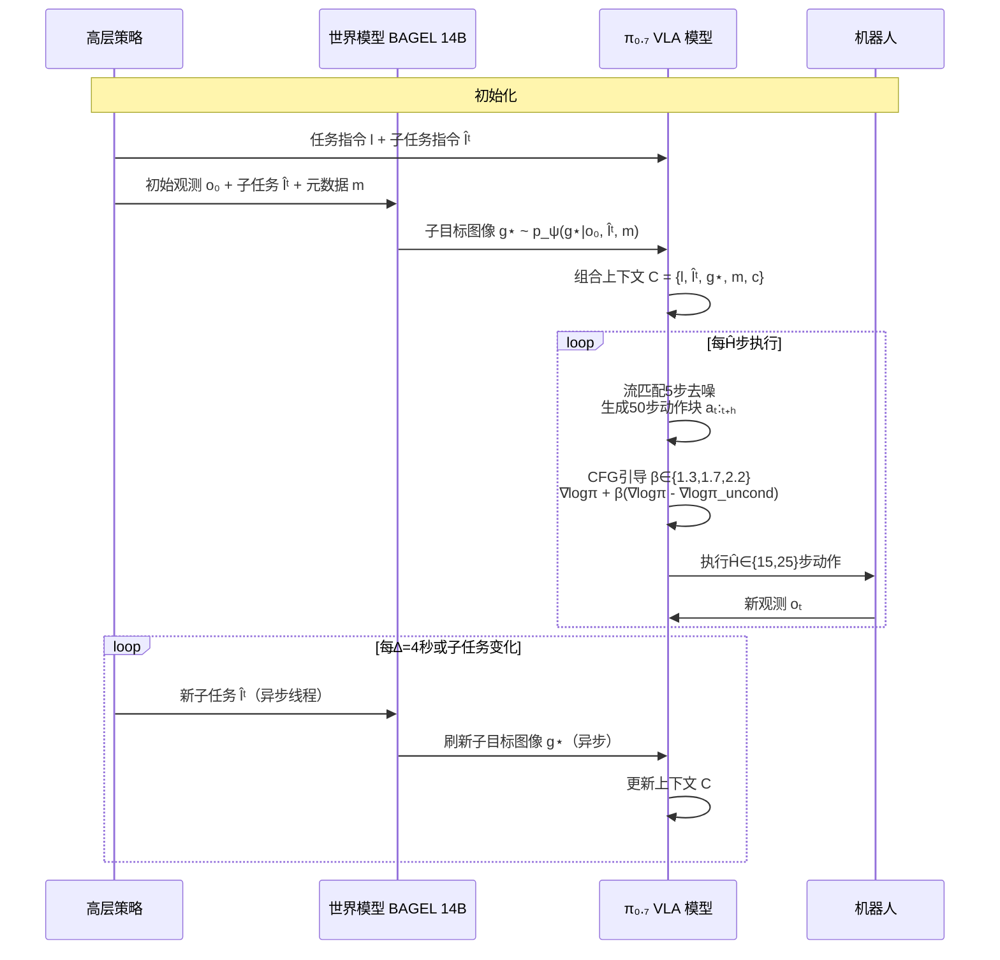
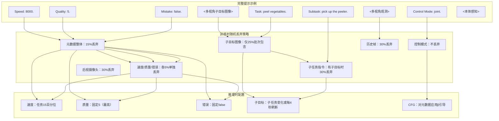
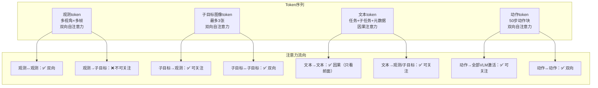

# $\pi_{0.7}$: a Steerable Generalist Robotic Foundation Model with Emergent Capabilities

## 数据流总览

---

## 训练数据流

---

## 推理数据流

---

## 提示上下文组合数据流

---

## 子目标图像生成数据流

```mermaid
flowchart TD
    subgraph WorldModel["世界模型训练"]
        W1["训练数据 D_g<br/>高质量子任务标注片段"]
        W2["真实未来帧 g⋆ = o_end<br/>段末帧作为真值"]
        W3["网络数据<br/>视频编辑/图像生成"]
        W4["人类自我中心视频"]
    end

    subgraph Gen["子目标图像生成"]
        G1["输入：观测 oₜ + 子任务 l̂ᵗ + 元数据 m"]
        G2["BAGEL 14B<br/>Mixture-of-Transformers"]
        G3["流匹配目标<br/>max_ψ E[L_CFM(g⋆, g_ψ(o,l̂,m))]"]
        G4["输出：多视角子目标图像 g⋆"]
    end

    subgraph Sampling["训练时采样策略"]
        S1["25%概率：段末帧"]
        S2["75%概率：0-4秒随机未来帧"]
        S3["世界模型生成图像<br/>缓解训练-测试不匹配"]
    end

    subgraph Usage["推理时使用"]
        U1["异步生成<br/>独立线程"]
        U2["子任务变化时刷新"]
        U3["每∆=4秒刷新"]
        U4["VLA使用最新可用子目标"]
    end

    W1 --> W2 --> G2
    W3 --> G2
    W4 --> G2
    G1 --> G2 --> G3 --> G4
    G4 --> S1 & S2 & S3
    S1 & S2 & S3 -->|"训练π₀.₇"| U1
    U1 --> U2 & U3 --> U4
```

---

## 注意力掩码数据流

---

## 关键参数汇总

| 参数 | 值 | 说明 |
|------|-----|------|
| VLM骨干 | 4B | Gemma3初始化 |
| 视觉编码器 | 400M | 含在VLM内 |
| 动作专家 | 860M | 流匹配Transformer |
| 总参数量 | ~5B | — |
| 输入摄像头 | 最多4个 | 前视+2腕部+后视 |
| 历史帧数 | 最多6帧/视角 | 步长1秒 |
| 子目标图像 | 最多3张 | 不含后视 |
| 图像分辨率 | 448×448 | — |
| 动作块长度 | 50步 | 固定 |
| 执行步数 Ĥ | 15-25步 | 可配置 |
| 推理延迟模拟 | 0-12步 | 240ms@50Hz |
| 去噪步数 | 5步 | 流匹配 |
| CFG权重 β | 1.3/1.7/2.2 | 元数据引导 |
| 子目标刷新间隔 ∆ | 4秒 | 或子任务变化时 |
| 控制模式 | joint / ee | 关节级/末端执行器 |
| 机器人频率 | 50Hz / 20Hz | UR5e为20Hz |

---

Written by LLM-for-Zotero.
