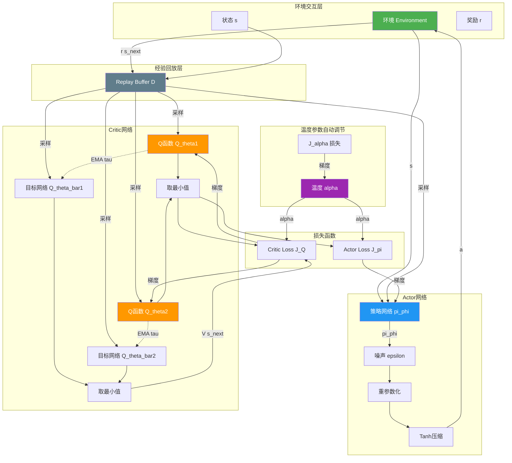
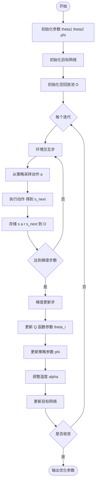
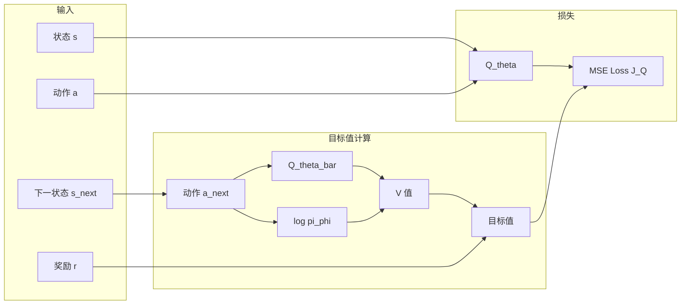
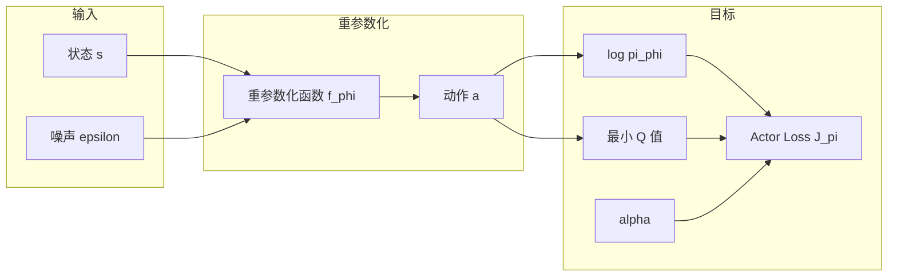
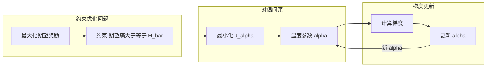
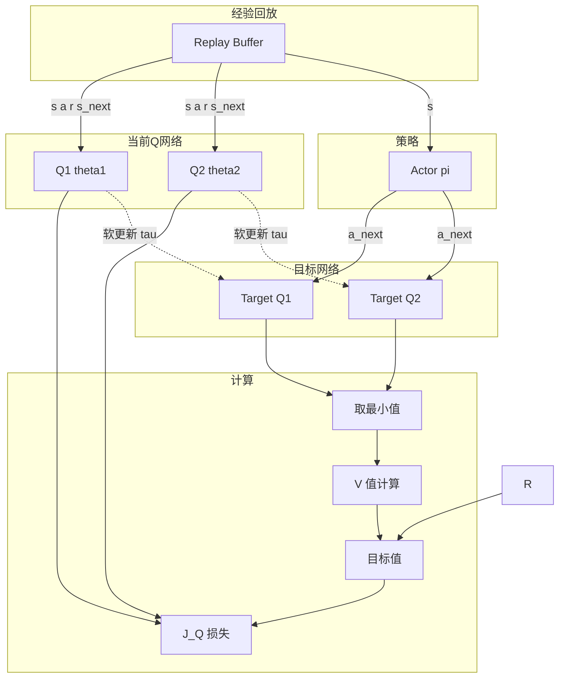

# SAC 算法架构图

## 1. 整体架构总览

## 2. 算法伪代码流程

## 3. Soft 策略评估（Critic 更新）

## 4. Soft 策略改进（Actor 更新）

## 5. 自动温度调节

## 6. 双 Q 函数与目标网络

## 7. 关键公式汇总

$$
\pi^* = \arg\max_\pi \sum_t \mathbb{E}[r(s_t,a_t) + \alpha\mathcal{H}(\pi(\cdot|s_t))]
$$
> **最大熵目标函数**：SAC 的核心目标，在最大化累积奖励的同时最大化策略熵

$$
T^\pi Q(s_t,a_t) = r(s_t,a_t) + \gamma\mathbb{E}_{s_{t+1}\sim p}[V(s_{t+1})]
$$
> **Soft Bellman 备份算子**：用于 Soft 策略评估的迭代算子

$$
V(s_t) = \mathbb{E}_{a_t\sim\pi}[Q(s_t,a_t) - \alpha\log\pi(a_t|s_t)]
$$
> **Soft 状态值函数**：将熵项纳入状态值估计

$$
\pi_{\text{new}} = \arg\min_{\pi'\in\Pi} D_{\text{KL}}\left(\pi'(\cdot|s_t) \Big\| \frac{\exp(\frac{1}{\alpha}Q^{\pi_{\text{old}}}(s_t,\cdot))}{Z^{\pi_{\text{old}}}(s_t)}\right)
$$
> **Soft 策略改进**：通过最小化 KL 散度更新策略

$$
J_Q(\theta) = \mathbb{E}_{(s_t,a_t)\sim\mathcal{D}}\left[\frac{1}{2}\left(Q_\theta(s_t,a_t) - (r + \gamma V_{\bar{\theta}}(s_{t+1}))\right)^2\right]
$$
> **Critic 损失函数**：最小化 Soft Bellman 残差

$$
J_\pi(\phi) = \mathbb{E}_{s_t\sim\mathcal{D},\epsilon_t\sim\mathcal{N}}[\alpha\log\pi_\phi(f_\phi(\epsilon_t;s_t)|s_t) - Q_\theta(s_t,f_\phi(\epsilon_t;s_t))]
$$
> **Actor 损失函数（重参数化）**：使用重参数化技巧的梯度估计

$$
J(\alpha) = \mathbb{E}_{a_t\sim\pi_t}[-\alpha\log\pi_t(a_t|s_t) - \alpha\bar{\mathcal{H}}]
$$
> **温度参数损失函数**：自动调节熵权重的对偶目标

---

*基于 Haarnoja et al. (2019) "Soft Actor-Critic Algorithms and Applications"*

---

Written by LLM-for-Zotero.
