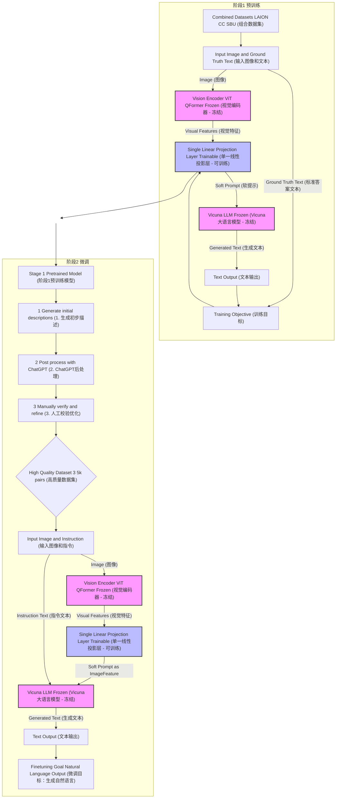

```mermaid
graph TD
    %% --- 阶段1：预训练对齐 ---

    subgraph Stage1_Pretraining [阶段1 预训练]
        D1_Data["Combined Datasets LAION CC SBU (组合数据集)"] --> T1_Input["Input Image and Ground Truth Text (输入图像和文本)"]
        
        T1_Input -- "Image (图像)" --> VE["Vision Encoder ViT QFormer Frozen (视觉编码器 - 冻结)"]
        VE -- "Visual Features (视觉特征)" --> PL["Single Linear Projection Layer Trainable (单一线性投影层 - 可训练)"]
        PL -- "Soft Prompt (软提示)" --> LLM["Vicuna LLM Frozen (Vicuna大语言模型 - 冻结)"]
        
        LLM -- "Generated Text (生成文本)" --> T1_Output["Text Output (文本输出)"]
        T1_Input -- "Ground Truth Text (标准答案文本)" --> T1_Loss["Training Objective (训练目标)"]
        T1_Output --> T1_Loss
        T1_Loss --> PL
    end

    %% --- 阶段2：数据构建与微调 ---

    subgraph Stage2_Finetuning [阶段2 微调]
        D2_Start["Stage 1 Pretrained Model (阶段1预训练模型)"] --> D2_Gen["1 Generate initial descriptions (1. 生成初步描述)"]
        D2_Gen --> D2_Post["2 Post process with ChatGPT (2. ChatGPT后处理)"]
        D2_Post --> D2_Manual["3 Manually verify and refine (3. 人工校验优化)"]
        D2_Manual --> D2_Final{"High Quality Dataset 3 5k pairs (高质量数据集)"}

        D2_Final --> T2_Input["Input Image and Instruction (输入图像和指令)"]
        
        T2_Input -- "Image (图像)" --> VE2["Vision Encoder ViT QFormer Frozen (视觉编码器 - 冻结)"]
        VE2 -- "Visual Features (视觉特征)" --> PL2["Single Linear Projection Layer Trainable (单一线性投影层 - 可训练)"]
        PL2 -- "Soft Prompt as ImageFeature" --> LLM2["Vicuna LLM Frozen (Vicuna大语言模型 - 冻结)"]
        
        T2_Input -- "Instruction Text (指令文本)" --> LLM2
        LLM2 -- "Generated Text (生成文本)" --> T2_Output["Text Output (文本输出)"]
        T2_Output --> T2_Goal["Finetuning Goal Natural Language Output (微调目标：生成自然语言)"]
    end

    %% --- 全局连接 ---
    Model_T1_End --> D2_Start
    
    %% --- 用于连接的虚拟节点 ---
    subgraph Model_T1 [ ]
        direction LR
        PL --> Model_T1_End( )
    end
    style Model_T1 fill:#fff,stroke:#fff
    style Model_T1_End fill:#fff,stroke:#fff


    %% --- 样式 ---
    style VE fill:#f9f,stroke:#333,stroke-width:2px
    style LLM fill:#f9f,stroke:#333,stroke-width:2px
    style PL fill:#bbf,stroke:#333,stroke-width:2px
    style VE2 fill:#f9f,stroke:#333,stroke-width:2px
    style LLM2 fill:#f9f,stroke:#333,stroke-width:2px
    style PL2 fill:#bbf,stroke:#333,stroke-width:2px
```