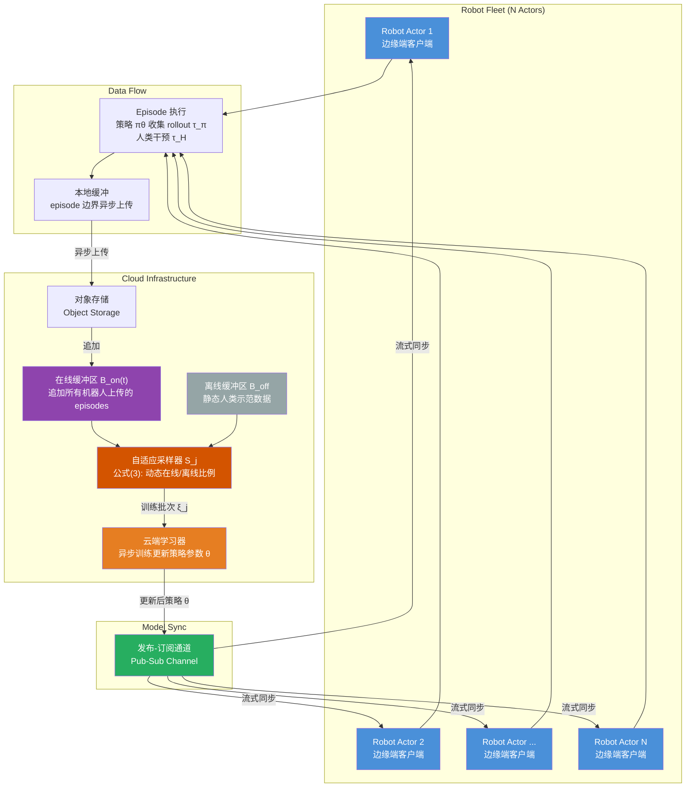
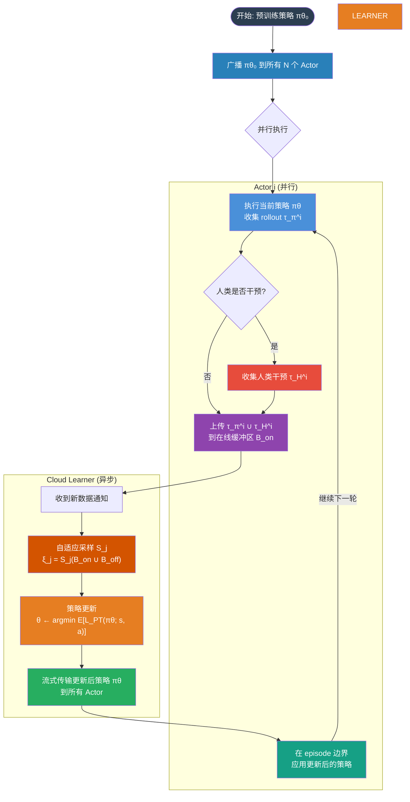
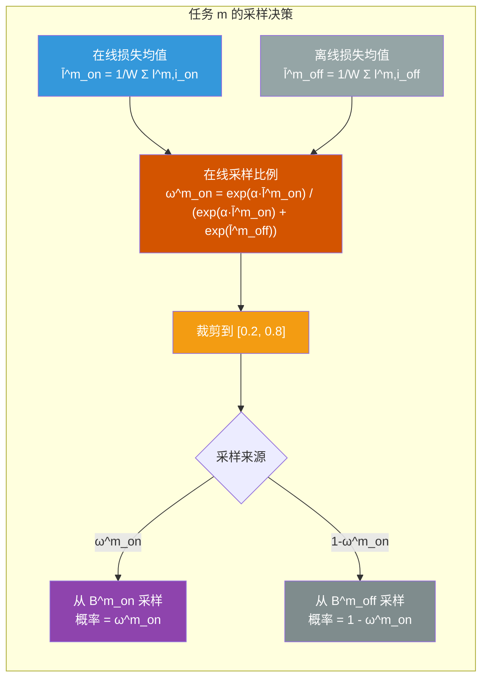

# SOP: A Scalable Online Post-Training System for Vision-Language-Action Models

## SOP 系统架构图

## SOP 算法流程

## 自适应采样策略

## 核心公式

### 公式 (1): 后训练优化目标

$$
\theta_{k+1} = \arg\min_{\theta} \mathbb{E}_{(s,a) \sim D_k} L_{PT}(\pi_\theta; s, a)
$$

### 公式 (2): 训练批次采样

$$
\xi_j := S_j(B_{on}(t_j) \cup B_{off})
$$

其中 $$B_{on}(t) = \bigcup_{i=1}^{N} \tau^i(t)$$

### 公式 (3): 自适应在线采样比例

$$
\omega^m_{on} = \frac{\exp(\alpha \cdot \bar{l}^m_{on})}{\exp(\alpha \cdot \bar{l}^m_{on}) + \exp(\bar{l}^m_{off})}
$$

### 公式 (4): RECAP 行为正则化策略改进

$$
\hat{\pi}(a|s) \propto \pi_{ref}(a|s) \left( \frac{\pi_{ref}(a|I, s)}{\pi_{ref}(a|s)} \right)^\beta
$$

### 行为克隆损失函数

$$
L_{BC}(\pi_\theta; s, a) = -\log \pi_\theta(a|s)
$$

## 系统组件说明

| 组件 | 角色 | 关键特性 |
|------|------|---------|
| **Robot Actor** | 边缘端执行策略，收集经验 | 本地缓冲 episodes，episode 边界异步上传 |
| **对象存储** | 接收并存储上传数据 | 异步、非阻塞上传 |
| **在线缓冲区 B_on** | 动态增长的在线经验池 | 随时间 t 不断增大 |
| **离线缓冲区 B_off** | 静态人类示范数据 | 训练开始前准备好 |
| **自适应采样器 S_j** | 动态混合在线/离线数据 | 按任务均匀 + 按损失动态调整 |
| **云端学习器** | 异步训练更新策略 | 通过通知按需检索数据 |
| **发布-订阅通道** | 轻量级模型同步 | 端到端延迟秒到数十秒级 |

## 参考文献

Pan, M., Feng, S., Zhang, Q., Li, X., Song, J., Qu, C., Wang, Y., Li, C., Xiong, Z., Chen, Z., Liu, Y., & Luo, J. (2026). *SOP: A Scalable Online Post-Training System for Vision-Language-Action Models*. arXiv:2601.03044 [cs.RO]. https://doi.org/10.48550/arXiv.2601.03044

---

Written by LLM-for-Zotero.
