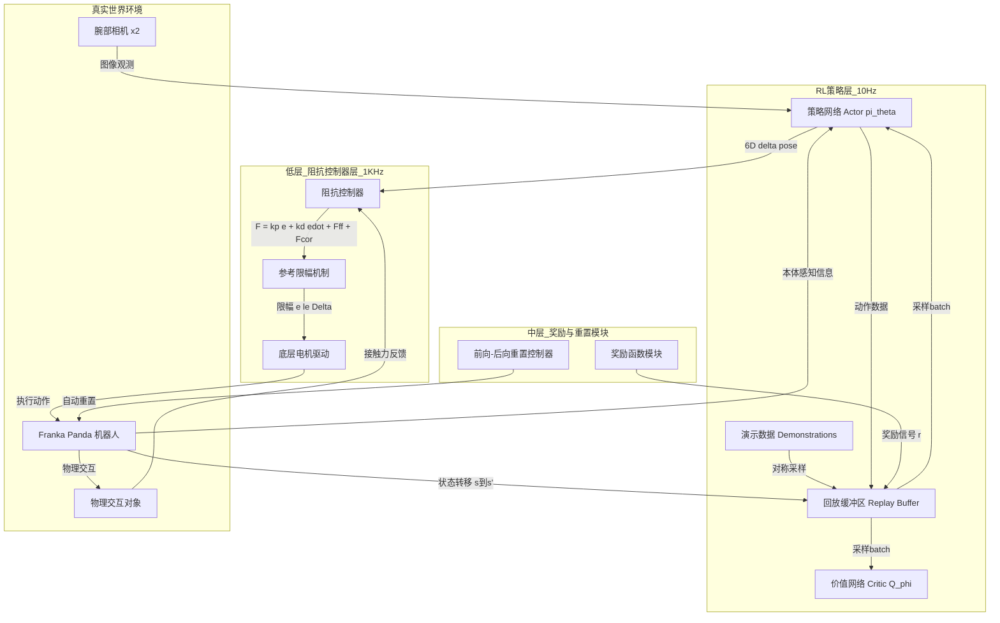
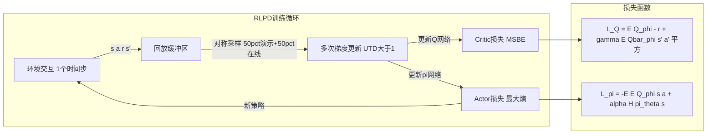
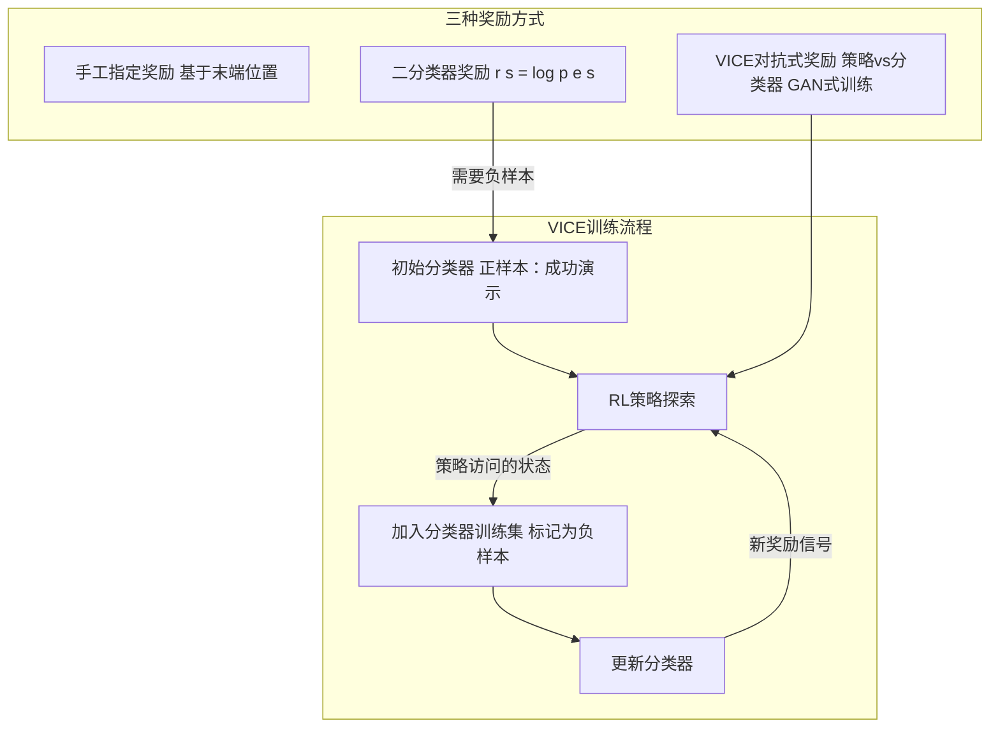
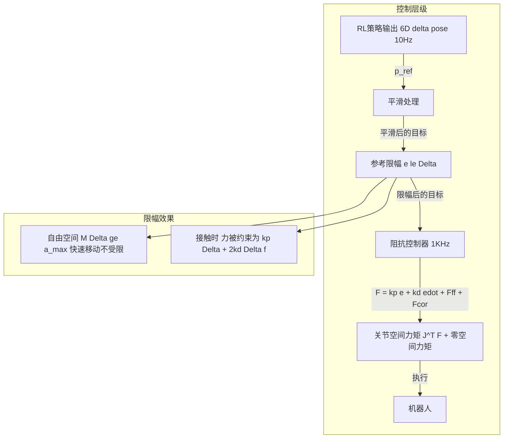
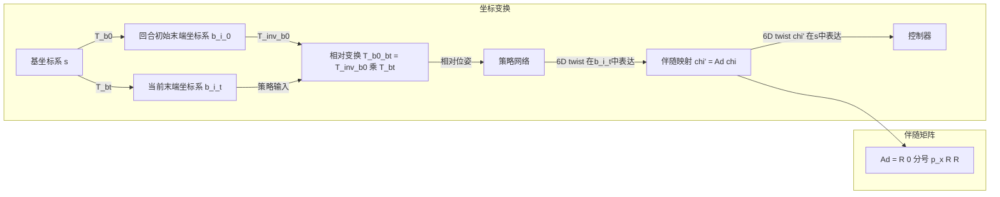
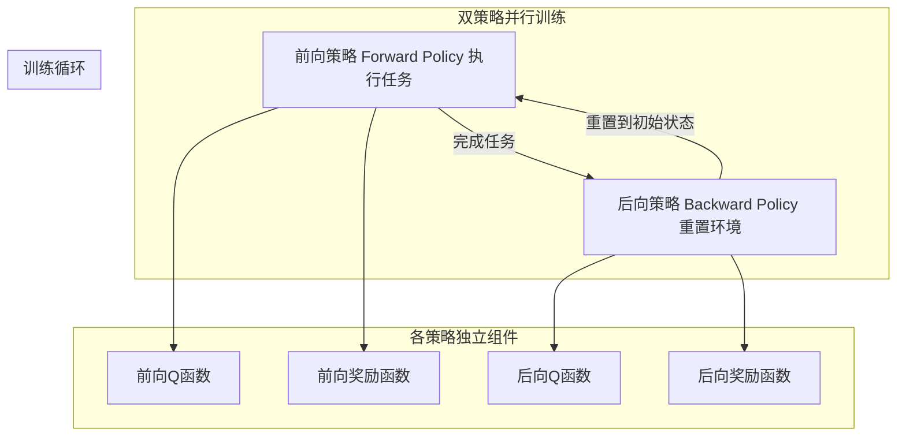
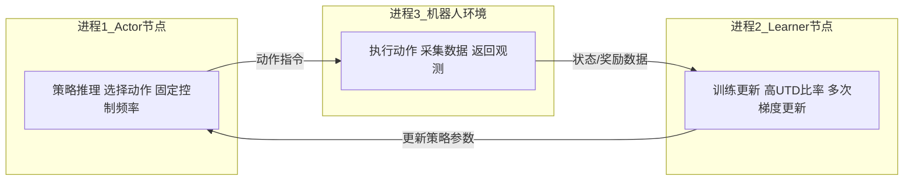
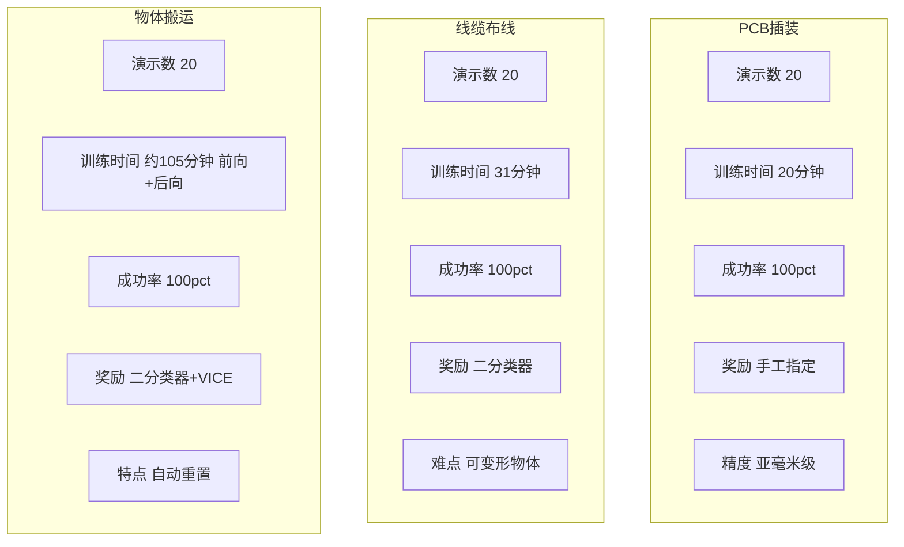

# SERL 系统架构图

## 一、SERL 整体系统架构

---

## 二、核心RL算法：RLPD (基于SAC)

---

## 三、奖励函数模块

---

## 四、阻抗控制器与参考限幅

---

## 五、相对观测与动作坐标系

---

## 六、前向-后向重置训练

---

## 七、三进程并行架构

---

## 八、三个实验任务概览

---

## 九、关键公式汇总

| 组件       | 公式                                                                                                                                              | 说明          |
| -------- | ----------------------------------------------------------------------------------------------------------------------------------------------- | ----------- |
| MDP目标    | $$J(\pi) = \mathbb{E}\left[\sum_{t=0}^{\infty} \gamma^t r(s_t, a_t)\right]$$                                                                    | 最大化期望累积回报   |
| Critic损失 | $$\mathcal{L}_Q(\phi) = \mathbb{E}_{s,a,s'}\left[(Q_\phi(s,a) - (r(s,a) + \gamma\mathbb{E}_{a'\sim\pi_\theta}[\bar{Q}_\phi(s',a')]))^2\right]$$ | 均方贝尔曼误差     |
| Actor损失  | $$\mathcal{L}_\pi(\theta) = -\mathbb{E}_s\left[\mathbb{E}_{a\sim\pi_\theta(a)}[Q_\phi(s,a)] + \alpha\mathcal{H}(\pi_\theta(\cdots))\right]$$    | 最大熵策略优化     |
| 分类器奖励    | $$r(s) = \log p(e\|s)$$                                                                                                                         | 基于成功概率的对数奖励 |
| 阻抗控制     | $$F = k_p \cdot e + k_d \cdot \dot{e} + F_{ff} + F_{cor}$$                                                                                      | 弹簧-阻尼系统     |
| 参考限幅     | $$\|e\| \leq \Delta$$                                                                                                                           | 接触力约束       |
| 齐次变换     | $$T_{ab} = \begin{bmatrix} R_{ab} & p_{ab} \\ 0_{1\times3} & 1 \end{bmatrix}$$                                                                  | 相对坐标系变换     |
| 伴随映射     | $$[Ad] = \begin{bmatrix} R & 0_{3\times3} \\ [p]_\times R & R \end{bmatrix}$$                                                                   | 动作坐标系转换     |

---

Written by LLM-for-Zotero.
