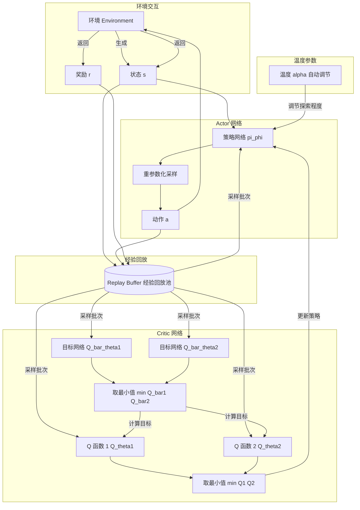
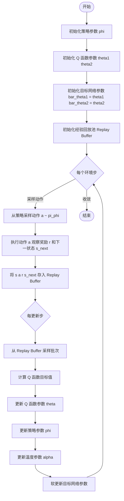

# SAC 简单工作流程

## 1. 整体架构总览

### 重参数化采样（Reparameterization Trick）详解

#### 问题背景

在 SAC 中，Actor（策略网络）输出的是一个**随机策略**——给定状态 $s_t$，它输出一个**高斯分布**（均值和方差），然后从这个分布中**采样**出一个动作 $a_t$ 来执行。

问题在于：**采样操作是不可微的**。如果直接对策略 $\pi_\phi(a_t|s_t)$ 采样，梯度无法通过采样节点反向传播到策略网络的参数 $\phi$。

#### 重参数化的核心思想

重参数化技巧的核心是：**把"从分布中采样"这个随机性，从模型参数中剥离出来**。

论文中的公式（8）：

> $$a_t = f_\phi(\epsilon_t; s_t)$$

(Haarnoja 等, 2019)

具体做法是：

1. **不直接采样** $a_t \sim \pi_\phi(\cdot|s_t)$（这不可微）
2. 而是先从一个**固定的简单分布**（如标准高斯 $\mathcal{N}(0, I)$）中采样一个**噪声** $\epsilon_t$
3. 然后用一个**可微的变换** $f_\phi$ 把噪声映射到动作空间

对于 SAC 的高斯策略：

$$a_t = \mu_\phi(s_t) + \sigma_\phi(s_t) \odot \epsilon_t, \quad \epsilon_t \sim \mathcal{N}(0, I)$$

其中：

- $\mu_\phi(s_t)$ — 策略网络输出的**均值**
- $\sigma_\phi(s_t)$ — 策略网络输出的**标准差**
- $\epsilon_t$ — 从标准高斯采样的**独立噪声**
- $\odot$ — 逐元素相乘

#### 为什么需要重参数化？

**没有重参数化**时，策略梯度是：

$$\nabla_\phi J = \mathbb{E}_{a_t \sim \pi_\phi}[\nabla_\phi \log \pi_\phi(a_t|s_t) \cdot Q(s_t,a_t)]$$

这是 **REINFORCE / 似然比梯度估计器**，方差很大，需要大量样本才能稳定。

**有了重参数化**后，策略目标变为（公式 9）：

> $$J_\pi(\phi) = \mathbb{E}_{s_t\sim\mathcal{D},\epsilon_t\sim\mathcal{N}}[\alpha\log\pi_\phi(f_\phi(\epsilon_t;s_t)|s_t) - Q_\theta(s_t,f_\phi(\epsilon_t;s_t))]$$

(Haarnoja 等, 2019)

这里的期望是对**噪声 $\epsilon_t$** 求的，而 $\epsilon_t$ 的分布与 $\phi$ 无关。因此梯度可以直接通过 $f_\phi$ 链式法则传播回去（公式 10）：

> $$\hat{\nabla}_\phi J_\pi(\phi) = \nabla_\phi\alpha\log(\pi_\phi(a_t|s_t)) + (\nabla_{a_t}\alpha\log(\pi_\phi(a_t|s_t)) - \nabla_{a_t}Q(s_t,a_t))\nabla_\phi f_\phi(\epsilon_t;s_t)$$

(Haarnoja 等, 2019)

#### 直观类比

想象你要训练一个画家画"随机但好看的画"：

- **无重参数化**：你让画家凭感觉画，画完后你说"好/不好"，画家只能凭运气猜怎么改——**方差大、学得慢**
- **有重参数化**：你给画家一张**随机噪声图**（固定来源的随机性），然后训练一个**可微的滤镜**把噪声变成画。这样你可以直接计算"画得好不好"对滤镜参数的梯度——**方差小、学得快**

#### SAC 中的额外处理：tanh 压缩

由于连续控制任务的动作通常有边界（如 $[-1, 1]$），SAC 在重参数化采样后还加了一个 $\tanh$ 压缩：

$$a_t = \tanh(\mu_\phi(s_t) + \sigma_\phi(s_t) \odot \epsilon_t)$$

这导致需要对数似然做修正（变量变换公式）：

> $$\log\pi(a|s) = \log\mu(u|s) - \sum_{i=1}^D \log(1 - \tanh^2(u_i))$$

(Haarnoja 等, 2019)

其中 $u_t = \mu_\phi(s_t) + \sigma_\phi(s_t) \odot \epsilon_t$ 是压缩前的原始动作。

#### 总结

||无重参数化（REINFORCE）|有重参数化（SAC）|
|---|---|---|
|采样方式|$a_t sim pi_phi(cdot\|s_t)$|$a_t = f_phi(epsilon_t; s_t), epsilon_t sim mathcal{N}$|
|随机性来源|策略分布本身|固定的外部噪声 $epsilon_t$|
|梯度传播|通过 $log pi$ 的分数估计|直接通过 $f_phi$ 链式法则|
|方差|高|低|
|实现复杂度|简单|稍复杂|

重参数化技巧让 SAC 能够**高效地训练随机策略**，既保留了随机策略的探索能力，又获得了类似 DDPG 的低方差梯度估计，这是 SAC 成功的关键因素之一。

## 2. 算法伪代码流程

## 3. 关键公式

### 最大熵目标
$$
\pi^* = \arg\max_\pi \sum_t \mathbb{E}[r(s_t,a_t) + \alpha\mathcal{H}(\pi(\cdot|s_t))]
$$

### Soft 状态值函数
$$
V(s_t) = \mathbb{E}_{a_t\sim\pi}[Q(s_t,a_t) - \alpha\log\pi(a_t|s_t)]
$$

### Critic 损失函数
$$
J_Q(\theta) = \mathbb{E}_{(s_t,a_t)\sim\mathcal{D}}\left[\frac{1}{2}\left(Q_\theta(s_t,a_t) - (r + \gamma V_{\bar{\theta}}(s_{t+1}))\right)^2\right]
$$

### Actor 损失函数
$$
J_\pi(\phi) = \mathbb{E}_{s_t\sim\mathcal{D},\epsilon_t\sim\mathcal{N}}[\alpha\log\pi_\phi(f_\phi(\epsilon_t;s_t)|s_t) - Q_\theta(s_t,f_\phi(\epsilon_t;s_t))]
$$

### 温度参数损失函数
$$
J(\alpha) = \mathbb{E}_{a_t\sim\pi_t}[-\alpha\log\pi_t(a_t|s_t) - \alpha\bar{\mathcal{H}}]
$$

---

Written by LLM-for-Zotero.
