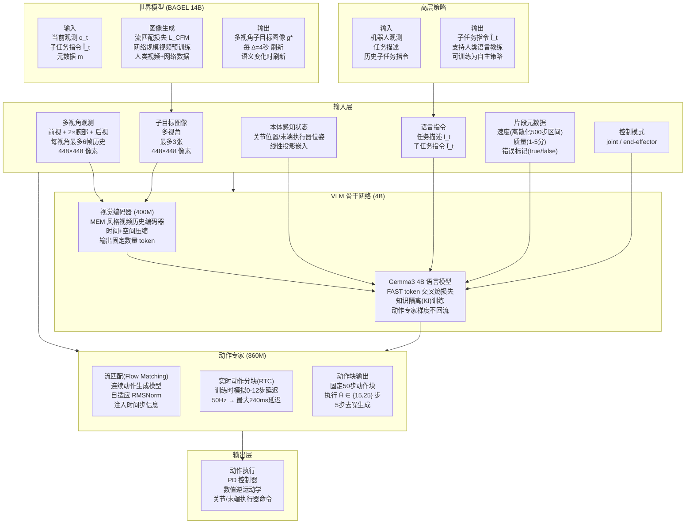
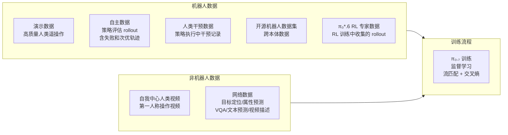
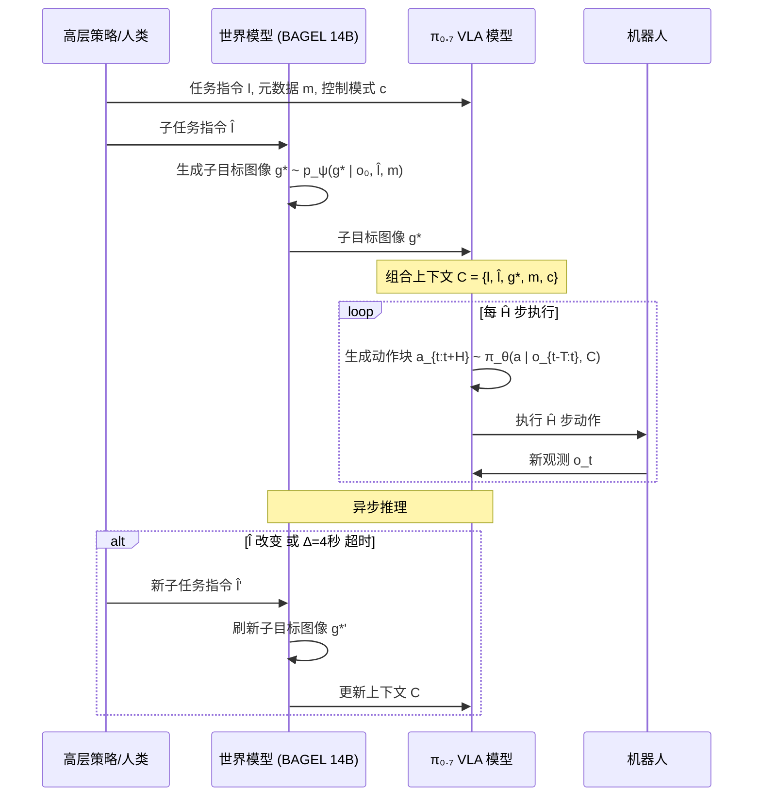
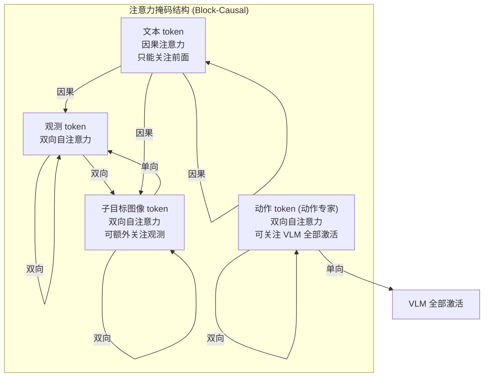
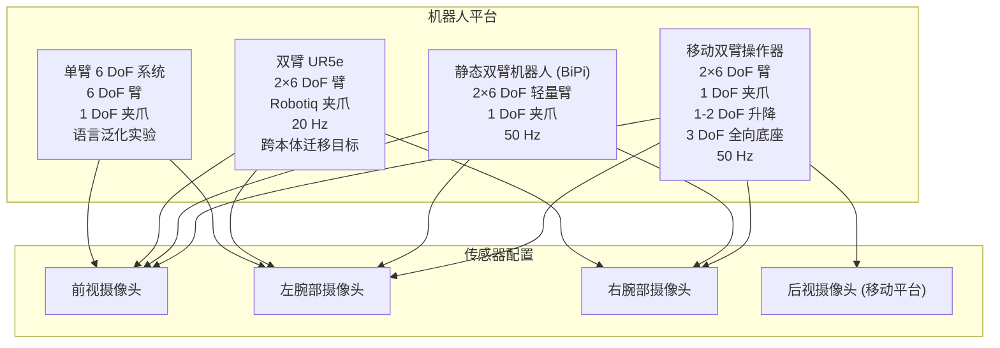

# $\pi_{0.7}$ 架构图

## 总体架构

## 训练数据组成

## 推理流程

## 注意力掩码机制

## 机器人平台

## 关键参数汇总

| 参数 | 值 |
|------|-----|
| VLM 骨干 | Gemma3 4B (含 400M 视觉编码器) |
| 动作专家 | 860M Transformer |
| 总参数量 | ~5B |
| 世界模型 | BAGEL 14B MoT |
| 输入图像分辨率 | 448×448 |
| 摄像头视角 | 最多 4 个 (前视+2×腕部+后视) |
| 历史帧数 | 每视角最多 6 帧 (步长 1秒) |
| 子目标图像 | 最多 3 张 (不含后视) |
| 动作块长度 | 50 步 |
| 执行步数 Ĥ | 15-25 步 |
| 机器人频率 | 50 Hz (UR5e: 20 Hz) |
| 子目标刷新间隔 | ∆=4 秒 |
| CFG 权重 β | {1.3, 1.7, 2.2} |
| 去噪步数 | 5 步 |
| 训练随机丢弃 | 子目标图像 25% 添加, 子任务指令 30%, 元数据 15%, 历史帧 30%, 后视 30% |

---

Written by LLM-for-Zotero.
