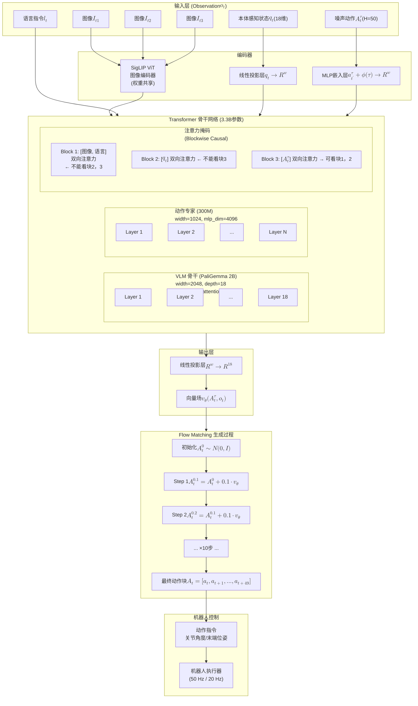
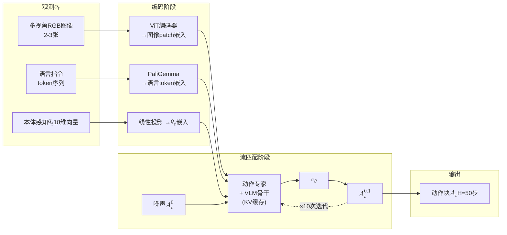
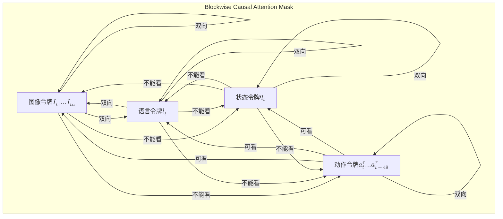
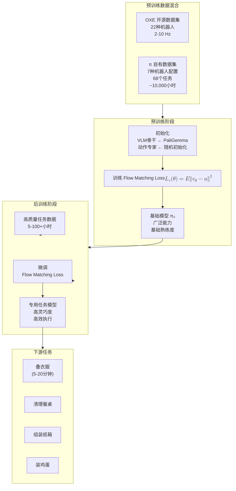

# π₀ 架构图

## 整体架构概览

---

## 数据流详解

---

## 注意力掩码结构

---

## 训练流程

---

## 关键参数汇总

| 组件 | 参数 | 说明 |
|------|------|------|
| VLM 骨干 | PaliGemma 2B | width=2048, depth=18, mlp_dim=16384, num_heads=18, num_kv_heads=1, head_dim=256 |
| 动作专家 | ~300M | width=1024, mlp_dim=4096 |
| 总参数量 | ~3.3B | 2B + 300M + ViT 编码器等 |
| 动作块长度 H | 50 | 一次预测50步动作 |
| 流匹配步数 | 10 | δ=0.1 欧拉积分 |
| 控制频率 | 50 Hz / 20 Hz | 灵巧任务50Hz，UR5e/Franka 20Hz |
| 推理延迟 | ~73ms (板载) / ~86ms (无线) | NVIDIA RTX 4090 |
| 状态/动作维度 | 18 | 零填充兼容不同机器人 |
| 图像数量 | 2-3 | 腕部相机 + 外部相机 |

---

Written by LLM-for-Zotero.
