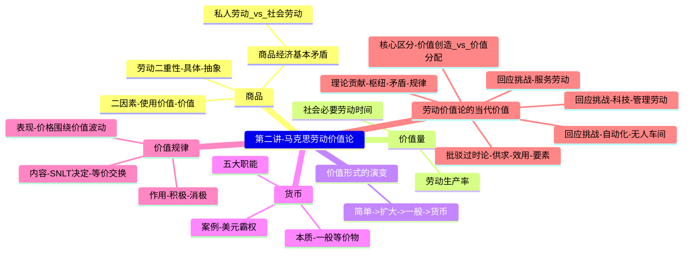

# 专题五：资本主义论
## 第二讲：马克思劳动价值论及其当代价值 (完整版)

> [!summary] 本讲核心
> 本讲是《资本论》的理论基石。我们将深入探讨马克思的劳动价值论，从基础原理到当代挑战，核心是解决以下问题：
> 1.  **商品**为什么同时具有**使用价值**和**价值**？（商品二因素）
> 2.  **劳动**为什么能同时创造这两种东西？（**劳动二重性**）
> 3.  商品的**价值**到底是由什么决定的？（社会必要劳动时间）
> 4.  商品经济的**根本矛盾**是什么？（私人劳动与社会劳动的矛盾）
> 5.  价值形式如何演变为**货币**？（货币起源与职能）
> 6.  商品经济的**基本规律**是什么？（价值规律）
> 7.  劳动价值论在**当代**（服务业、自动化时代）**是否过时**？

---

### 一、 马克思是如何分析“劳动创造价值”的？

#### 1. 批判与继承：对古典政治经济学的超越
- **(一) 古典经济学家的贡献 (亚当·斯密, 大卫·李嘉图)**
    - 他们首次提出了“劳动是价值的源泉”的观点，奠定了劳动价值论的基础。
- **(二) 古典经济学家的局限：**
    1.  没有区分“劳动”和“劳动二重性”，因此无法回答“什么劳动创造价值”。
    2.  不能区分“价值”和“交换价值”，无法科学解释价值量。
    3.  混淆了“劳动”和“劳动力”，因此无法科学揭示“剩余价值”（利润）的真正来源。
- **(三) 马克思的伟大创新**
    - 马克思通过“劳动二重性”和“社会必要劳动时间”等概念，科学地解决了上述所有问题。
    - 他分析的出发点是**商品**——资本主义社会最简单的“经济细胞”。
    > [!quote]
    > “分析经济形态，既不能用显微镜，也不能用化学试剂。二者都必须用**抽象力**来代替。而对资产阶级社会说来，**劳动产品的商品形态，或者商品的价值形态**，就是经济的细胞形态。”
    > — 马克思, 《资本论》第一卷

---

### 二、 商品经济与商品

#### 1. 什么是商品经济？
- **商品经济：** 是以**交换为目的**而进行生产的经济形态，是一定的**社会历史范畴**。
- **与自然经济的区别：** 自然经济（自给自足）的生产目的是为了满足生产者自身的需求，产品不用于交换。

#### 2. 什么是商品？
- **定义：** 商品是用来**交换**、能满足人们某种需要的**劳动产品**。
- **关键点：** 并非所有劳动产品都是商品。只有**以交换为目的**的劳动产品才是商品。
> [!example] 随堂练习
> “一个物可以有用，而且是劳动产品，但不是商品。”符合这个描述的是：
> - **A. 中世纪农民为封建主作为代役租的粮食** (这是封建地租，是强制缴纳，不是等价交换)
> - **B. 农民为家人生产并用于消费的衣副产品** (这是自给自足，不是为了交换)

#### 3. 商品经济产生的社会历史条件
商品交换的产生需要两个基本条件：
- **(一) 社会分工：**
    - 社会分工使人们的产品日益丰富，产生了**互相交换劳动产品**的需求。
- **(二) 生产资料和劳动产品属于不同的所有者：**
    - 这是商品交换的**决定性条件**。在私有制下，一个人要得到别人的产品，就只能通过**等价交换**。

---

### 三、 商品的二因素：使用价值与价值

商品是使用价值和价值的**对立统一体**：

- **(一) 使用价值 (Use-Value)：**
    - **定义：** 商品能满足人某种需要的**有用性**。它是商品的**自然属性**。
    - **特点：** 使用价值是**价值的物质承担者**。
    > [!question] 思考：空气、阳光有价值吗？
    > **答案：** 它们有**使用价值**（满足人的需求），但**没有价值**。因为价值是**商品**（用于交换的劳动产品）特有的社会属性。空气、阳光不是劳动产品，所以没有价值。

- **(二) 价值 (Value)：**
    - **定义：** 凝结在商品中的**无差别的一般人类劳动**，即人的脑力和体力的耗费。
    - **特点：** 价值是商品**特有的社会属性**，其本质是商品生产者之间相互交换劳动的**社会关系**。

- **(三) 交换价值 (Exchange-Value)：**
    - 价值是看不见、摸不着的，它必须通过**交换价值**表现出来。
    - **定义：** 一种使用价值同另一种使用价值相交换的**量的比例关系**。（例如：`1只绵羊 = 2把斧头`）
    - **基础：** 二者之所以能交换，是因为它们背后都凝结了**等量的一般人类劳动（价值）**。

- **(四) 二者的对立统一关系：**
    - **统一性：** 商品必须**同时具有**使用价值和价值。
    - **对立性（矛盾性）：** 对于同一个商品，使用价值和价值是**互斥**的，二者不可兼得。
        - **对购买者而言：** 必须付出价值（货币）才能获得使用价值。
        - **对销售者而言：** 必须让渡使用价值（把商品给别人）才能实现价值（换回货币）。

---

### 四、 马克思的重大发现：劳动的二重性

> [!tip] 核心突破
> 为什么商品会具有“使用价值”和“价值”这两个对立的因素？马克思的伟大发现是：这是由生产商品的**劳动本身具有二重性**决定的。
> **劳动二重性**学说是理解马克思主义政治经济学的“枢纽”。

- **(一) 具体劳动 (Concrete Labor)**
    - **定义：** 生产**一定使用价值**的、具有**具体形式**的劳动。（如裁缝、木匠的劳动）
    - **作用：** **具体劳动创造使用价值。**
    - **属性：** 劳动的**自然属性**。
- **(二) 抽象劳动 (Abstract Labor)**
    - **定义：** 撇开一切具体形式的、**无差别的一般人类劳动**，即人的**体力和脑力**的耗费。
    - **作用：** **抽象劳动创造（或形成）价值。**
    - **属性：** 劳动的**社会属性**（只有在商品经济中才存在）。

> [!quote]
> “一切劳动，一方面是人类劳动力在生理学意义上的耗费……它形成商品价值。一切劳动，另一方面是人类劳动力在特殊的、有一定目的的形式上的耗费……它生产使用价值。”
> — 马克思, 《资本论》第一卷

---

### 五、 价值量 (The Magnitude of Value)

> [!note] 核心问题
> 既然“抽象劳动”创造价值，那么我们该如何**衡量**一个商品里包含了多少价值呢？

- **(一) 价值量的决定**
    - **定义：** 商品的价值量不是由**个别劳动时间**决定的，而是由**社会必要劳动时间 (SNLT)** 决定的。
    > [!quote]
    > “社会必要劳动时间是在现有的社会正常的生产条件下，在社会平均的劳动熟练程度和劳动强度下，制造某种使用价值所需要的劳动时间。”
    > — 马克思, 《资本论》第一卷
- **(二) 价值量与劳动生产率**
    - **价值量**同**社会劳动生产率**成**反比**。
    - **推导：** 社会劳动生产率 ↑ → 生产单位商品所需要的 SNLT ↓ → 单位商品的价值量 ↓
    - **结论：** 科技越发达，生产效率越高，单位商品（如手机、汽车）就越便宜（价值越低）。

---

### 六、 商品经济的根本矛盾

> [!danger] 根本矛盾：私人劳动与社会劳动的矛盾
> 劳动二重性进一步引申出了商品经济最深刻、最根本的矛盾。

- **(一) 私人劳动 (Private Labor)：**
    - **原因：** 生产资料私有制。
    - **表现：** 生产者的劳动是**独立**进行的，生产什么、生产多少由自己决定。
- **(二) 社会劳动 (Social Labor)：**
    - **原因：** 社会分工。
    - **表现：** 劳动是为了**交换**，为了满足**社会需求**。
- **(三) 矛盾的体现：**
    - 商品生产者在生产时，并不知道自己的“私人劳动”是否能被社会所承认。
    - **命运：** 只有当他/她把商品**成功卖掉**（即完成了交换），“私人劳动”才被证明是“社会劳动”的一部分，其价值才得以实现。
    - **商品拜物教 (Commodity Fetishism)：** 在这个过程中，商品似乎变成了一种神秘的、有自主生命的东西，它反过来**支配**着生产者的命运。人与人之间的**社会关系**，被**物与物之间的关系**所掩盖了。

> [!warning] 资本主义的最终矛盾
> 在资本主义社会，这个“私人劳动与社会劳动的矛盾”进一步演化为：
> **生产的社会化 (Socialized Production)**
> **VS**
> **资本主义私有制 (Private Ownership)**
> 随着生产力的不断发展，这种“私有制”的束缚会越来越大，社会矛盾不断激化，最终必然导致资本主义被新的、更高级的社会形态所代替。

---

### 七、 货币 (Money) 的起源与职能

#### 1. 商品价值形式的演变
- **阶段一：简单的或偶然的价值形式** (`1只绵羊 = 2把斧头`)
- **阶段二：总和的或扩大的价值形式** (`1只绵羊 = 2把斧头` 或 `3根麻布` ...)
- **阶段三：一般价值形式** (所有商品都交换某一种商品，如`绵羊`)
- **阶段四：货币形式** (“一般等价物”固定在**贵金属**上)

#### 2. 货币的本质
> [!quote]
> “金银天然不是货币，但货币天然是金银。”
> — 马克思, 《资本论》第一卷
- **解释：** 金银的**自然属性**（稀有、稳定、可分）使它们**最适合**充当一般等价物。
- **本质：** 货币是**固定充当一般等价物的特殊商品**。

#### 3. 货币的五大职能
1.  **价值尺度：** 衡量和表现商品价值的大小（即“标价”）。此时只需**观念上的货币**。
2.  **流通手段：** 充当商品交换的媒介（“一手交钱，一手交货”）。此时必须是**现实的货币**（或纸币）。
3.  **贮藏手段：** 作为社会财富的代表被贮藏起来（“存钱”）。
4.  **支付手段：** 用于清偿债务、支付工资、租金、税款等（“赊账”或“发工资”）。
5.  **世界货币：** 在国际市场上发挥作用（如购买外国商品、支付逆差）。

> [!example] 当代案例：布雷顿森林体系 与 美元霸权
> - **布雷顿森林体系 (1944-1971)：** 确立了**美元与黄金挂钩**、**各国货币与美元挂钩**的体系，美元成为“准世界货币”。
> - **崩溃：** 1971年美国停止美元兑换黄金，体系瓦解。
> - **美元霸权：** 崩溃后，美元通过与石油等大宗商品挂钩，依然维持其主导地位。美国可利用此地位**输出通货膨胀**（印钞）、**收割全球财富**（加息）或进行**金融制裁**。

---

### 八、 价值规律 (The Law of Value) - 商品经济的基本规律

- **(一) 基本内容：**
    1.  **价值的决定：** 商品的价值量是由**社会必要劳动时间**决定的。
    2.  **交换的原则：** 商品交换以**价值量**为基础，按照**等价交换**的原则进行。
- **(二) 表现形式：**
    - **价格围绕价值上下波动**。受**供求关系**的影响，价格会偏离价值，但始终以价值为**中心轴**。
- **(三) 价值规律的作用 (双重作用)**
    - **1. 积极作用 (市场资源配置)：**
        - **调节**生产资料和劳动力在各部门的分配。
        - **刺激**生产者改进技术，提高劳动生产率。
        - **导致**优胜劣汰，调节社会收入分配。
    - **2. 消极作用 (盲目性与破坏性)：**
        - **导致**社会资源浪费（生产盲目性）。
        - **阻碍**技术进步（技术垄断）。
        - **导致**收入两极分化。

---

### 九、 马克思劳动价值论的当代价值 (深化与挑战)

> [!note] 核心问题
> 进入21世纪，随着服务业、信息技术和人工智能的发展，有人质疑：马克思的劳动价值论是否已经过时了？

#### 1. 挑战一：服务劳动是否创造价值？
- **(一) 马克思的广义“生产劳动”定义**
    - 马克思指出，**“生产劳动”**的定义是**历史的、社会**的。
    - 在资本主义制度下，**判断一个劳动是否为“生产劳动”，关键不在于它是否生产物质产品，而在于它是否为资本家生产“剩余价值”。**
    > [!quote]
    > “例如，一个自弹自唱的歌女是非生产劳动者。但是，同一个歌女被（资本家）雇佣，老板为了赚钱而让她去演唱，她就是生产劳动者了。因为她**直接生产资本**。”
    > — 马克思, 《政治经济学批判（1861-1863年手稿）》
- **(二) 结论**
    - 在当代，绝大部分服务业（如金融、IT服务、物流）都是**以盈利为目的**的，服务人员同样是**被资本雇佣**来创造剩余价值的。因此，**这部分服务劳动同样是“生产劳动”，同样创造价值。**

#### 2. 挑战二：科技/管理劳动如何创造价值？
- **(一) “总体工人” (Gesamtarbeiter) 理论**
    - 马克思预见到，生产过程将不再是“单个工人”的活动，而是“总体工人”的**社会化、协同性**活动。
    - **“总体工人”** 不仅包括**一线体力劳动者**，也包括从事**研发、设计、管理、协调**的**科技人员和管理人员**。
- **(二) 复杂劳动与价值创造**
    - 科技和管理人员的劳动是一种**“复杂劳动”**，它比“简单劳动”包含着**更多的知识、技能和脑力耗费**。
    - **结论：** 复杂劳动在**同一时间内**，能创造出**倍加的价值**。

#### 3. 挑战三：自动化 (“无人车间”) 是否创造价值？
- **(一) 现象：** “无人车间”、“无人工厂”大量出现，机器替代了人力。
- **(二) 马克思主义的回答：**
    - 自动化生产**不创造**新价值，它只是**价值转移**的效率**极高**的形式。
    1.  **机器（固定资本）的价值：** 机器本身是**物化劳动**（过去的人类劳动）的结晶，它在生产过程中，只**转移**其**自身的价值**到新产品中去。
    2.  **新价值的来源：** 机器**不创造**新价值。新价值的**唯一源泉**仍然是**活劳动**（人的劳动）。
    3.  **“无人车间”的本质：** 并非真的“无人”，而是将活劳动从“车间内的直接操作”转移到了“车间外的研发、编程、维护、管理”等环节。这些**高强度的、复杂的脑力劳动**，是新价值的主要来源。

#### 4. 当代挑战的最终总结：区分“价值创造”与“价值分配”
- **(一) 价值创造 (Value Creation)**
    - **回答的问题：** “价值**从哪里来**？”
    - **唯一源泉：** **只有活劳动**（劳动者的抽象劳动）才能**创造**新价值。
- **(二) 价值分配 (Value Distribution)**
    - **回答的问题：** “价值**到哪里去**？”
    - **决定依据：** 由**生产要素的所有权**来决定。
- **(三) 对“要素价值论”的最终批驳**
    - **错误观点 (要素价值论)：** 认为价值是由劳动、资本、土地、技术、数据等**多种要素共同创造**的。
    - **批驳：** 这种理论**混淆了“价值创造”和“价值分配”**。
    - **真相：**
        1.  **只有劳动（活劳动）**才能**创造**新的价值。
        2.  资本、土地、技术、数据等要素的**所有者**（资本家、地主、平台方），凭借其**所有权**（垄断地位），在**分配环节**无偿地**占有和分割**了劳动者创造的价值（剩余价值）。
- **(四) 当代中国的启示 (社会主义市场经济)**
    - 坚持劳动价值论的**根本立场**：
    1.  **承认劳动是价值的唯一源泉**，这是制定分配制度的**理论基础**。
    2.  **完善分配制度：** 既要坚持**按劳分配**为主体（承认劳动的首要地位），又要承认资本、技术、管理、数据等**生产要素**参与**价值分配**（调动一切积极性），实现多种分配方式并存。

