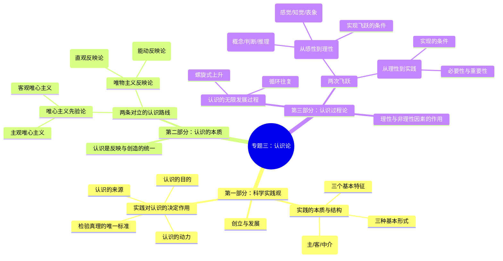

## tag: 课程笔记, 马克思主义, 哲学, 认识论

# 专题三：辩证唯物主义认识论 (完整讲义)

> [!summary] 课程核心思想
> 
> 本专题的核心论点是：实践是认识的基础。
> 
> 整个课程围绕这一核心，分为前后关联、层层递进的三个主要部分：
> 
> 1. **[[#第一部分：科学实践观]]**：探讨作为认识论起点的“实践”是什么。
>     
> 2. **[[#第二部分：认识的本质]]**：探讨“认识”是什么，以及哲学史上两大对立的认识路线。
>     
> 3. **[[#第三部分：认识过程论]]**：详解认识从实践中来，再回到实践中去的完整动态过程。
>     

---

## 第一部分：科学实践观

> [!note] 核心问题
> 
> 在讨论“认识”之前，我们必须先搞清楚产生认识的基础——实践。马克思主义哲学首次将实践提升到核心地位，从而创立了科学的实践观。

### 一、 对马克思主义诞生前各种实践观的批判

#### 1. 西方哲学的局限

旧哲学虽然也讨论“实践”，但都未能理解其实质：

- **康德 (Kant):** 把实践看成是理性的、先天的**道德活动**。
    
- **黑格尔 (Hegel):** 把实践归结为主体自我意识的**精神活动**。
    
- **费尔巴哈 (Feuerbach):** 将实践局限于**日常生活和生物本能活动**。
    

> [!failure] 结论
> 
> 他们都没有看到，改造客观世界的物质生产活动才是最基本的实践，因此未能理解实践在社会历史和认识活动中的决定性意义。

#### 2. 马克思实践观与旧哲学的对比

|维度|黑格尔的“实践” (唯心)|费尔巴哈的“实践” (直观)|**马克思的“实践” (科学)**|
|---|---|---|---|
|**主体**|抽象的“绝对精神”|感性的自然存在物|**现实的、社会关系中的人**|
|**性质**|精神的、观念的自我运动|对日常生活的直观感受|**改造客观世界的物质活动**|
|**立场**|唯心辩证法|直观唯物主义|**辩证唯物主义与历史唯物主义**|

---

### 二、 科学实践观的创立与哲学的历史性变革

> [!quote] 哲学的根本任务：从“解释世界”到“改变世界”
> 
> “哲学家们只是用不同的方式解释世界，问题在于改变世界。”
> 
> — 马克思, 《关于费尔巴哈的提纲》

这一论断标志着哲学实现了历史性变革，从书斋走向了广阔的现实世界。

---

### 三、 实践的本质、结构与形式

#### 1. 实践的三个基本特征

- **客观实在性:** 实践的要素(主体、客体、中介)、过程和结果都是客观的，不以人的意志为转移。
    
- **自觉能动性:** 实践是人在一定意识指导下，**有意识、有目的**地改造世界的活动，致力于变“自在之物”为“为我之物”，这与动物的本能活动有本质区别。
    
- **社会历史性:** 实践总是在一定的社会关系中进行，并随着社会历史的发展而发展。
    

> [!question] 案例思考：鲁滨逊在荒岛上的活动有社会性吗？
> 
> 有。因为他使用的语言、知识、求生技能和制造工具的能力，都是在离开社会前从人类社会中获得的，是社会历史发展的产物，是社会关系的延伸。

#### 2. 实践的基本结构与辩证关系

- **结构三要素:**
    
    - **主体:** 从事活动的人。
        
    - **客体:** 活动所指向的对象。
        
    - **中介:** 连接主客体的工具、手段和方法。
        
- **主客体的辩证转化:**
    
    - **客体主体化:** 通过实践，客体（如铁矿石）被改造成满足主体需要的产品（如铁路），成为主体生命活动的一部分。
        
    - **主体客体化:** 在实践中，主体的知识、技能和意志凝聚、物化在劳动产品中。
        

#### 3. 实践的三种基本形式

1. **物质生产实践:** 最基本的实践活动，决定其他一切活动。
    
2. **社会政治实践:** 处理社会关系的活动，如国家治理、社会改革等。
    
3. **科学文化实践:** 生产精神文化产品的活动，如科学实验、文艺创作等。
    

---

## 第二部分：认识的本质

> [!note] 核心问题
> 
> 搞清楚了“实践”之后，我们来探讨“认识”本身。认识是什么？它是如何产生的？

### 一、 两条根本对立的认识路线

> [!question] 问题导入：认识是镜子式的反映吗？
> 
> 许多哲学流派，无论东西方，都曾用“镜子”来比喻心灵对外部世界的反映。但这个比喻恰当吗？

#### 1. 核心分歧：唯心主义 vs 唯物主义

|派别|认识路线|基本观点|
|---|---|---|
|**唯心主义 (Idealism)**|**先验论 (Apriorism)**|**从意识到存在** (主观→客观)。认为认识先于经验，是生而有之的或神赋予的。|
|**唯物主义 (Materialism)**|**反映论 (Reflection Theory)**|**从存在到意识** (客观→主观)。认为认识是主体对客体的反映，来源于实践。|

#### 2. 唯心主义认识路线

- **主观唯心主义:** 把**个人**主观精神视为世界本原。
    
    - > [!example] 例子
        
    
    > - **慧能:** “不是风动，不是幡动，仁者心动。”
    >     
    > - **孟子:** “良知良能”是天生的。
    >     
    
- **客观唯心主义:** 把某种**“客观”**精神（理念、天理）视为世界本原。
    
    - > [!example] 例子
        
    - **柏拉图:** 认识即“回忆”理念世界。
        
    - **笛卡尔:** “天赋观念”是上帝放置的。
        

#### 3. 唯物主义认识路线

- **旧唯物主义（直观反映论）:**
    
    - **特点:** 把认识看作是**消极、被动、镜子式**的直观反映。
        
    - **局限:** 脱离了社会实践，不理解认识的能动性和辩证过程。
        
- **辩证唯物主义（能动反映论）:**
    
    - 这是马克思主义的认识论。
        

### 二、 辩证唯物主义的认识本质：能动的反映

> [!faq] “镜子比喻”问题解答
> 
> 辩证唯物主义认为，“镜子比喻”是不完全恰当的。因为它只揭示了认识的反映性，却忽略了更重要的创造性和实践基础。

- **认识是反映性与创造性的统一:**
    
    - **反映性:** 认识的内容来源于客观世界。
        
    - **创造性:** 认识不是简单复制，而是对外部信息进行**抽象、概括、重构**，从而把握事物的本质和规律。
        
    - > [!example] 案例：“龙”的形象
        
    
    > “龙”的形象，是在摹写现实中多种动物（蛇身、鹿角、鱼鳞等）特征的基础上，进行艺术创造和抽象概括的产物，体现了反映与创造的统一。
    

---

## 第三部分：认识过程论

> [!note] 核心问题
> 
> 认识不是一个静止的点，而是一个动态的过程。这个过程是如何展开的？

### 一、 认识过程的“两次飞跃”

认识过程是一个从实践到认识，再从认识到实践的完整过程，包含两次关键的飞跃。

### 二、 第一次飞跃：从感性认识到理性认识

#### 1. 两个阶段：感性认识与理性认识

|认识阶段|**感性认识 (Sensory Knowledge)**|**理性认识 (Rational Knowledge)**|
|---|---|---|
|**内容**|事物的**现象、外部联系**|事物的**本质、全体、内部联系和规律**|
|**特征**|**直接性**、**形象性**|**间接性**、**抽象性**|
|**形式**|感觉、知觉、表象|概念、判断、推理|
|**地位**|认识的**初级阶段**，是理性认识的基础|认识的**高级阶段**|

#### 2. 二者的辩证关系

- **理性依赖感性:** 感性认识是基础和起点。
    
- **感性有待发展为理性:** 认识必须深化，才能把握本质。
    

> [!failure] 两种错误倾向
> 
> - **唯理论 → 教条主义:** 轻视感性经验，从书本出发。
>     
> - **经验论 → 经验主义:** 轻视理论指导，满足于个人狭隘经验。
>     

#### 3. 实现第一次飞跃的两个条件

1. **投身实践:** 获取丰富、真实的感性材料。
    
2. **思维加工:** 对感性材料进行“去粗取精、去伪存真、由此及彼、由表及里”的抽象思考。
    

### 三、 第二次飞跃：从理性认识到实践

> [!tip] 第二次飞跃比第一次飞跃意义更重大
> 
> 因为只有回到实践，认识才能获得检验，理论才能转化为改造世界的物质力量。

#### 1. 必要性和重要性

- **目的性:** 认识世界的目的在于**改造世界**。
    
- **检验性:** 认识的真理性只有在实践中才能得到最终的**检验、修正和发展**。
    

#### 2. 实现第二次飞跃的条件

1. 从实际出发，坚持理论和具体实践相结合。
    
2. 经过一定的中介环节（制定方案、进行试验等）。
    
3. 理论必须为**群众所掌握**，才能转化为物质力量。
    
4. 要有正确的实践方法。
    

### 四、 认识过程中理性因素与非理性因素的作用

- **定义:** 非理性因素主要指认识主体的**情感、意志**，以及**联想、想象、直觉、灵感**等非逻辑思维形式。
    
- **作用:** 人的认识是**理性因素和非理性因素协同作用**的结果。非理性因素对科学发现和理论创新具有重要的激发和推动作用。
    

> [!example] 案例：凯库勒的梦
> 
> 化学家凯库勒在梦中受到一条首尾相连的蛇的启发，顿悟并提出了“苯环”的分子结构。

### 五、 认识无限发展的总过程

> [!question] 经历了两次飞跃，认识就完成了吗？
> 
> 答案：既完成了，又没有完成。
> 
> - **“完成”** 是指对某一具体事物的认识。
>     
> - **“没有完成”** 是指整个实践和认识是无限发展的。
>     

认识是一个**“实践、认识、再实践、再认识，循环往复以至无穷”**的**波浪式前进、螺旋式上升**的过程。

> [!quote] 时代要求
> 
> “实践没有止境，理论创新也没有止境。我们必须在理论上跟上时代……”
> 
> — 习近平

---

### **本讲小结 (思维导图)**

