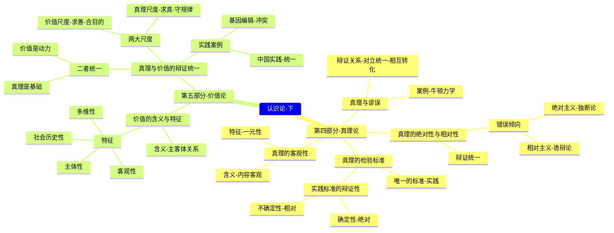

# 专题三（下）：真理论与价值论

> [!summary] 本讲核心
> 本讲义聚焦于认识论的后半部分，探讨认识的成果与目的。
> 1.  **[[#第四部分：真理论]]**：探讨认识的成果——“真理”是什么？它有何特性？我们又该如何检验它？
> 2.  **[[#第五部分：价值论]]**：探讨认识的目的——“价值”是什么？我们如何在追求真理（“求真”）的同时实现价值（“求善”）？

---

## 第四部分：真理论

> [!note] 核心问题
> 认识的目的是追求真理。那么，什么是真理？真理有何特性？我们又该如何检验真理？

### 一、 问题导入：资本主义是永恒的吗？

> [!quote]
> “一定要把关于资本主义兴起的历史叙述变成一般发展道路的历史哲学理论，一切民族，不管他们所处的历史环境如何，都注定要走这条道路……但是我要请他原谅。他这样做，会给我过多的荣誉，同时也会给我过多的侮辱。”
> — 马克思

- **讨论：** 马克思在这段话中所反对的，就是那种把资本主义看作永恒不变、所有民族都必须遵从的“绝对真理”的**独断论**思想。这引出了我们对“真理”本身特性的探讨。

### 二、 真理的客观性

- **1. 含义：** 真理首先是**客观的**。它的**内容**是对客观事物及其规律的正确反映，这种正确性不以任何人的主观意志、利益或好恶为转移。
- **2. 核心：** 承认“思想是外部世界的映象”（列宁），坚持唯物主义的认识路线。
- **3. 特征：真理的一元性**
    - 由真理的客观性决定。
    - 在特定时间、特定条件下，对特定对象的正确认识**只有一个**，不存在“多元真理”。

### 三、 真理与谬误

- **1. 谬误 (Fallacy):** 是对客观事物及其规律的**歪曲、颠倒**的反映。
- **2. 辩证关系：** 二者**对立统一**。
    - **对立：** 性质根本不同，一个是正确反映，一个是歪曲反映。
    - **统一：**
        1.  **相互依存：** 真理与谬误相比较而存在。
        2.  **相互转化：** 在一定条件下，真理会超出其适用范围而转化为谬误；谬误中也可能包含着真理的片断。

> [!example] 案例：真理与谬误的转化
> - **地心说：** 相对于“日心说”是谬误，但在它诞生的时代，它比神创论是更进一步的真理性认识。
> - **牛顿经典力学：** 在宏观、低速领域是颠扑不破的真理；但如果将其滥用到微观、高速的量子领域或宏观、高速的相对论领域，它就变成了谬误。这证明了任何真理都是有适用范围的。

### 四、 真理的绝对性与相对性

- **核心观点：** 任何真理都是**绝对性**与**相对性**的辩证统一。它既是绝对的，又是相对的。
- **概念辨析：**
| 概念 | **绝对真理** | **相对真理** |
| :--- | :--- | :--- |
| **含义一** (从整体看) | 指人类认识**最终**能达到的对无限发展世界的**完整、无条件**的正确认识。这是一个永无止境的过程。 | 指人类认识在**特定历史阶段**所达到的对世界**有限、不完善**的正确认识。 |
| **含义二** (从部分看) | 指任何真理认识中包含的**不容置疑的、正确的**客观内容。 | 指任何真理认识都有其**局限的、有条件的**一面，有待深化和扩展。 |
- **辩证关系：**
    1.  **相互依存：** 绝对真理寓于相对真理之中；无数相对真理的总和构成了绝对真理。
    2.  **相互转化：** 人类的认识就是无数相对真理不断积累，从而**无限逼近**绝对真理的过程。

> [!failure] 两种错误倾向
> - **1. 绝对主义 (独断论)：**
>     - **观点：** 片面夸大真理的绝对性，否认其相对性。
>     - **表现：** 思想僵化、教条主义、故步自封。
>     - **例：** “天不变，道亦不变”。
> - **2. 相对主义 (诡辩论)：**
>     - **观点：** 片面夸大真理的相对性，否认其绝对性和客观性。
>     - **表现：** 怀疑主义、不可知论。
>     - **例：** “人是万物的尺度”（认为没有客观标准）。

### 五、 真理的检验标准

- **(一) 哲学史上的纷争**
    - **主观真理论：** 否认真理的客观标准。如实用主义认为“有用即真理”。
    - **旧唯物主义：** 缺乏实践标准，导致其认识论是消极、直观的，无法科学地解决检验问题。
- **(二) 唯一的标准：实践**
    - **核心论点：** 只有**实践**才是检验真理的唯一标准。
    - **为什么？**
        1.  **真理的本性：** 真理是主观与客观的统一，而只有实践才能把主观（理论）和客观（现实）连接起来。
        2.  **实践的特点：** 实践是改造世界的物质活动，具有**“直接现实性”**，能将理论的设想变为现实的结果。
- **(三) 实践标准的辩证性：确定性与不确定性**
    - **1. 确定性 (绝对性)：**
        - 指的**是只有**实践能最终检验真理，别无他途。
        - 凡是被实践反复证明了的真理，都是不可推翻的。
    - **2. 不确定性 (相对性)：**
        - 指的是**某一个特定历史阶段**的实践，有其局限性，不能**一次性**地完全证实或证伪一切认识。
        - 检验真理是一个**动态、发展**的过程。
> [!quote]
> “必须把人的全部实践——当作真理的标准。”
> — 列宁

> [!tip] 学习意义
> 坚持实践的唯一标准，就要反对唯心主义的不可知论、教条主义的本本主义，以及实用主义的“有用即真理”。

---

## 第五部分：价值论

> [!note] 核心问题
> 认识真理（“是什么”）的最终目的，是为了实现价值（“应怎样”），即满足人的需求。

### 一、 价值的含义与基本特征

- **(一) 价值的含义**
    - **定义：** 价值是一种**主体与客体之间的关系**，指客体（事物、属性）能够满足主体（人、群体）需要的**意义**。
    - **价值的二重性：**
        1.  **客观基础：** 价值依赖于客体的**客观属性**。（一块石头无法满足“吃”的价值）
        2.  **主体属性：** 价值必须**“对主体有意义”**，它始终以**“主体为中心”**。（空气有客观属性，但对不需呼吸的物体就无价值）
- **(二) 价值的基本特征**
    - **1. 价值的主体性：** 价值与主体直接相关，因主体的不同、需求的不同而变化。
    - **2. 价值的客观性：** 在一定条件下，客体对于主体的价值不依赖于主观意识。
    - **3. 价值的多维性：** 同一个客体，对于不同的主体（或同一主体的不同需求）可以具有多种不同的价值。
    - **4. 价值的社会历史性：** 主体和客体都是社会历史性的存在，因此价值观念会随着社会历史的变化而变化。

### 二、 真理与价值的辩证统一

- **(一) 人类活动的两大尺度**
    - **1. 真理的尺度 (真理原则)：**
        - 指人们在实践中必须遵循**客观规律**，认识世界（“能做什么”）。
        - 它体现了人的活动中的**客观制约性**。
    - **2. 价值的尺度 (价值原则)：**
        - 指人们在实践中必须按照**自身的需求**去改造世界（“该做什么”）。
        - 它体现了人的活动中的**目的指向性**。

- **(二) 二者的辩证统一**
    - **成功的实践**，必须是**“真”**（符合客观规律）与**“善/美”**（满足主体价值）的统一。
    - **真理是价值的基础：** 价值追求必须以遵循客观规律为前提。
    - **价值是真理的动力与归宿：** 追求价值（满足需求）是人类探索真理的根本动力。
    - **二者的统一是历史的：** 真理与价值的统一，会随着实践的发展而不断发展到更高级的程度。

- **(三) 实践案例**
    - **1. 基因编辑技术 (CRISPR)：**
        - **真理：** 这项技术可以精确修改DNA，治疗疾病（“能做什么”）。
        - **价值冲突：** 它也可能被滥用（如制造“定制婴儿”），带来巨大的伦理风险（“不该做什么”）。
        - **启示：** 警示我们必须在真理的指导下进行正确的价值选择。
    - **2. 新时代中国特色社会主义的伟大实践：**
        - 这是真理尺度与价值尺度相统一的典范，既遵循了社会发展规律（真理），又满足了人民对美好生活的向往（价值）。

---
### 本讲小结 (第四、五部分)

