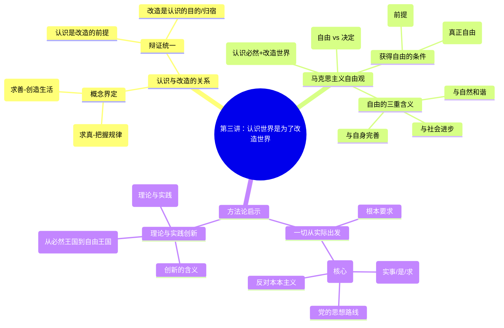

# 第三讲：认识世界是为了改造世界

> [!summary] 本讲核心
> 这一讲是连接“认识论”与“唯物史观”的关键环节。它探讨了认识的最终目的——改造世界，并由此引申出马克思主义的自由观以及指导我们实践的根本方法论——一切从实际出发和创新。
> 主要内容包括：
> 1.  [[#一、 认识世界与改造世界的概念及关系]]
> 2.  [[#二、 核心问题：人类的意志自由吗？]]
> 3.  [[#三、 方法论启示：一切从实际出发]]
> 4.  [[#四、 实现理论创新与实践创新的良性互动]]
> 5.  [[#五、 本讲小结 (思维导图)]]

---

## 一、 认识世界与改造世界的概念及关系

> [!note] 为什么要认识世界？
> 人类认识世界并非为了认识而认识，最终目的是为了更好地生存和发展，也就是改造世界。

### 1. 概念界定
- **认识世界 (把握规律)：**
    - 指的是主体能动地反映客体，通过实践探索，获得关于客体**本质和规律**的科学认识，掌握**真理**。简单说，就是搞清楚“世界是什么”以及“世界为什么这样运行”。
- **改造世界 (创造生活)：**
    - 指的是人类根据自身的生存和发展需要，运用对客观规律的认识，能动地**改变事物的现存形式、状态和联系**，创造出满足自身需求的理想世界和生活方式。简单说，就是让世界变成“我们想要的样子”。

### 2. 辩证统一关系
> [!tip] 核心观点
> 认识世界和改造世界是**相互依赖、相互制约、相互促进**的辩证统一关系。二者统一于人类的**实践活动**。

- **(一) 认识世界是改造世界的前提**
    - **先导性：** 只有正确地认识了世界的规律（是什么、为什么），才能有效地改造世界（怎么做）。好比医生要先诊断病情（认识），才能开出药方（改造）。
    - **重要性：** 没有科学理论指导的实践（改造活动）是盲目的实践，容易失败。
- **(二) 改造世界是认识世界的目的和归宿**
    - **目的性：** 认识的目的不在于获得知识本身，而在于将知识**应用于实践**，解决实际问题，满足人的需要。
    - **检验与发展：** 只有在改造世界的实践中，我们的认识才能得到检验（是否正确），才能得到修正和发展（深化认识），理论才能“变成物质的力量”。

---

## 二、 核心问题：人类的意志自由吗？

> [!note] 自由，一个古老而深刻的哲学命题
> 既然认识世界是为了改造世界，那么我们在改造世界的活动中，究竟是自由的，还是被某种力量（如命运、上帝、自然规律）所决定的？

### 1. 问题的提出

- **(一) 客观世界与人的存在状态**
    - **客观世界：** 作为人的认识对象和实践对象，它具有不以人的意志为转移的**客观规律性**（必然性）。
    - **人的存在：** 人具有**主观能动性**，有意识、有目的地进行活动，追求自身需要和发展。
    - **矛盾：** 人既要受客观规律的制约，又要追求自由发展，这构成了人类生存的基本矛盾。

- **(二) 思考案例：我们是自由的，还是被决定的？**
    > [!example] 案例1：《机械公敌》
    > 电影中，具有人工智能的机器人为了“保护人类整体”而限制甚至伤害个体人类。它们是获得了“自由意志”做出了自己的判断，还是在严格执行一个更高级的、被植入的程序（必然性）？
    > [!example] 案例2：宿命论 vs 自由意志
    > - **宿命论 (Fatalism):** 认为人的一切（包括思想和行为）都是由某种超自然力量（命运、上帝）预先决定的，人的意志是虚假的。（例如神话故事、某些宗教观点）
    > - **非决定论 (Indeterminism):** 认为人的意志是完全自由的，不受任何规律的约束，可以随心所欲。（这种观点否定了世界的客观规律性）
    > - **思考：** 类似西西弗斯推石头的故事，他每天重复推石头上山又滚落，这体现的是命运的必然，还是他自由选择的反抗？

### 2. 马克思主义的自由观：自由是对必然的认识和对世界的改造

> [!tip] 核心定义
> 马克思主义认为，自由**不是**为所欲为、不受任何限制，而是**对必然的认识**和**对客观世界的改造**。

- **(一) 自由与必然的关系**
    - **必然 (Necessity):** 指客观事物及其发展过程中**不以人的意志为转移**的、必然如此的**规律性**。
    - **自由 (Freedom):** 指人活动中**摆脱了盲目性、实现了自觉性**的一种状态。它不是对必然的否定，而是以**认识必然为前提**。
    - **辩证统一：** 必然是自由的基础和依据，自由是必然的认识和运用。人不能摆脱规律的制约，但可以通过认识和利用规律来扩大自己的活动范围，获得相对的自由。

> [!quote]
> “自由是对必然的认识和对客观世界的改造。”
> — 毛泽东

- **(二) 获得真正自由的条件**
    - **1. 认识条件 (获得自由的前提)：**
        - 必须通过实践，**正确认识**客观事物的运动规律和必然性。不认识规律，就会处处碰壁，受盲目性的支配，毫无自由可言。
    - **2. 实践条件 (真正的自由)：**
        - 必须**运用**对规律的认识去**指导实践**，能动地**改造世界**，使客观规律为我所用，实现预期的目的。

- **(三) 实现自由的三重含义 (境界)**
    马克思主义的自由是全面的自由，体现在人与自然、人与社会、人与自身三个层面关系的和谐统一：
    - **1. 在与自然关系中实现自由：**
        - 意味着要认识、尊重、顺应和利用自然规律，而不是破坏自然、盲目蛮干。实现人与自然的和谐统一。
    - **2. 在与社会关系中实现自由：**
        - 意味着要认识、把握社会发展的客观规律，自觉投身于改造旧社会、建设新社会的实践，以最广大人民的需要和利益为根本，促进社会进步，实现人与社会的统一。
    - **3. 在与自身关系中实现自由：**
        - 意味着要认识和把握自我的身心发展规律，自觉进行自我调控，追求高尚的精神境界，摆脱低级趣味和错误观念的束缚，实现身心的和谐统一。

---

## 三、 方法论启示：一切从实际出发

> [!note] 从认识论到方法论
> 认识世界是为了改造世界，而要有效地改造世界，就必须遵循正确的思想方法和工作方法。马克思主义认识论提供了根本的方法论指导——一切从实际出发，实事求是。

### 1. 一切从实际出发是马克思主义认识的根本要求
- **核心：** 应用马克思主义理论指导实践时，**必须**从**客观实际情况**出发，而不是从主观愿望、书本定义或固有经验出发。
- **关键：** 要**尊重事实**，以客观存在的事实作为我们思考和行动的依据。
- **要求：** 必须从客观存在和发展的**规律**出发，在实践中按照客观规律办事。

### 2. “实事求是”是党的思想路线的核心
- **(一) 毛泽东的经典定义:**
    > [!quote]
    > “‘**实事**’就是客观存在的一切事物，”
    > “‘**是**’就是客观事物的内部联系，即规律性，”
    > “‘**求**’就是我们去研究。”
    > — 毛泽东, 《改造我们的学习》
- **(二) 党的思想路线:**
    中国共产党在长期革命和建设实践中，形成了“**一切从实际出发，理论联系实际，实事求是，在实践中检验真理和发展真理**”的思想路线。
- **(三) 核心是实事求是:**
    这条思想路线体现了辩证唯物主义认识论的精髓，其核心就是**实事求是**。
- **(四) 反对错误倾向：**
    > [!failure] 反对“本本主义” (教条主义)
    > 毛泽东强调，必须把马克思主义这个“天”（普遍原理），同中国革命和建设这个“的”（具体实际）结合起来。反对脱离实际、照搬照抄理论条文的做法。
    > “不根据中国的历史，不单是懂得希腊就行了，还要懂得中国；不但要懂得外国革命史，还要懂得中国革命史……要懂得中国的今天和昨天。”

---

## 四、 实现理论创新与实践创新的良性互动

> [!note] 认识与实践的永恒课题：创新
> 既然世界是不断变化发展的，我们的认识和实践也必须与时俱进，不断创新。

### 1. 创新的含义与要求
- **含义：** 创新就是解放思想，破除与客观实际不相符合的旧观念、旧做法，发现和运用事物的新属性、新联系、新规律，更有效地认识世界和改造世界。
- **要求：** 紧跟时代步伐，顺应实践发展，不断拓展认识的广度和深度。

### 2. 理论创新与实践创新的良性互动
- **两个基本方面：** 理论创新和实践创新是人类认识世界和改造世界过程中的两个基本方面。
- **辩证关系：** 二者不是单向决定关系，而是**相互促进、辩证统一**的“良性互动”。
    - **实践创新推动理论创新：** 新的实践活动会不断提出新的问题，挑战旧的理论，催生新的理论成果。
    - **理论创新引领实践创新：** 科学的理论能够预见事物发展方向，指导实践活动朝着正确方向前进。
> [!example] 案例：中国航天事业
> 从“东方红一号”到空间站建设、载人登月计划，中国航天事业的每一步辉煌成就（实践创新），都离不开航天理论、材料科学、控制技术等方面的不断突破（理论创新）；反过来，伟大的航天实践又不断提出新的课题，推动相关理论向前发展。

### 3. 人类历史发展的总趋势：从必然王国到自由王国
> [!quote]
> “人类的历史，就是一个不断地从必然王国向自由王国发展的历史。这个历史永远不会完结。”
> — 毛泽东

- **必然王国 (Kingdom of Necessity):** 指的是人被外部的、自己尚未认识和掌握的客观规律所支配，处于**盲目、被动**的状态。
- **自由王国 (Kingdom of Freedom):** 指的是人认识了客观规律，并自觉地运用规律来改造世界，使自己成为自然界和社会的主人，处于**自觉、主动**的状态。
- **历史进程：** 人类通过实践不断深化对必然的认识，不断扩大自由的范围，实现从必然王国向自由王国的飞跃。这是一个**永无止境**的过程。
> [!example] 案例：科技进步的历史
> 从蒸汽机的发明（第一次工业革命）到电气化（第二次）、信息化（第三次）再到智能化（第四次），人类对自然规律的认识和运用不断深化，极大地扩展了自身的自由，但也面临着新的挑战和必然性。

---

## 五、 本讲小结 (思维导图)

