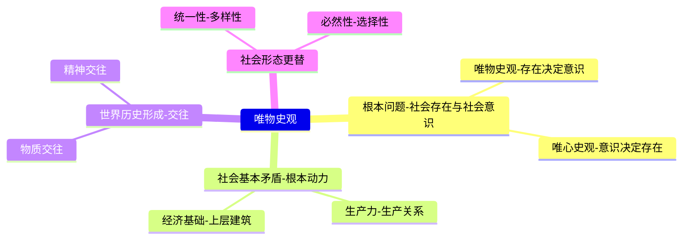

# 专题四：唯物史观 (全集终版讲义)

> [!summary] 本专题核心
> 唯物史观，即历史唯物主义，是马克思主义哲学的“两大发现”之一。它科学地回答了“社会存在与社会意识”的关系问题，揭示了人类社会发展的根本动力和一般规律，被誉为“唯一科学的历史观”。
> 
> **本专题将围绕以下四个核心问题展开：**
> 1.  为什么说唯物史观是“唯一科学的历史观”？（[[#一、 什么是历史观？]]）
> 2.  打开人类社会“历史之谜”的钥匙是什么？（[[#三、 打开“历史之谜”的钥匙：社会基本矛盾]]）
> 3.  世界历史如何形成和发展？（[[#四、 世界历史是如何形成和发展的？]]）
> 4.  社会形态如何更替？（[[#五、 社会形态是如何更替的？]]）

---

## 一、 什么是历史观？(唯物史观 vs 唯心史观)

### 1. 历史观的根本问题
- **历史观 (社会历史观)：** 就是人们对社会历史的总的看法和根本观点。
- **根本问题：** **社会存在与社会意识的关系问题**。
    - **通俗解释：** 到底是人们的物质生活（经济、生产）决定了人们的思想、政治和法律，还是反过来，人们的思想、政治和法律决定了物质生活？

### 2. 唯心史观 (历史唯心主义)
- **核心观点：** **社会意识决定社会存在**。
- **通俗解释：** 这种观点认为，历史的发展是由少数英雄人物的思想、意志（如凯撒、拿破仑），或者某种神秘的“绝对精神”（如黑格尔的“世界精神”）、“天命”所决定的。
- **局限性：** 它只看到了历史的表面现象（人的思想和活动），没有找到藏在背后的真正动力，最终把历史归结为少数精英的活动，否认了人民群众是历史的创造者。
> [!quote]
> “历史是精神的伸展，或者它的思想的实现。伟大的历史人物是‘世界精神的代理人’。”
> — 黑格尔, 《历史哲学》

### 3. 唯物史观 (历史唯物主义)
- **核心观点：** **社会存在决定社会意识**。
- **通俗解释：** 唯物史观彻底颠倒了唯心史观。它认为，不是人们的思想、观念决定了他们如何生活；相反，是人们的社会生活，特别是他们的**物质生产活动（经济基础）**，从根本上决定了他们的思想、观念、政治制度和法律。
- **科学性：** 它不是从抽象的概念出发，而是从**现实的、从事物质实践活动的人**出发来解释历史。
> [!quote]
> “不是人们的意识决定人们的存在，相反，是人们的社会存在决定人们的意识。”
> — 马克思, 《〈政治经济学批判〉序言》
> 
> “我们仅仅知道一门唯一的科学，即历史科学。”
> — 马克思、恩格斯, 《德意志意识形态》

---

## 二、 社会存在与社会意识的辩证关系

这是唯物史观最核心的原理，是理解一切社会现象的基础。

### 1. 社会存在的构成
- **定义：** 是指社会生活的**物质方面**，即社会物质生活条件的总和。
- **三个组成部分：**
    - **(1) 物质生产方式 (最核心)：** 人们获取衣、食、住、行等生活资料的方式。这是社会存在和发展的基础，是决定性力量。
    - **(2) 自然地理环境：** 社会存在和发展的**自然条件**（如气候、土壤、资源）。它是社会发展的**制约因素**。
    - **(3) 人口因素：** 社会存在和发展的**人的条件**（如人口数量、质量、密度、结构）。它对社会发展起**加速或延缓**的作用。
> [!example] 案例
> - **地理环境：** “一方水土养一方人”，“靠山吃山，靠水吃水”。当代对“碳中和”、“生态文明”的强调，也是认识到了地理环境对社会存在的制约。
> - **人口因素：** 中国的人口规模、老龄化趋势、1220万的就业市场压力等，都是深刻影响社会发展（社会存在）的重要因素。

### 2. 社会意识的构成
- **定义：** 是社会生活的**精神方面**，是社会存在的反映。
- **(一) 从主体上划分：**
    - **个体意识：** 个人生活经历、社会地位和教育背景在自己头脑中的反映。
    - **群体意识：** 某一群体（如阶级、民族、政党）在共同实践中形成的、代表该群体利益和意志的意识。
- **(二) 从层次上划分：**
    - **社会心理：** 自发的、不定型的、表层的社会意识（如人们的情感、习俗、风尚、情绪）。
    - **社会意识形式 (思想体系)：** 系统化的、规范化的、深层的社会意识。这就是我们常说的**上层建筑的“观念”部分**，包括：
        - 政治思想、法律思想
        - 道德、艺术、宗教
        - 哲学、科学等

### 3. 二者的辩证关系

#### (一) 决定作用：社会存在决定社会意识
- **内容的来源：** 社会存在是社会意识**内容的唯一来源**。一切思想，无论多么“超凡脱俗”，归根结底都是对现实物质世界的反映。
- **性质的决定：** 社会存在**决定**社会意识的性质。有什么样的社会存在（如封建经济），就会产生什么样的社会意识（如君权神授、三纲五常）。
- **发展的决定：** 社会存在的发展变化，**最终决定**社会意识的发展变化。

> [!question] 随堂测验 (案例分析)
> 马克思说：“‘内心’中的旁人是对最美的景色都无动于衷；贩卖矿物的商人只看到‘物’的商业价值，而看不到‘物’的美和特性；他没有矿物学的感觉。” 这说明：
> **(答案：C)**。商人的社会存在（职业、经济活动）决定了他只关心“商业价值”的社会意识。

#### (二) 能动作用：社会意识具有相对独立性
社会意识不是对社会存在的消极、被动反映，它有自身独特的发展规律和能动的反作用。
- **1. 非同步性：** 社会意识的发展与社会存在的发展**不一定**完全同步。
    > [!example] 案例：经济与文化的非同步
    > - 古代希腊在经济上相对落后，但其哲学和艺术（社会意识）却达到了后世难以企及的高峰。
    > - 18世纪的德国在经济和政治上落后于英法，但其古典哲学（社会意识）却引领了时代。
- **2. 历史继承性：** 社会意识具有“代代相传”的特点，会吸收和保留历史上的思想成果（无论是精华还是糟粕）。
    > [!example] 案例：思想的继承
    > - 中国春秋战国时期的诸子百家思想（如儒、法、道），在汉代被董仲舒等人继承和改造，并在后续两千年中持续影响着中国的政治和文化。
- **3. 能动的反作用：** 这是相对独立性最突出的表现。
    > [!example] 案例：思想的反作用
    > - **先进的意识促进发展：** 蕾切尔·卡逊的《寂静的春天》一书，唤醒了全球的环保意识（先进意识），直接推动了西方国家环保法规的建立和生态文明的发展（改造社会存在）。
    > - **落后的意识阻碍发展：** 僵化的教条主义、保守的传统观念（落后意识）会束缚思想，阻碍社会的变革和进步。

---

## 三、 打开“历史之谜”的钥匙：社会基本矛盾

> [!note] 历史的真正动力是什么？
> 唯心史观归结为神或英雄，而唯物史观找到了隐藏在社会内部的、客观的根本动力——**社会基本矛盾**。

### 1. 社会基本矛盾的构成
社会形态（社会制度）是一个复杂的系统，它建立在两大基本矛盾之上：
1.  **生产力 与 生产关系 的矛盾**
2.  **经济基础 与 上层建筑 的矛盾**
这两大矛盾贯穿人类社会始终，构成了社会发展的**根本动力**。

### 2. 矛盾一：生产力与生产关系的矛盾运动

#### (一) 深入解析：生产力 (Production Forces)
- **定义：** 人类在生产实践中形成的、改造和影响自然、使其适应社会需要的物质力量。
- **生产力的三要素：**
    - **1. 劳动者：** 具有一定生产经验和劳动技能的人。**(最活跃、最决定性的因素)**
    - **2. 劳动资料：** 人们用以作用于劳动对象的物质资料，主要是**生产工具**（如机器、厂房）。生产工具是衡量生产力水平的客观尺度。
    - **3. 劳动对象：** 人们在劳动中加工的物质对象（如原料、土地）。
- **科学技术是生产力中的重要因素：**
    - 科技本身不是独立的要素，但它通过渗透到上述三个要素中，转化为现实的生产力。
    - 它能引起劳动者素质的变革、劳动资料的革新，并极大地提高管理效率。

#### (二) 深入解析：生产关系 (Relations of Production)
- **定义：** 人们在物质生产过程中所结成的、不以人的意志为转移的**经济关系**。
- **生产关系的三个方面：**
    - **1. 生产资料所有制关系：** 生产资料（工具、原料、土地）归谁所有。(如公有制、私有制)。**(这是最基本、起决定性的方面)**
    - **2. 生产中人与人的关系：** 人们的地位及其相互关系（如管理与被管理、分工协作）。
    - **3. 产品分配关系：** 生产出来的产品如何分配（如按劳分配、按资分配）。

#### (三) 根本规律：生产关系一定要适合生产力状况
- **1. 生产力决定生产关系：**
    - 生产力发展到什么水平，就会要求有什么样的生产关系与之相适应。
    > [!quote]
    > “手推磨产生的是封建主的社会，蒸汽磨产生的是工业资本家的社会。” —— 马克思
- **2. 生产关系对生产力的能动反作用：**
    - **当生产关系 适合 生产力发展时：** 它会**促进**生产力的发展。
    - **当生产关系 不适合 生产力发展时：** 它会**阻碍**生产力的发展。
- **3. 矛盾运动是社会发展的根本动力：**
    - 生产力是不断发展的，当它发展到一定阶段，旧的生产关系（如所有制）就会成为它的“桎梏”。这时，就必然会爆发社会革命，用新的生产关系取代旧的生产关系，以解放和发展生产力。
    > [!quote]
    > “无论哪一个社会形态，在它所能容纳的全部生产力发挥出来以前，是决不会灭亡的；而新的更高的生产关系，在它的物质存在条件在旧社会的胎胞里成熟以前，是决不会出现的。” —— 马克思
- **4. 案例：新质生产力**
    - **定义：** 是由技术革命性突破、生产要素创新性配置、产业深度转型升级而催生的，符合新发展理念的先进生产力。
    - **特征：** 创新为主导，具有高科技、高效能、高质量的特征。
    - **实质：** 这是对“生产力”要素（劳动者、劳动资料、劳动对象）的全面革新，它必然要求新的生产关系（如管理模式、分配方式）与之相适应。

### 3. 矛盾二：经济基础与上层建筑的矛盾运动

#### (一) 深入解析：经济基础 (Economic Base)
- **定义：** 由社会一定发展阶段的**生产力**所决定的**生产关系的总和**。
- **通俗解释：** 这就是社会的“经济制度”，是社会结构的“底座”。它与“生产关系”基本同义，但更强调其作为“基础”的地位。

#### (二) 深入解析：上层建筑 (Superstructure)
- **定义：** 建立在一定经济基础之上的**意识形态**以及与之相适应的**制度、组织和设施**。
- **构成 (两大方面)：**
    - **1. 政治上层建筑：** 包括国家政治制度、立法司法制度、政府机构、军队、警察、法庭、监狱等。（核心是**国家政权**）
    - **2. 观念上层建筑：** 即社会意识形态，包括政治、法律、道德、艺术、宗教、哲学等思想观点。

#### (三) 根本规律：上层建筑一定要适合经济基础状况
- **1. 经济基础 决定 上层建筑：**
    - 经济基础是上层建筑产生和存在的**根源**。
    - 经济基础的性质**决定**上层建筑的性质。（如封建经济基础决定了君主专制国家）
    - 经济基础的变更**必然引起**上层建筑的变革。
- **2. 上层建筑 反作用 于 经济基础：**
    - 这种反作用是巨大的，并且是**服务性**的。
    - **当上层建筑 适合 经济基础时：** 它会成为**推动力量**，促进经济基础的巩固和发展。
    - **当上层建筑 不适合 经济基础时：** 它会成为**阻碍力量**，阻碍经济基础的发展和变革。
- **3. 深入解析：国家 (上层建筑的核心)**
    - **本质：** 国家是**阶级矛盾不可调和的产物**，是经济上占统治地位的阶级，为了维护自己的统治而建立的**暴力机关**。
    - **国体：** 指社会各阶级在国家中的地位，即**哪个阶级掌握国家政权**。（如：工人阶级领导的、以工农联盟为基础的人民民主专政）
    - **政体：** 指国家政权的**具体组织形式和管理形式**。（如：人民代表大会制度）

> [!faq] 课堂讨论：这是“经济决定论”吗？
> **不是。** 唯物史观承认经济（生产力 -> 生产关系 -> 经济基础）的**最终决定**作用，但**绝不否认**上层建筑（如政治、法律、思想）对经济基础的**巨大能动反作用**。马克思主义强调的是二者之间的**辩证互动**，而非单向的、机械的决定。

---

## 四、 世界历史是如何形成和发展的？

> [!note] 历史是如何从“地方史”变成“世界史”的？

### 1. 什么是“世界历史”？
- **唯物史观的定义：** 指各民族、国家通过**普遍交往**，打破孤立隔绝的状态，进入相互依存、相互联系的**世界整体性历史**。

### 2. 形成的基础和动力：
- **根本动力：生产力的发展。**
- **马克思的观点：** “大工业”创造了世界历史，因为它把一切民族和个人的需要都联系了起来，摧毁了各国以往自然形成的闭关自守的状态。
- **历史进程：** 从第一次工业革命（机械化）到第四次工业革命（智能化、互联互通），生产力的每一次飞跃都在推动世界历史向更深层次发展。

### 3. 核心机制：交往 (Association)
- **含义：** 指在一定条件下，个人、群体、阶级、民族、国家之间在**物质和精神**上相互联系、相互作用、彼此影响的活动。
- **交往的类型：**
    - **物质交往：** 以**物质产品交换**为核心的实践交往。这是**最基本**的交往。
    - **精神交往：** 人们在思想、意识、观念、情感等精神生活领域进行的交往。
- **二者关系：** 物质交往是精神交往的基础和根源；精神交往是物质交往的产物，并渗透于物质交往之中。
> [!example] 案例：
> 近年来，随着中国与世界各国（如“一带一路”）的**物质交往（贸易）**不断深入，全球学习**中文（精神交往）**的热潮也随之兴起。
- **交往的作用：**
    - 促进生产力的发展
    - 促进社会关系的进步
    - 促进文化的发展与传播
    - 促进人的全面发展

### 4. 当代的世界历史
- **基本特征：普遍交往。** 任何民族、任何国家都不能脱离世界市场而存在。
- **中国方案：构建“人类命运共同体”**
    - **理念：** “万物并育而不相害，道并行而不相悖。”
    - **实践：** 坚持和平发展道路，坚持互利共赢的开放战略（如“一带一路”），共同参与全球治理，推动世界朝着更加美好的方向发展。
- **世界历史的最终归宿：共产主义。**
    - 世界历史的形成为共产主义的实现提供了必要的**物质条件**（如超级计算机、绿色革命、人工智能所代表的高度发达的生产力）和**实践路径**（全球化的普遍交往）。

---

## 五、 社会形态是如何更替的？

> [!note] 历史发展是“一条道走到黑”，还是有不同的路径？

### 1. 什么是社会形态？
- **定义：** 社会形态是**经济基础**与**上层建筑**的**具体的、历史的统一体**。
- **构成：** 它是一个包含了经济形态、政治形态和意识形态的**有机整体**。
- **本质：** 马克思指出，“生产关系的总和”构成了社会形态的**本质方面（经济基础）**。因此，划分社会形态的根本标准是**生产关系的性质**。

### 2. 统一性与多样性

- **统一性 (必然性)：**
    - **核心观点：** 社会形态的更替是一个**客观的、必然的**自然历史过程。
    - **根本动力：** **生产力与生产关系的矛盾运动**。
    - **规律：** 只要生产关系还给予生产力发展的空间，社会形态就会相对稳定；当生产关系束缚了生产力的发展，社会形态的更替就成为必然。
- **多样性 (选择性)：**
    - **核心观点：** 社会发展的必然规律，是**通过“人”的活动**来实现的。
    - **历史选择性：** 在社会形态更替的关头，人们（特别是代表先进生产力的阶级）会根据自身的利益、条件和对规律的认识，在多种可能性中做出**历史性的选择**。
> [!example] 案例：资本主义的形成路径
> - **英国：** 率先完成资产阶级革命，建立了君主立宪制。
> - **法国：** 经历了彻底的大革命，推翻了封建专制，建立了共和制。
> - **美国：** 通过独立战争摆脱殖民统治，建立了总统制共和制。
> **结论：** 尽管各国走向资本主义（同一社会形态）的具体道路和政治形式（上层建筑）千差万别，但其**经济基础**（资本主义生产关系）是相同的。

### 3. 必然性与选择性的辩证统一

> [!quote]
> “历史不过是追求着自己目的的人的活动而已。”
> 
> “每一代人都在继承前人创造的物质和精神财富的基础上，进行新的实践活动，从而改变着环境。”
> — 马克思

- **结论：** 人民的历史选择，**不是**随心所欲的，而是**归根到底**由社会存在的根本规律和当时当地的具体条件所决定的。

> [!example] 案例：中国选择社会主义道路
> - **必然性（客观制约）：** 旧中国的半殖民地半封建社会性质，以及帝国主义和封建主义的压迫，决定了走资本主义道路的尝试（如洋务运动、戊戌变法、辛亥革命）必然失败。
> - **选择性（主观能动）：** 新民主主义革命胜利后，中国人民在中国共产党的领导下，选择了社会主义道路。这是因为中国已经具备了社会主义革命的基本生产力条件和以工人阶级为领导的政治力量（主观条件），这一选择符合中国社会发展的必然趋势。

---

## 六、 本讲小结 (Mermaid思维导图)

