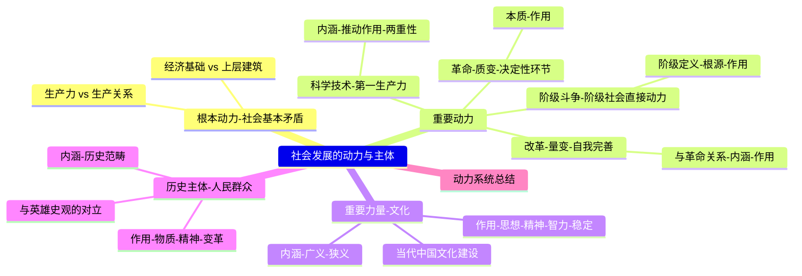

# 专题四（续）：社会发展的动力与主体

> [!summary] 本讲核心
> 本讲义聚焦于唯物史观的核心应用部分，深入探讨推动社会历史发展的各种动力因素，并明确历史的真正创造者。主要内容包括：
> 1.  [[#一、 社会历史发展的根本动力：社会基本矛盾]]
> 2.  [[#二、 社会历史发展的重要动力]] （阶级斗争、革命、改革、科学技术）
> 3.  [[#三、 文化在社会发展中的重要作用]]
> 4.  [[#四、 人民群众是历史的创造者]]
> 5.  [[#五、 社会历史动力及规律系统总结]]

---

## 一、 社会历史发展的根本动力：社会基本矛盾

> [!note] 历史前进的“发动机”是什么？
> 唯物史观认为，推动社会发展的最根本、最深层次的动力，来自于社会内部固有的、客观存在的**基本矛盾**。

### 1. 两大基本矛盾
贯穿人类社会始终，并规定社会发展基本趋势的是两大基本矛盾：
- **生产力 与 生产关系 的矛盾**
- **经济基础 与 上层建筑 的矛盾**

> [!quote]
> “一切历史冲突都根源于生产力和交往形式（即生产关系）之间的矛盾。”
> — 马克思、恩克思, 《德意志意识形态》
>
> “只有把生产力和生产关系的矛盾运动同经济基础和上层建筑的矛盾运动结合起来考察，把社会基本矛盾作为一个整体来观察，才能全面地把握整个社会的基本面貌和发展方向。”
> — 习近平

### 2. 根本动力的作用机制
- **根源性：** 这两大基本矛盾的运动**决定和制约**着其他社会矛盾的存在和发展（如阶级矛盾、民族矛盾等）。
- **推动性：** 正是这两大矛盾的不断产生和解决，才推动着社会形态从低级向高级演进，实现社会发展。
- **与唯心史观的区别：** 唯心史观将历史动力归结为外在的“神意”或内在的“思想动机”，而唯物史观则深入到这些现象背后，揭示了**物质生产活动**（生产力与生产关系的矛盾）是最终的决定性力量。

---

## 二、 社会历史发展的重要动力

社会基本矛盾作为根本动力，会通过一系列具体的社会现象和活动表现出来，这些就构成了推动社会发展的重要动力。

### 1. 重要动力：阶级斗争 (阶级社会的直接动力)

> [!tip] 阶级斗争是阶级社会发展的直接动力。

- **(一) 阶级的定义：**
    > [!quote]
    > “所谓阶级，就是这样一些集团，由于它们在一定社会经济结构中所处的地位不同，其中一个集团能够占有另一个集团的劳动。”
    > — 列宁, 《伟大的创举》
    - **核心：** 阶级首先是一个**经济范畴**，根本区别在于**对生产资料的占有关系**不同。
- **(二) 阶级斗争的根源：**
    - 根本原因在于**社会基本矛盾**。当生产关系（特别是所有制）成为生产力发展的桎梏时，代表先进生产力的阶级与维护旧生产关系的反动统治阶级之间的矛盾就会激化。
    - 直接原因在于不同阶级之间**物质利益**的根本对立。
- **(三) 阶级斗争的作用：**
    - 在阶级社会中，社会基本矛盾必然通过阶级斗争表现出来。
    - 它是推翻旧制度、建立新制度，实现社会形态更替的**直接动力**。
- **(四) 对阶级斗争的科学认识：**
    - 必须认识到阶级斗争是阶级社会客观存在的现象。
    - 在社会主义初级阶段，由于国内和国际因素，阶级斗争还将在一定范围内长期存在，但已不是社会的主要矛盾。要承认其存在，但也要**反对阶级斗争扩大化**。
- **(五) 历史表现：** (如斯巴达克起义、德国农民战争、法国大革命、俄国十月革命等)

### 2. 重要动力：革命 (社会质变的决定性环节)

> [!tip] 革命是解放生产力、实现社会形态更替的决定性手段。

- **(一) 革命的本质：**
    - 革命是阶级斗争发展到**最激烈**的表现形式，是社会发展的**质变**过程。
    - **核心：** 是**革命阶级推翻反动阶级的统治，用新的社会制度代替旧的社会制度**的根本变革。
- **(二) 革命的作用：**
    1.  **根本变革社会制度：** 是实现社会形态更替的重要手段和决定性环节。
    2.  **解放和发展生产力：** 打破旧生产关系和上层建筑对生产力的束缚。
    3.  **推动社会全面进步：** 促进经济、政治、文化等各个方面的进步。
    4.  **教育和动员群众：** 革命是“人民群众的盛大节日”，能极大激发群众的历史创造性。
> [!quote]
> “革命是历史的火车头。” — 马克思
>
> “革命是‘社会进步和政治进步的强大推动力’。” — 恩格斯
>
> “革命是被压迫者和被剥削者的盛大节日。人民群众在任何时候都不能像在革命时期这样以新社会制度的积极创造者的身份出现。” — 列宁

### 3. 重要动力：改革 (社会制度的自我完善)

> [!tip] 改革是在同一社会形态内部进行的调整，也是推动社会发展的重要动力。

- **(一) 改革与革命的关系：**
    - **革命 (质变)：** 旨在**推翻**旧的社会根本制度。
    - **改革 (量变/部分质变)：** 旨在**不改变**社会根本制度的前提下，对其**具体体制、机制**进行调整和完善。
- **(二) 改革的内涵：**
    - 是社会制度的**自我调整和完善**。
    - 改革可以有不同的**层次**（根本性/局部性）、**广度**（全面/专项）和**深度**（深刻/浅层）。
    - 改革的**根本目的**也是为了**解放和发展生产力**，解决社会基本矛盾所引发的具体问题。
- **(三) 改革的作用：**
    - 是推动社会历史发展的重要动力。
    - 在社会主义社会，改革是社会主义制度**自我完善和发展**的内在要求，是发展中国特色社会主义的**必由之路**。
> [!example] 案例：中国的改革开放
> 40多年的改革开放，极大地解放和发展了中国社会生产力，使中国实现了从站起来、富起来到强起来的伟大飞跃，生动体现了改革对社会进步的巨大推动作用。

### 4. 重要动力：科学技术 (第一生产力与革命力量)

> [!tip] 科学技术是推动社会发展的“革命力量”和“有力杠杆”。

- **(一) 科学与技术的内涵：**
    - **科学：** 关于自然、社会和思维的**知识体系**。
    - **技术：** 人类改造自然的**技能和手段**。
    - **当代趋势：** 科学与技术日益**一体化**（如量子通信）。
- **(二) 科学技术是“第一生产力”：**
    > [!quote]
    > “在马克思看来，科学是一种在历史上起推动作用的、革命的力量。” — 恩格斯
    >
    > “科学技术是第一生产力。” — 邓小平
    - 科技通过渗透到生产力的三要素（劳动者素质提升、劳动资料革新、劳动对象拓展）中，转化为**现实的、巨大的**生产力。
- **(三) 科技革命的巨大推动作用：**
    1.  **改变生产要素** (自动化、智能化)
    2.  **改变劳动方式** (体力 -> 脑力)
    3.  **改变社会经济结构** (产业升级)
    4.  **改变生活方式** (交通、通讯、信息)
    5.  **改变思维方式** (拓展认识边界，如相对论)
- **(四) 科技的社会作用具有两重性 (双刃剑)：**
    - **正面作用：** 推动生产力发展，改善生活，促进社会进步。
    - **负面作用：**
        - **误用可能带来危害:** 如核武器、环境污染（日本核废水排放）、生态破坏。
        - **加剧社会问题:** 如自动化导致失业、数字鸿沟、技术被用于加强控制（亚马逊监控员工）。
    - **结论：** 必须**正确认识和运用**科学技术。
        - **树立正确的价值观** (科技向善)
        - **建立合理的社会制度** (规范应用)
        - **加强科技伦理建设**

---

## 三、 文化在社会发展中的重要作用

> [!note] 文化也是推动社会发展不可忽视的重要力量。

### 1. 文化的内涵
- **广义文化：** 人类创造的**物质财富和精神财富**的总和。
- **狭义文化：** **意识形态**所创造的精神生产活动及其结果。

### 2. 文化在社会发展中的作用
1.  **提供思想指引：** 为社会发展提供方向性的指导思想和价值观念。
2.  **提供精神动力：** 凝聚人心，激发民族精神，提供精神支撑。
3.  **提供智力支持：** 提升国民素质，提供人才和智力保障。
4.  **维系社会稳定：** 规范社会秩序，协调社会关系。

### 3. 当代中国的文化建设
> [!quote]
> “我们必须坚定历史自信、文化自信……把马克思主义思想精髓同中华优秀传统文化精华贯通起来……不断赋予科学理论鲜明的中国特色……让马克思主义在中国牢牢扎根。”
> — 习近平
- **目标：** 发展面向现代化、面向世界、面向未来的，民族的科学的大众的社会主义文化，增强实现中华民族伟大复兴的精神力量。

---

## 四、 人民群众是历史的创造者

> [!tip] 这是唯物史观区别于一切剥削阶级历史观的根本观点。

### 1. 唯物史观 vs 英雄史观
- **英雄史观 (唯心史观)：** 认为历史是由少数英雄人物、帝王将相创造的。
- **唯物史观：** 认为**人民群众**才是历史发展的**决定性力量**。

### 2. 人民群众的内涵
- **定义：** 人民群众是一个**历史范畴**，不是固定不变的。其主体始终是从事**物质资料生产**的**劳动群众**及其知识分子。
- **在中国：** 在当代中国，一切拥护、参加和推动中国特色社会主义事业的阶层和社会力量，都属于人民群众的范畴。

### 3. 人民群众创造历史的作用
1.  **物质财富的创造者：** 人民群众是社会**生产力**的主体。
2.  **精神财富的创造者：** 人民群众的生活实践是精神财富产生的**源泉**。
3.  **社会变革的决定力量：** 人民群众是社会革命和改革的**主体**。

---

## 五、 社会历史动力及规律系统总结

> [!summary] 综合来看，唯物史观揭示的社会发展动力系统是一个有机的整体：
> - **根本动力：** 社会基本矛盾
> - **直接动力 (阶级社会)：** 阶级斗争
> - **重要动力：** 革命、改革、科学技术
> - **精神动力/智力支持：** 文化
> - **主体：** 人民群众

---

## 六、 本讲小结 (Mermaid思维导图)

