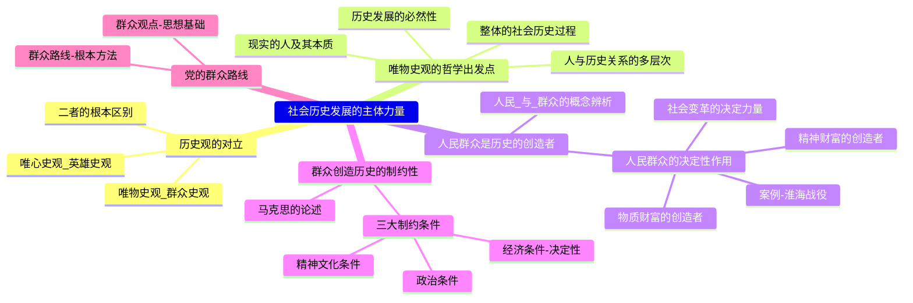

# 专题四：唯物史观
## 第三讲：社会历史发展的主体力量

> [!summary] 本讲核心
> 这一讲聚焦于唯物史观的一个根本问题：“究竟谁是历史的创造者？”。本讲将深入辨析“英雄史观”与“群众史观”的根本对立，并详细阐述唯物史观关于人民群众是历史创造者的科学内涵、哲学依据及其在当代中国的实践应用（群众路线）。

---

### 一、 问题的提出：究竟谁是历史的创造者？

#### 1. 唯心史观 (英雄史观)
- **核心观点：** 认为社会意识决定社会存在，因此**少数英雄人物、帝王将相**是历史的决定性力量，他们**创造了历史**。
- **表现形式：**
    - **宿命论 (柏拉图)：** 认为统治者是“神”用“金子”造的，天生高贵；劳动者是“神”用“铜和铁”造的，天生卑贱。
    - **唯意志论 (梁启超)：** 认为历史不过是英雄的舞台，少数“大人”可以凭一己之言发动或改变世界。
    - **超人哲学 (尼采)：** 认为群众不过是“无能为力的、迟钝的、无足轻重的角色”，历史由“超人”意志所驱动。
- **产生的根源：**
    1.  **认识根源：** 人们容易只看到历史表面的、突出的**个人活动**（如英雄的决策），而看不到背后深刻的**物质经济根源**和**人民群众**的集体力量。
    2.  **社会历史根源：** 在长期的阶级社会中，人民群众处于被统治和被剥削的地位。
    3.  **阶级根源：** 剥削阶级的思想家为了**维护自身统治**，需要“抹杀人民群众的历史作用”，宣扬“英雄史观”。

#### 2. 唯物史观 (群众史观)
- **核心观点：** 彻底贯彻“社会存在决定社会意识”，认为**人民群众才是历史的创造者**。
- **马克思主义的贡献 (列宁总结)：** 唯物史观消除了以往历史观的两大缺点：
    1.  **缺点一：** 只考察了人们历史活动的**思想动机**，而没有研究这些动机背后的**物质根源**。
    2.  **缺点二：** 没有说明**人民群众**的活动。
- **经典论述 (补充)：**
    > [!quote]
    > “历史活动是群众的活动，随着历史活动的深入，必将是群众队伍的扩大。”
    > — 马克思、恩格斯, 《神圣家族》
    
    > [!quote]
    > “在十七世纪和十八世纪的法国，甚至连最高级的最辉煌的那些人都不是他自己挣得的，而是手工业、工人和农民大众，即人民大众挣得的。”
    > — 恩格斯, 《流亡者文献》
    
    > [!quote]
    > “具有革命精神的品质的是少数人，而决定历史结局的是‘大多数’，如果少数人不能使群众信服，那只有时时抱怨他们不该‘不争气’。”
    > — 列宁, 《论经济主义》

#### 3. 英雄史观与群众史观的根本区别 (总结表)
| 维度 | **英雄史观 (唯心史观)** | **群众史观 (唯物史观)** |
| :--- | :--- | :--- |
| **理论出发点** | 从“人的思想动机”出发 | 从“物质生产活动”出发 |
| **分析方法** | 停留于思想的“表面” | 探寻动机背后的“物质根源” |
| **阶级立场** | 站在“少数统治者”的立场 | 站在“广大人民群众”的立场 |

---

### 二、 唯物史观考察历史创造者的哲学出发点

> [!note] 唯物史观的群众史观不是一个简单的口号，它建立在科学的哲学基础之上。

1.  **立足于“现实的人”及其本质**
    - 唯物史观考察的是**现实的、非抽象的人**，是“基于自身需要、从事一定实践活动、处于一定社会关系中、具有能动性的人”。
    > [!quote]
    > “人的本质不是单个人所固有的抽象物，在其现实性上，它是一切社会关系的总和。”
    > — 马克思, 《关于费尔巴哈的提纲》
    - **人的本质：**
        - 人的本质是**社会属性**，而不是孤立的自然属性。
        - 人的本质表现在各种社会关系中（如地缘、血缘、家庭、政治、经济、法律关系等）。
        - 人的本质是**变化、发展的**，而不是永恒不变的。

2.  **立足于“整体的社会历史过程”**
    - 历史是**无数个人**活动形成的**合力**的结果，而不是单个“英雄”意志的体现。
    > [!quote]
    > “无论历史的结局如何，人们总是通过每一个人追求他自己的、自觉预期的目的来创造他们的历史，而这许多按不同方向活动的愿望及其对外部世界的各种各样作用的合力，就是历史。”
    > — 恩格斯

3.  **立足于“社会历史发展的必然性”**
    - 历史的发展包含各种力量，有**推动**社会前进的力量（代表历史必然性），也有**阻碍**的力量。
    - 只有**代表和推动**历史发展必然性的力量，才是**真正的历史创造者**。

4.  **立足于“人与历史关系的不同层次”**
    - 唯物史观从三个层次考察历史创造者：
        - **类 (Species)：** “人们自己创造自己的历史。”（强调人的能动性）
        - **群体 (Group)：** “人民群众是历史的真正创造者。”（强调历史的主体）
        - **个体 (Individual)：** “个人在历史上的杰出作用。”（承认英雄的作用，但不夸大）

---

### 三、 人民群众及其构成

#### 1. 概念辨析：“人民” vs “群众”
- **人民 (People)：**
    - 是一个**政治概念**，也是一个**历史范畴**。
    - 它的范围在不同历史时期是**不同**的。
    - 泛指一切推动社会历史发展的阶级、阶层和社会集团的总和。（例如，抗日战争时期，一切抗日的阶级都属于“人民”）
- **群众 (Masses)：**
    - 是一个**社会学概念**，也常作政治概念使用。
    - 泛指**社会人口的绝大多数**。
    - 在政治上，它常与“人民”同义，但更强调其“非精英”、“非干部”的普通成员身份。
- **人民群众 (The People / Masses)：**
    - 是一个**历史范畴**，在不同历史时期有不同内容。
    - 其**主体**始终是从事**物质资料生产**的**劳动群众**及其知识分子。
    - **在当代中国：** 人民群众是指全体社会主义劳动者、社会主义事业的建设者、拥护社会主义的爱国者、拥护祖国统一和致力于中华民族伟大复兴的爱国者。

#### 2. 人民群众在创造历史中的决定性作用
- **(一) 人民群众是社会物质财富的创造者**
    - 人民群众是生产力的主体（劳动者），提供了社会赖以生存和发展的**物质基础**。
    - 体现在“衣、食、住、行”等一切物质资料的生产中。
- **(二) 人民群众是社会精神财富的创造者**
    - 人民群众的社会实践是精神财富产生的**唯一源泉**。
    - 人民群众也**直接创造**了丰富的精神文化。
    > [!example] 案例
    > 《天工开物》、《黄帝内经》、《齐民要术》、《本草纲目》等伟大科学文化著作，都是对广大劳动人民长期生产实践经验的**总结和提炼**。
- **(三) 人民群众是社会变革的决定力量**
    - 在社会形态更替的变革时期，人民群众是**推翻旧制度、建立新制度**的主力军。
    > [!example] 案例：淮海战役
    > 淮海战役的胜利，深刻体现了人民群众是社会变革的决定性力量。
    > **数据：** 参战兵力80万，支前民工543万人（是参战兵力的近7倍），出动担架20.67万副，小车88.1万辆。
    > **结论：** “淮海战役的胜利，是人民群众用小车推出来的。” “辽沈、淮海、平津三大战役的胜利，没有人民群众的支持，是不可能的。”

---

### 四、 群众创造历史的活动受社会历史条件制约

> [!note] 唯物史观是辩证法，不是“群众万能论”。

- **核心观点：** 承认人民群众是历史的创造者，**但**他们的创造活动**不是**随心所欲、不受限制的。
- **马克思的论述：**
    > [!quote]
    > “人们自己创造自己的历史，但是他们并不是随心所欲地创造，并不是在他们自己选定的条件下创造，而是在直接碰到的、既定的、从过去承继下来的条件下创造。”
    > — 马克思, 《路易·波拿巴的雾月十八日》
- **三大制约条件：**
    > [!quote] **恩格斯论三大制约 (补充)**
    > “我们自己创造着我们的历史，但是第一，我们是在十分确定的前提和条件下创造的。其中**经济的前提和条件**归根到底是决定性的。但是**政治**等等的前提和条件，甚至那些萦回于人们头脑中的**传统**，也起着一定的作用，虽然不是决定性的作用。”
    > — 恩格斯, 《致瓦·博尔吉乌斯》
    1.  **经济条件 (决定性制约)：**
        - 生产力水平和生产关系状况是**最终的决定性因素**。
    2.  **政治条件：**
        - 政治制度、国家形态、阶级关系等也会极大地影响群众的活动。
    3.  **精神文化条件：**
        - 传统观念、意识形态、风俗习惯等也会对人们的头脑产生重要作用。

---

### 五、 党的群众观点与群众路线 (理论的实践应用)

> [!tip] 群众路线
> 群众路线是**中国共产党**将马克思主义的群众史观（人民创造历史）运用于党的具体工作实践而形成的**根本工作路线**和**重要理论成果**。

- **1. 群众观点 (思想基础)**
    - **坚信人民群众自己解放自己**的观点。
    - **全心全意为人民服务**的观点。
    - **一切向人民群众负责**的观点。
    - **虚心向群众学习**的观点。
- **2. 群众路线 (根本方法)**
    - **核心：** 一切为了群众，一切依靠群众；从群众中来，到群众中去。
    - **“从群众中来”：** 把群众分散的、无系统的意见，集中起来，化为系统的、条理化的思想和政策。
    - **“到群众中去”：** 把已经形成的政策、理论，带到群众中去宣传、贯彻，并在群众的实践中检验、修正和发展。

