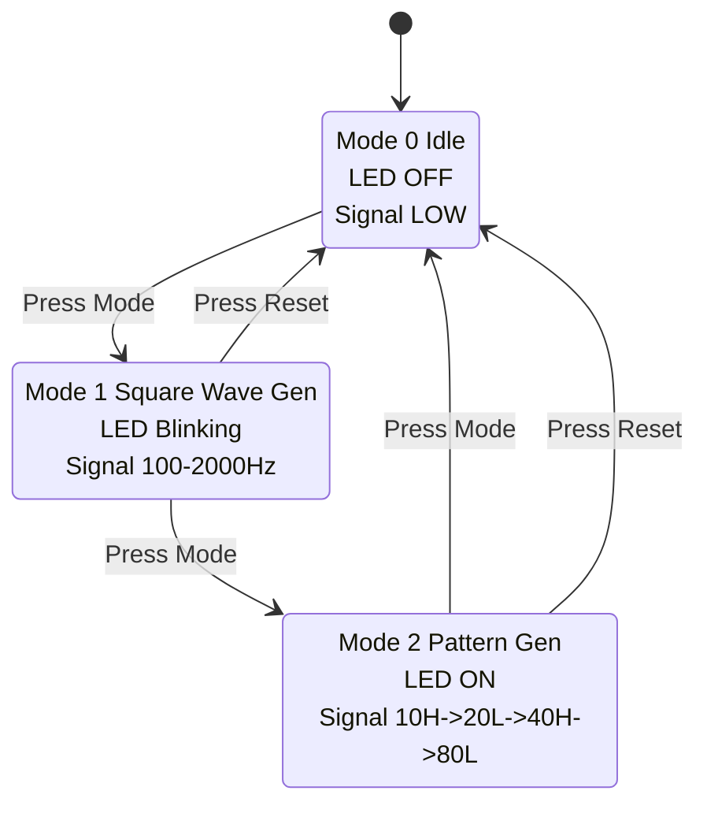
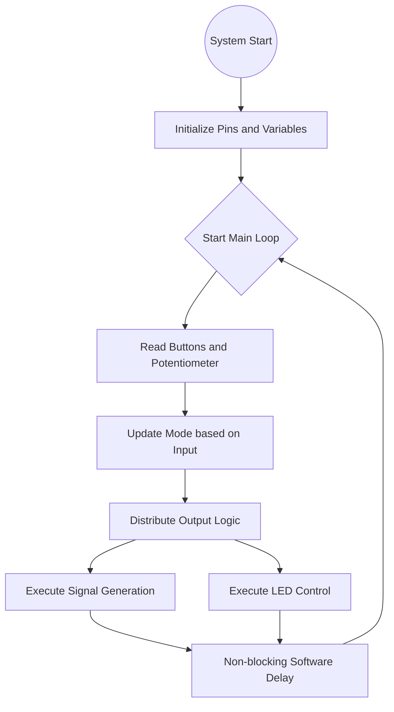

```mermaid
stateDiagram-v2
    [*] --> Mode0

    Mode0 --> Mode1 : Press Mode
    Mode1 --> Mode2 : Press Mode
    Mode2 --> Mode0 : Press Mode

    Mode1 --> Mode0 : Press Reset
    Mode2 --> Mode0 : Press Reset

    Mode0 : Mode 0 Idle<br>LED OFF<br>Signal LOW
    Mode1 : Mode 1 Square Wave Gen<br>LED Blinking<br>Signal 100-2000Hz
    Mode2 : Mode 2 Pattern Gen<br>LED ON<br>Signal 10H->20L->40H->80L
```

```mermaid
graph TD
    Start((System Start)) --> Init[Initialize Pins and Variables]
    Init --> LoopStart{Start Main Loop}

    LoopStart --> Input[Read Buttons and Potentiometer]
    Input --> ModeCtrl[Update Mode based on Input]
    ModeCtrl --> OutputLogic[Distribute Output Logic]
    
    OutputLogic --> SignalGen[Execute Signal Generation]
    OutputLogic --> LEDCtrl[Execute LED Control]
    
    SignalGen --> Delay[Non-blocking Software Delay]
    LEDCtrl --> Delay
    
    Delay --> LoopStart
```

