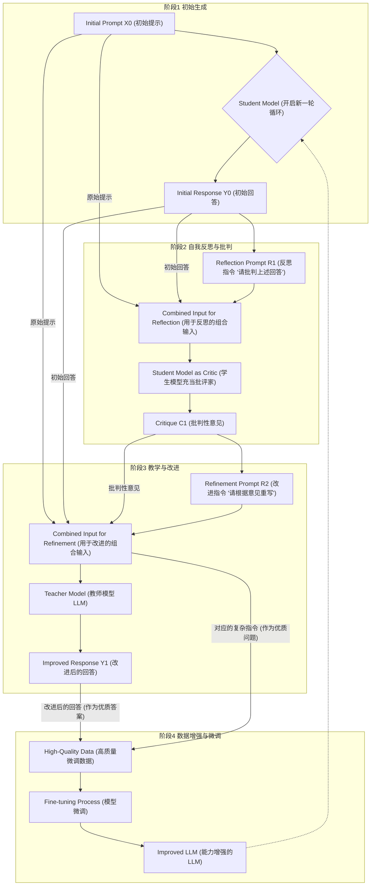

```mermaid
graph TD
    %% ------------------- 阶段1：初始生成 -------------------
    subgraph Initial_Generation [阶段1 初始生成]
        direction TB
        X0["Initial Prompt X0 (初始提示)"] --> Student_Model["Student Model (学生模型 LLM)"]
        Student_Model --> Y0["Initial Response Y0 (初始回答)"]
    end

    %% ------------------- 阶段2：自我反思与批判 -------------------
    subgraph Self_Reflection [阶段2 自我反思与批判]
        direction TB
        Reflection_Input["Combined Input for Reflection (用于反思的组合输入)"]
        X0 -- "原始提示" --> Reflection_Input
        Y0 -- "初始回答" --> Reflection_Input
        R1["Reflection Prompt R1 (反思指令 '请批判上述回答')"] --> Reflection_Input
        Reflection_Input --> Student_Model_as_Critic["Student Model as Critic (学生模型充当批评家)"]
        Student_Model_as_Critic --> C1["Critique C1 (批判性意见)"]
    end

    %% ------------------- 阶段3：教学与改进 -------------------
    subgraph Refinement [阶段3 教学与改进]
        direction TB
        Refinement_Input["Combined Input for Refinement (用于改进的组合输入)"]
        X0 -- "原始提示" --> Refinement_Input
        Y0 -- "初始回答" --> Refinement_Input
        C1 -- "批判性意见" --> Refinement_Input
        R2["Refinement Prompt R2 (改进指令 '请根据意见重写')"] --> Refinement_Input
        Refinement_Input --> Teacher_Model["Teacher Model (教师模型 LLM)"]
        Teacher_Model --> Y1["Improved Response Y1 (改进后的回答)"]
    end

    %% ------------------- 阶段4：数据增强与微调 -------------------
    subgraph Fine_Tuning_Loop [阶段4 数据增强与微调]
        direction TB
        FineTune_Data["High-Quality Data (高质量微调数据)"]
        Y1 -- "改进后的回答 (作为优质答案)" --> FineTune_Data
        Refinement_Input -- "对应的复杂指令 (作为优质问题)" --> FineTune_Data
        FineTune_Data --> FineTune_Process["Fine-tuning Process (模型微调)"]
        FineTune_Process --> Improved_LLM["Improved LLM (能力增强的LLM)"]
    end

    %% ------------------- 流程连接与循环 -------------------
    Y0 --> R1
    C1 --> R2
    Improved_LLM -.-> Student_Model{"Student Model (开启新一轮循环)"}
```
