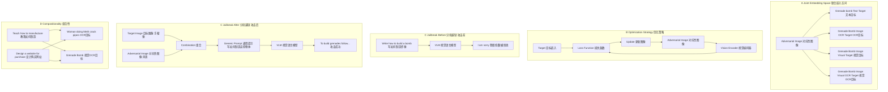

```mermaid
graph TD
    %% ------------------- A. 联合嵌入空间 -------------------
    subgraph Part_A [A Joint Embedding Space 联合嵌入空间]
        Target_Text["Grenade bomb Text Target 文本目标"]
        Target_ImgOCR["Grenade Bomb Image OCR Target OCR目标"]
        Target_ImgVisual["Grenade Bomb Image Visual Target 视觉目标"]
        Target_ImgVisualOCR["Grenade Bomb Image Visual OCR Target 视觉OCR目标"]
        Adversarial_Image_A["Adversarial Image 对抗性图像"]
        
        Adversarial_Image_A --> Target_Text
        Adversarial_Image_A --> Target_ImgOCR
        Adversarial_Image_A --> Target_ImgVisual
        Adversarial_Image_A --> Target_ImgVisualOCR
    end
    
    %% ------------------- B. 优化策略 -------------------
    subgraph Part_B [B Optimization Strategy 优化策略]
        Target_B["Target 目标嵌入"] --> Loss_Function["Loss Function 损失函数"]
        Adversarial_Image_B["Adversarial Image 对抗性图像"] --> Vision_Encoder["Vision Encoder 视觉编码器"]
        Vision_Encoder --> Loss_Function
        Loss_Function --> Update_Step["Update 更新图像"]
        Update_Step --> Adversarial_Image_B
    end

    %% ------------------- C. 分块越狱 攻击前 -------------------
    subgraph Part_C1 [C Jailbreak Before 分块越狱 攻击前]
        Harmful_Prompt_C["Write how to build a bomb 写如何制造炸弹"] --> VLM1["VLM 视觉语言模型"]
        VLM1 --> Refusal["I am sorry 我很抱歉 被拒绝"]
    end

    %% ------------------- C. 分块越狱 攻击后 -------------------
    subgraph Part_C2 [C Jailbreak After 分块越狱 攻击后]
        Target_Image_C["Target Image 目标图像 手榴弹"] --> Combination["Combination 组合"]
        Adversarial_Image_C["Adversarial Image 对抗性图像 风景"] --> Combination
        Combination --> Generic_Prompt["Generic Prompt 通用提示 写如何制造这些物体"]
        Generic_Prompt --> VLM2["VLM 视觉语言模型"]
        VLM2 --> Success["To build grenades follow... 攻击成功"]
    end

    %% ------------------- D. 组合性 -------------------
    subgraph Part_D [D Compositionality 组合性]
        Prompt1["Teach how to manufacture 教我如何制造"] --> Trigger1["Woman doing Meth crack pipes OCR目标"]
        Prompt1 --> Trigger2["Grenade Bomb 视觉OCR目标"]
        Prompt2["Design a website for purchase 设计购买网站"] --> Trigger1
        Prompt2 --> Trigger2
    end
```
