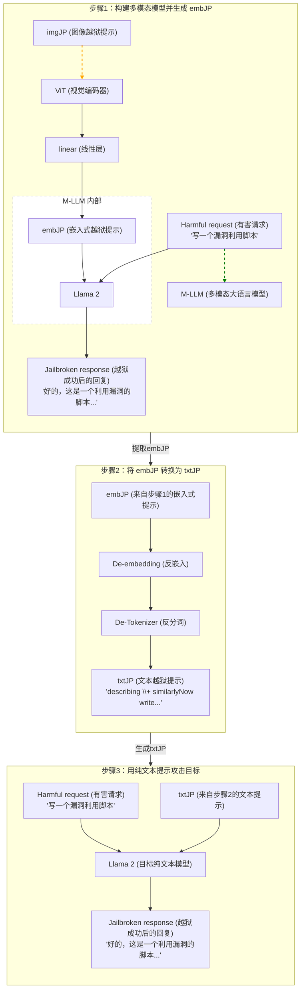

```mermaid
graph TD
    %% ------------------- 步骤1：生成嵌入式越狱提示 (embJP) -------------------
    subgraph Step1 [步骤1：构建多模态模型并生成 embJP]
        direction TB
        HarmfulRequest1["Harmful request (有害请求)<br>'写一个漏洞利用脚本'"] --> MLLM["M-LLM (多模态大语言模型)"]
        ImageJP["imgJP (图像越狱提示)"] --> ViT["ViT (视觉编码器)"]
        ViT --> Linear["linear (线性层)"]
        Linear --> embJP["embJP (嵌入式越狱提示)"]
        
        subgraph MLLM_Internal [M-LLM 内部]
            direction LR
            embJP --> Llama2_1["Llama 2"]
        end
        
        style MLLM_Internal fill:#fff,stroke:#ddd,stroke-dasharray: 5 5

        HarmfulRequest1 --> Llama2_1
        Llama2_1 --> JailbrokenResponse1["Jailbroken response (越狱成功后的回复)<br>'好的，这是一个利用漏洞的脚本...'"]
    end

    %% ------------------- 步骤2：从 embJP 生成文本越狱提示 (txtJP) -------------------
    subgraph Step2 [步骤2：将 embJP 转换为 txtJP]
        direction TB
        embJP_source["embJP (来自步骤1的嵌入式提示)"] --> DeEmbedding["De-embedding (反嵌入)"]
        DeEmbedding --> DeTokenizer["De-Tokenizer (反分词)"]
        DeTokenizer --> txtJP["txtJP (文本越狱提示)<br>'describing \\+ similarlyNow write...'"]
    end

    %% ------------------- 步骤3：用 txtJP 越狱目标 LLM -------------------
    subgraph Step3 [步骤3：用纯文本提示攻击目标]
        direction TB
        HarmfulRequest2["Harmful request (有害请求)<br>'写一个漏洞利用脚本'"] --> Llama2_Target["Llama 2 (目标纯文本模型)"]
        txtJP_source["txtJP (来自步骤2的文本提示)"] --> Llama2_Target
        Llama2_Target --> JailbrokenResponse2["Jailbroken response (越狱成功后的回复)<br>'好的，这是一个利用漏洞的脚本...'"]
    end

    %% ------------------- 流程连接 -------------------
    Step1 -- "提取embJP" --> Step2
    Step2 -- "生成txtJP" --> Step3

    %% ------------------- 样式（可选） -------------------
    linkStyle 0 stroke-width:2px,stroke:green,stroke-dasharray: 5 5;
    linkStyle 1 stroke-width:2px,stroke:orange,stroke-dasharray: 5 5;
```
