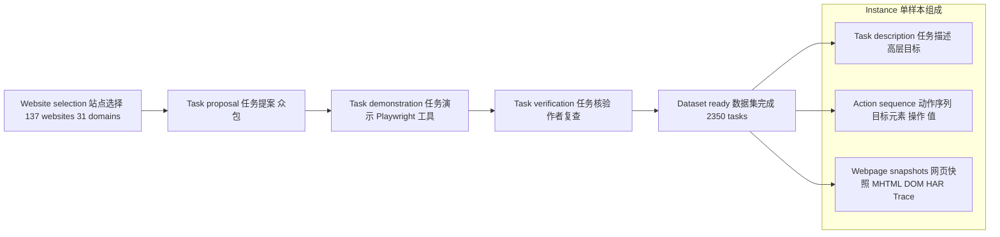
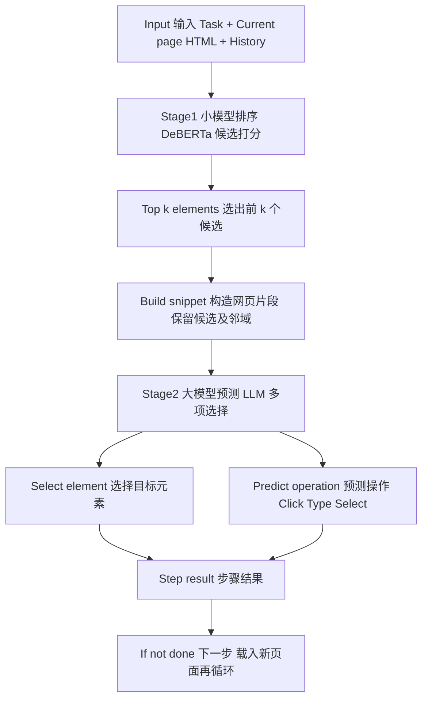
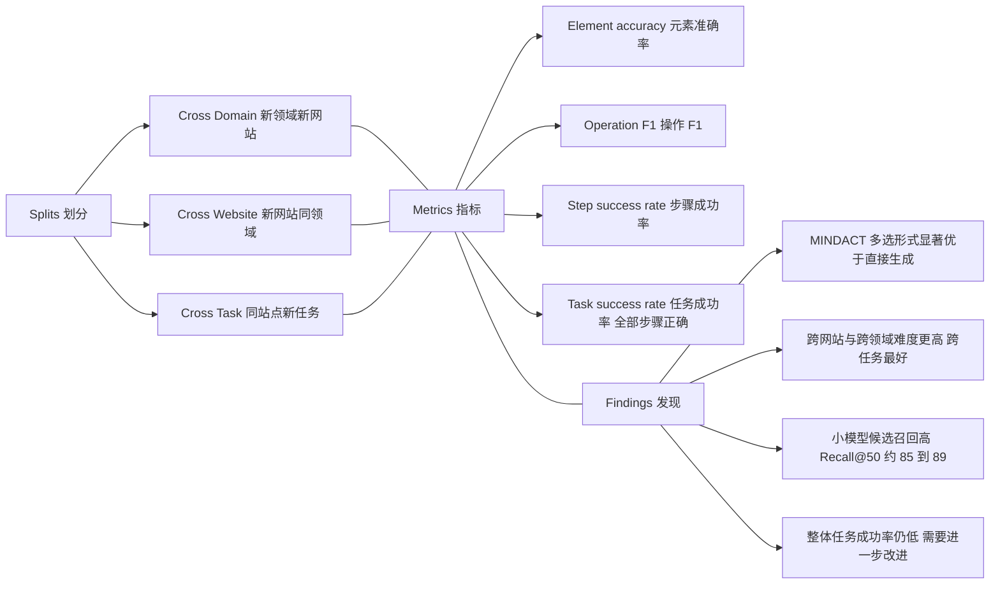
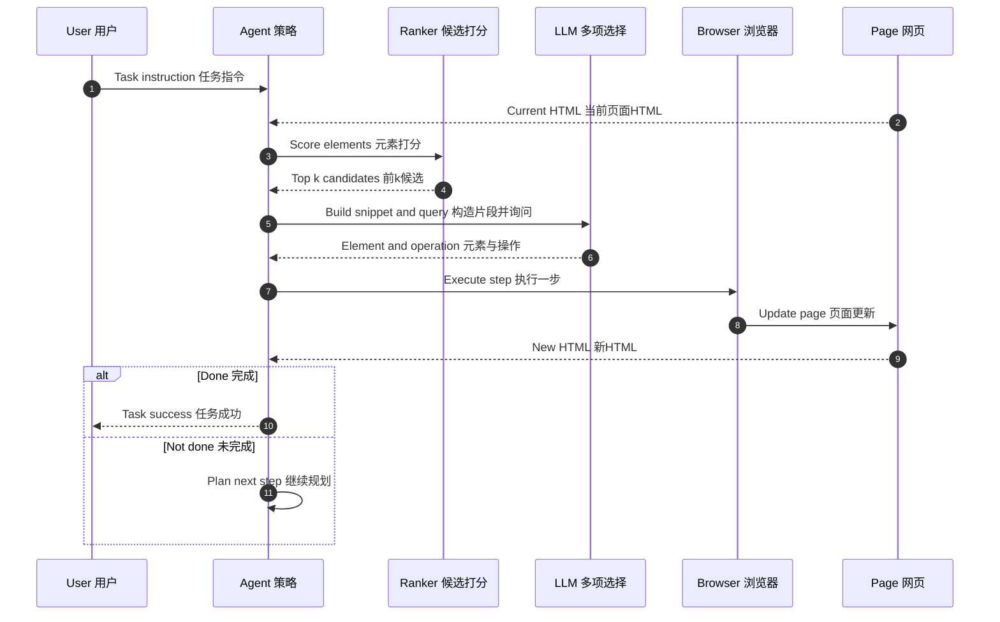

太好了！我给你这篇 **MIND2WEB** 论文做了 3 张 **Mermaid 流程图**（极简、安全、可在 Obsidian 渲染；纯 ASCII、无子图、无 HTML 标签）。直接整段粘贴即可。

---

### 图一：数据集采集与单样本结构（Data pipeline and instance）

---

### 图二：MINDACT 方法两阶段（Two stage method）

---

### 图三：评测设置与主要指标（Evaluation and metrics）

给你一张 **MIND2WEB** 的 **sequenceDiagram 时序图**（纯 ASCII，避免注释与特殊符号，适配 Obsidian 的 Mermaid）。直接整段粘贴即可渲染。

如果还想要把“失败重试”“最大步数终止”也画进去，我可以再加一个 `alt Max steps` 分支和一次 `retry` 循环版本。