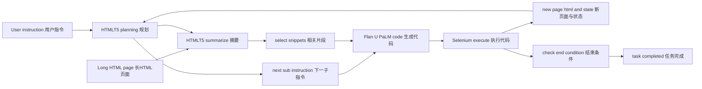
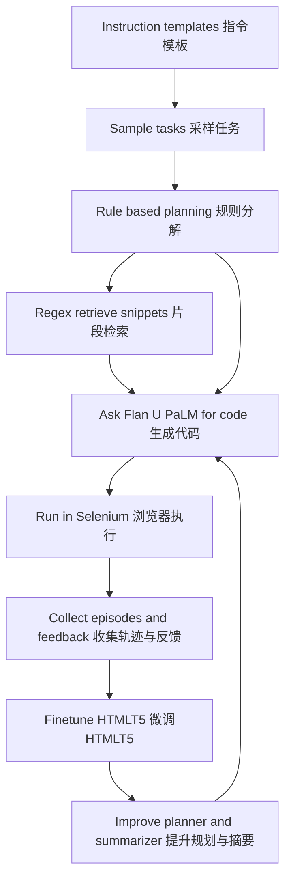
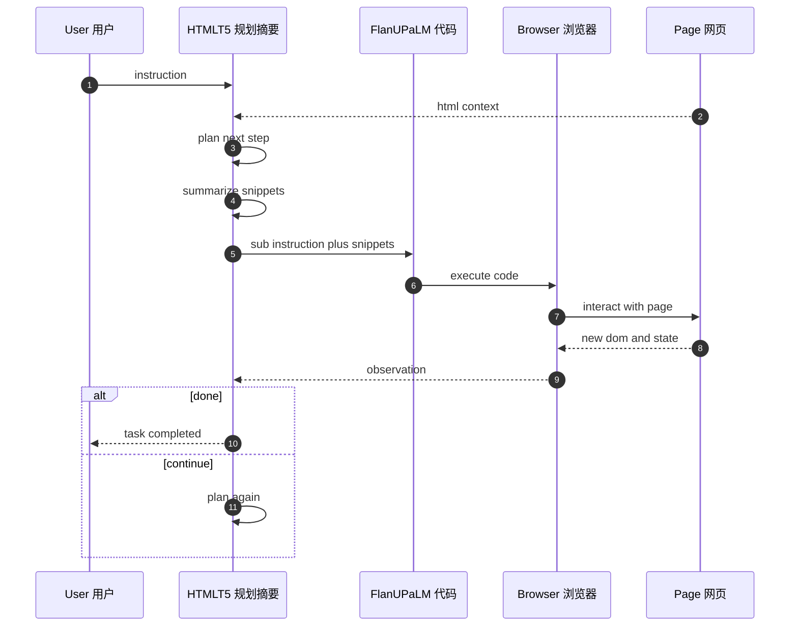
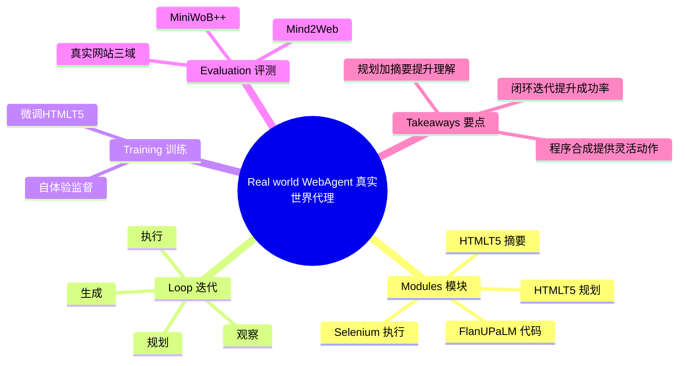

抱歉前面的 Mermaid 在你那边还是报错。这里给出**更保守、在 Obsidian 里稳定渲染**的四个版本：全部**纯 ASCII、无子图(subgraph)、无括号/斜杠/逗号注释、无 Note**。直接整段粘贴即可。

---

## 图一（流程图1）：架构与推理流程

---

## 图二（流程图2）：自体验监督与训练闭环

---

## 版本三（时序图）：端到端交互

---

## 版本四（思维导图）：组件与要点

> 如果仍有解析问题：
> 
> 1. 先用最小例 `flowchart TD; A-->B; B-->C;` 验证渲染；
>     
> 2. 粘贴后清理每行末尾空格；
>     
> 3. 关闭“智能标点”；
>     
> 4. 把 Obsidian 的 Mermaid 升到较新版本。  
>     需要我把节点再细化成你论文里的术语，也可以继续改。
>