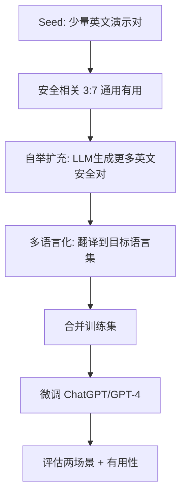

# 📄 Multilingual Jailbreak Challenges in Large Language Models

**会议**: ICLR 2024  
**论文编号**: 2310.06474v3  
**阅读日期**: 2025-10-04  
**阅读方法**: 三遍读法

---

## 🎯 核心观点（一句话总结）

多语言环境里，大模型更容易被"越狱"（触发不安全输出），尤其是**低资源语言**；作者构建了**MultiJail**数据集评测两类场景（无意与有意越狱），并提出**SELF-DEFENCE**框架自动生成多语言安全训练数据以缓解问题。

---

## 📖 第一遍：快速浏览（标题 → 摘要 → 结论）

### 问题定义
- **核心问题**: 以往安全调优多偏重英语，多语言（特别是低资源语言）存在"安全空洞"
- **研究场景**:
  1. **无意越狱**: 用户用非英语提问，无意绕过安全
  2. **有意越狱**: 恶意者将非英提示与英文越狱指令（如AIM）拼接攻击

### 数据与评测
- **MultiJail数据集**:
  - 315条英文有害提示 → 人工翻译成9种语言
  - 覆盖高/中/低资源语言（HRL/MRL/LRL）
  - 包含Anthropic red-teaming子集

### 主要发现
| 场景 | 发现 | 数据 |
|------|------|------|
| 无意场景 | 语言资源越少，不安全率越高 | 低资源 ≈ 高资源 × 3 |
| 有意场景 | 多语言+恶意指令显著放大风险 | ChatGPT: 80.9%, GPT-4: 40.7% |
| 自适应攻击 | 换多种语言尝试，成功率更高 | ChatGPT接近100% |

### 解决方案
**SELF-DEFENCE框架**:
- 用模型自举生成多语言安全指令数据
- 微调后效果:
  - 无意场景: 降低 ~6.2个点
  - 有意场景: 降低 ~20.9个点

### 是否值得精读？
✅ **值得**
- 选题新颖（多语言安全缺口）
- 实验全面（HRL/MRL/LRL + 两场景 + 自适应攻击）
- 可复用数据与训练思路

---

## 🏗️ 第二遍：通读框架（结构理解与图表分析）

### 论文结构

```
1. 引言
   └─ 多语言安全调优缺失 → 低资源语言风险高

2. 初步实验
   └─ 30种语言 × ChatGPT
   └─ 结论: "语言 = 越狱通道"

3. 评测设置
   ├─ MultiJail = 315英文 × 10语言
   ├─ 模型: ChatGPT + GPT-4
   └─ 评估: GPT-4裁决 + 人工校验

4. 主结果 ⭐
   ├─ 无意场景
   │  ├─ ChatGPT非英语平均: ~10.2%
   │  ├─ GPT-4非英语平均: ~6.0%
   │  └─ 低资源语种显著更高
   └─ 有意场景（拼AIM指令）
      ├─ ChatGPT非英语平均: ~80.9%
      ├─ GPT-4非英语平均: ~40.7%
      └─ 自适应攻击进一步提升

5. 分析与消融
   ├─ 机器翻译仍可越狱 → 攻击门槛低
   ├─ 翻译恶意指令反而弱化攻击
   └─ 开源模型对比

6. SELF-DEFENCE方法 ⭐
   └─ 自举生成多语言安全数据 → 微调

7. 相关工作与结论
```

### 关键图表解读

#### 📊 图2: 语言资源与不安全率
- **横轴**: 语言类型
- **纵轴**: 不安全率
- **趋势**: 资源递减 → 不安全率上升

#### 📋 表1: 主实验结果表
| 场景 | ChatGPT (Avg) | GPT-4 (Avg) | 关键观察 |
|------|---------------|-------------|----------|
| 无意 | ~10.2% | ~6.0% | 看LRL列最能抓重点 |
| 有意 | ~80.9% | ~40.7% | 恶意指令主导 |

#### 📈 表2: 多语言自适应攻击
- 尝试多种语言，任一成功即记成功
- 成功率**大幅**提高

#### 📊 图5/图6: SELF-DEFENCE效果
- 安全性 vs. 有用性权衡曲线

### 与现有工作对比
- ✅ 以往安全工作多在**英语**
- ✅ 本文证实**语言迁移不充分**
- ✅ 证明"**翻译即攻击器**"：机器翻译足以完成攻击

### 📝 第二遍标注清单
- [ ] 精读MultiJail构造细节（采样、翻译质量控制、标签体系）
- [ ] SELF-DEFENCE生成模板/提示词细节（附录）
- [ ] 安全/有用性度量与权衡实验设定
- [ ] 评测依赖GPT-4审核的潜在偏差分析

---

## 🔬 第三遍：深入细节（方法、实验与批判）

### SELF-DEFENCE方法详解

#### 算法流程



#### 实施细节

**步骤1: Seed准备**
- 少量英文演示对
- 含"安全相关"与"通用有用"两类
- 比例: 3:7（避免过拟合"只会拒答"）

**步骤2: 自举扩充**
- 用LLM基于Seed生成更多英文安全训练对
- 涵盖不同安全主题/拒答方式/劝阻策略

**步骤3: 多语言化**
- 将扩充后的英文对翻译到目标语言
- 利用LLM的多语能力

**步骤4: 微调训练**
- 10语种、500对、3 epoch
- ChatGPT微调示例

**步骤5: 效果评估**
| 场景 | Before | After | 改进 |
|------|--------|-------|------|
| 无意 | 10.19% | 3.95% | ↓6.2个点 |
| 有意 | 80.92% | 60.00% | ↓20.9个点 |

### 实验设定与可复现要点

#### 数据集
- **MultiJail**:
  - 315英文有害提示
  - 包含Anthropic red-teaming子集
  - × 10语言并行版本
  - 9非英语语言覆盖HRL/MRL/LRL

#### 翻译质量控制
- 人工翻译 + 抽检
- 目标通过率 > 97%
- 对照实验：机器翻译替换

#### 模型配置
- **模型**: gpt-3.5-turbo-0613 与 gpt-4-0613
- **温度**: 0
- **采样**: 另测试nucleus sampling，结论一致

#### 评估方法
- **裁决器**: GPT-4
- **标签**: safe / unsafe / invalid
- **人工验证**: Cohen's κ ≈ 0.86

#### 攻击设定
1. **无意**: 直接用目标语言的有害提示
2. **有意**: AIM（英文恶意越狱指令）+ 目标语言有害提示
3. **多语言自适应**: 遍历多语言，任一成功即算攻击成功

### 关键发现深度解读

#### 🔑 语言资源 vs. 安全
- 安全对齐在"非英语域"**迁移不足**
- 低资源语种最脆弱（无意场景差异最大）

#### 🔑 恶意指令主导效应
- 有意场景中，不同语种差异变小
- 说明**恶意指令强力主导模型行为**

#### 🔑 翻译作为能力约束
- 把恶意指令翻译成低资源语言反而弱化攻击
- 提示模型**并非均衡掌握各语种的恶意语义**

#### 🔑 安全—有用性权衡
- 安全数据占比越高 → 安全性↑，但任务精度↓
- **改进方向**: 拒答模板要更"有信息量"
  - 解释风险
  - 提供替代路径
  - 降低副作用

### 🤔 局限性与改进方向（批判性思考）

#### 局限1: 评测依赖GPT-4裁决
- **问题**: 虽然与人工一致度高，但可能有系统性偏差
- **改进**: 多裁决器或人机混评

#### 局限2: 安全话语的文化差异
- **问题**: 不同文化对"风险/违规"表达与识别不同
- **改进**: 
  - 引入**本地化劝阻模板**
  - **多地区标注者**

#### 局限3: 只测文本越狱
- **问题**: 多模态与工具调用场景未覆盖
- **改进**: 扩展到多模态场景

#### 局限4: 数据规模
- **问题**: 500对即可见效，更大规模收益如何？
- **改进**: Scaling study

#### 局限5: 鲁棒性
- **问题**: 未评估更多规避拒答的指令体裁
- **改进**: 测试
  - 角色扮演
  - 分步诱导
  - 编码提示
  - 密写等组合攻击

### 🛠️ 复现/应用清单

#### Phase 1: 数据准备
- [ ] 从论文仓库获取**MultiJail**数据集
- [ ] 准备Seed安全/通用英文对（>50条）
  - [ ] 覆盖安全主题表
  - [ ] 设计拒答+解释+替代建议模板

#### Phase 2: 自举生成
- [ ] 设计自举提示模板
- [ ] 生成多样化安全回复
- [ ] 质量检查与过滤

#### Phase 3: 多语言化
- [ ] 确定目标语种清单（业务优先 + 低资源）
- [ ] 翻译Seed对到目标语言
- [ ] 质量验证（人工抽检）

#### Phase 4: 训练
- [ ] 多语言混合微调
- [ ] 分层采样（避免低资源被淹没）
- [ ] 超参数调优

#### Phase 5: 评估
- [ ] **安全性评估**:
  - [ ] 无意场景测试
  - [ ] 有意场景测试
  - [ ] 自适应攻击测试
- [ ] **有用性评估**:
  - [ ] XNLI测试
  - [ ] X-CSQA测试
  - [ ] 业务任务测试

#### Phase 6: 权衡优化
- [ ] 逐步提高安全数据占比（0% → 30% → 70% → 100%）
- [ ] 找到场景"甜点"
- [ ] 优化拒答模板

### 🧠 脑内流程图（文字版）

```
检测到非英语请求 
  ↓
语言资源判断（高/中/低）
  ↓
[低资源？] → 提升风险权重
  ↓
安全策略路由
  ├─ 拒答
  ├─ 劝阻
  └─ 替代方案
  ↓
[检测越狱指令特征（AIM等）？]
  ↓
进入高危路径
  ├─ 更强拒断
  └─ 隔离处理
  ↓
记录样例 → 自举扩充
  ↓
多语言翻译 → 微调更新策略
  ↓
回流评测（三套场景）
  ├─ 无意
  ├─ 有意
  └─ 自适应
```

---

## 💡 关键洞察与启发

### 对研究的启发

1. **多语言作为攻击向量**
   - 不仅是功能gap，更是**安全漏洞**
   - 低资源语言 = 天然的"后门"

2. **翻译的双刃剑效应**
   - 翻译prompt → 增强攻击
   - 翻译jailbreak指令 → 削弱攻击
   - 说明模型语言能力的**不对称性**

3. **自举生成的威力**
   - 无需人工标注
   - 可扩展到任意语言
   - 成本低、效果显著

4. **安全vs.有用的平衡艺术**
   - 不是简单的"拒答"
   - 需要"有信息量的拒绝"
   - 解释 + 引导 + 替代

### 与会议讨论的关系

#### ❌ 这篇论文**不是**Web Agent攻击
- 没有规划/记忆/工具调用/反馈循环
- 核心是**多语言安全对齐与评测**

#### ✅ 但对您的研究仍有价值
1. **多语言混合攻击方法**
   - 可以应用到agent场景
   - 多语言prompt + 工具调用指令的组合

2. **自举数据生成思路**
   - 可用于生成agent安全训练数据
   - 降低标注成本

3. **评测框架设计**
   - 无意vs.有意场景的区分
   - 自适应攻击的评估方法

---

## 🎯 下一步行动建议

### 短期（本周）
- [ ] 向Polly确认这篇论文的作用
  - 是作为多语言jailbreak参考？
  - 还是等待真正的Web Agent攻击论文？

- [ ] 提取可复用的方法
  - [ ] 多语言混合攻击模板
  - [ ] SELF-DEFENCE自举框架
  - [ ] 评测场景设计（无意/有意/自适应）

### 中期（本月）
- [ ] 结合会议讨论，设计Web Agent攻击方案
  - [ ] 多语言 + Web内容注入
  - [ ] 多语言 + 工具调用诱导
  - [ ] 多语言 + 决策链攻击

- [ ] 搜索真正的Web Agent安全论文
  - [ ] Agent安全评测benchmark
  - [ ] Prompt injection in agents
  - [ ] Tool misuse attacks

### 长期（本季度）
- [ ] 构建多语言Agent攻击数据集
- [ ] 设计防御框架
- [ ] 撰写论文/提案

---

## 📚 相关资源

### 论文相关
- **arXiv**: 2310.06474v3
- **会议**: ICLR 2024
- **代码**: [待查找仓库链接]

### 扩展阅读
- [ ] Anthropic red-teaming数据集
- [ ] 多语言安全对齐相关工作
- [ ] Web Agent安全研究（待Polly推荐）

---

## 📝 Notes & Questions

### Questions for Polly
1. 这篇论文在我们研究中的定位？
2. 是否有Web Agent攻击的直接相关论文？
3. 多语言混合攻击能否应用到agent场景？

### 个人思考
1. 如何将多语言jailbreak与agent结合？
2. Web页面内容的多语言注入攻击可行性？
3. 工具调用指令的多语言混淆攻击？

---

**最后更新**: 2025-10-04  
**阅读状态**: ✅ 完成三遍精读  
**下次复习**: 一周后

