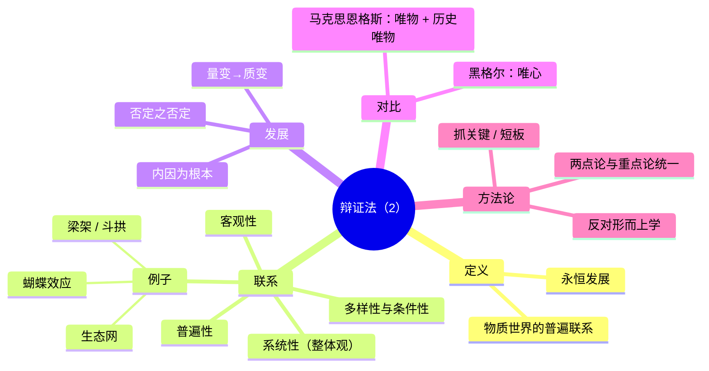

# 目录
- [[#第二讲｜唯物辩证法的总特征|第二讲｜唯物辩证法的总特征]]
- [[#专题二·辩证法（2）—普遍联系与永恒发展|专题二·辩证法（2）—普遍联系与永恒发展]]

---

# 第二讲｜唯物辩证法的总特征

> 一句话总纲：**用联系、发展、全面与矛盾的观点看问题**，反对把事物割裂、凝固、片面化的**形而上学**。

## 0. 本讲导图
- 两种思维法：**辩证法 vs 形而上学** → 方法论的根分野
- 近代认识论转向：**休谟问题**（因果与“是—应然”）
- **康德**：先天综合判断、四大二律背反、哥白尼式革命与理性限度
- **黑格尔**：积极的辩证法（“正—反—合”/对立统一），及其**形而上学性**与局限（“存在即合理？”等）
- **马克思恩格斯**：批判继承→**唯物辩证法**（革命的、批判的本质）
- 三个核心追问：**联系—发展—动力（矛盾）**
- 方法落地：**“矛盾的观点看问题”** + 答题模板与易错警示

## 一、两种思维方法：辩证法 vs 形而上学

### 1）概念与对立
- **辩证法**（dialectic，本义对话/辩难）：在**普遍联系与发展**中把握事物，用**对立统一**解释变化和生成。
- **形而上学**（metaphysics，亚里士多德后编者之称，后被黑格尔用于现代意义）：倾向**孤立、静止、片面**地看待对象，把性质与关系固定化。
- 恩格斯强调：自然、人类历史和思维的**相互作用、无穷联系与变化**，是理解世界的钥匙（PPT引文页）。

### 2）特征对照（见课堂表格页）
- 形而上学：**孤立、静止、外在联系**；易犯错误：割裂、类比滥用、过度简化。
- 辩证法：**联系、发展、全面**；关注**“对立面的统一与斗争”**、**量变—质变**、**否定之否定**等。

> 直白记忆：遇题先问三件事——**它和谁有关？它怎样变？矛盾在哪？**

## 二、近代认识论转向：休谟的挑战
- **“因果是否有效？”** 休谟认为，因果是**心理习惯**而非必然；白天鹅/黑天鹅提醒经验的**不完全性**。
- **“是—应然（Is–Ought）问题”**：事实并不能自动推出价值与规范（“应当”）。
- 启示：经验与归纳有**限度**，必须追问**概念框架**与**判断根据**（引出康德）。

## 三、康德：先天综合判断与四大二律背反
- **先天综合判断**：既**必然**又**扩展知识**（可指导经验），是我们认知秩序的“骨架”。
- **四大二律背反**（宇宙论）：有限/无限、可分/不可分、自由/必然、第一因/无第一因……显示**理性自我矛盾**。
- **哥白尼式革命**：不是认识去迎合对象，而是**对象必须符合我们的认识形式**（时空、范畴等）。
- 结论：纯粹理性有**边界**，为科学奠底，也对形而上学妄断**设限**（“为人类理性划界”PPT）。

## 四、黑格尔：积极的辩证法与其形而上学性
### 1）积极面
- **对立统一**：任何事物都内含**“正与反”**的矛盾双方，并在互动中走向更高规定性（常以“正—反—合”表述）。
- 方法本质：**联系、发展、全面**（PPT“积极的辩证法”页）。
### 2）局限与“形而上学性”
- **“存在即合理？”** 被误解为**现状崇拜**，其实黑格尔有其历史辩护逻辑，但**易滑向保守**。
- **绝对精神/理性终点**：把世界历史理解为**理念自我展开**，带有**理念本体化**色彩。
- **没把辩证法贯彻到底**：仍留有**终点、绝对、超验**等思路（PPT“两点严重缺陷”）。

> 结论：**方法是活的**；黑格尔提供的是**“辩证运动的范式”**，但要**从唯心回到唯物与实践**。

## 五、马克思恩格斯：从批判继承到唯物辩证法
- **批判继承黑格尔**：保留其**联系—发展—矛盾**的动力观，**剔除唯心内核**；把辩证法从“理念自演”转为**物质世界与社会实践**的运动。
- **革命性与批判精神**（恩格斯引文页）：
  - 世界没有最终、神圣、不变之物；只有**生成—灭亡—上升**的**无尽过程**。
  - 辩证法**不畏推翻自身结论**，以开放姿态面对新经验与批评。
- **与黑格尔/唯心主义的根本区别**（PPT“区别/保守与创新”两页）：
  - **主体地位**：黑格尔以理念为主体；马克思以**现实的人与实践**为主体。
  - **对象规定**：不是观念改造对象，而是**对象在实践中被改造**，并**反过来规定人的思维**。
- **统一的理论架构**（PPT“哲学两大支柱”）：**辩证唯物主义**（自然观与认识论）＋**历史唯物主义**（社会历史观）。

## 六、三个核心追问：联系—发展—动力
> PPT橙色三问图总结为一个“核心问题：**是否承认矛盾**”。

1. **联系是什么？**  
   - 内在的、本质的、历史生成的**相互作用网络**，不是偶然并置。
2. **发展是什么？**  
   - 事物**新陈代谢**：既有**量变—质变**的跃迁，也有**否定之否定**的螺旋上升。
3. **动力从何而来？**  
   - **矛盾**（对立统一）的**斗争性**与**同一性**共同推动；外因通过内因而起作用。

> 小口诀：联系定**位**，发展看**变**，动力抓**辩**（矛盾）。

## 七、从材料到作答：用**矛盾的观点**看问题
- **“存在即合理？”** 题：区分“历史合理性（曾经的合目的/条件性）”与“现实合理性（当下应保留？）”，**既看到曾经的功能，也看到转型的必然**（PPT“存在即合理？”与“形式上学性”两页）。
- **文学/社会材料**（PPT《好人歌》《光明顶》引用页等）：
  - 先**界定矛盾双方**（如传统/现代、秩序/自由、个体/集体），再说明其**对立**与**转化条件**，最后给出**实践路径**（制度供给、技术进步、观念更新）。

## 八、易错点（高度浓缩）
1. 把**形而上学**当“很高深”=正确（✗）→在本课程中指**孤立、静止、片面**的思维习惯。  
2. 把辩证法=“折中主义”“两边都对”（✗）→辩证法讲**矛盾运动与主次方面、条件转化**，不是和稀泥。  
3. 误读“存在即合理”成**现状崇拜**（✗）→需具体分析其**历史合理性/现实合理性**。  
4. 休谟否定因果（✗）→他强调**经验归纳的限度**，促发对**先验结构**与**科学方法**的反思。  
5. 只讲黑格尔“正反合”（✗）→关键是**对立统一**与**规定性提升**，且黑格尔仍有**唯心终点论**的局限。  
6. 忽视**实践**：唯物辩证法**以现实实践为出发与检验**。

## 九、答题模板（速用）

### A. 概念辨析题（如“辩证法与形而上学的区别”）
1. **下定义**：给出两者课程内涵（联系/发展/全面 vs 孤立/静止/片面）。  
2. **举关键特征**：三到四点对照（表格式语句）。  
3. **说明联系**：辩证法批判吸收形而上学的**分析性**优点，但克服其片面。  
4. **落到方法**：**矛盾分析、两点论与重点论统一、量变—质变、否定之否定**。

### B. 史论题（休谟—康德—黑格尔—马克思脉络）
- **提出问题**（休谟：因果与“是—应然”）→  
- **建立框架**（康德：先天综合判断、二律背反与限度）→  
- **展开运动**（黑格尔：对立统一/规定性提升，同时暴露唯心终点）→  
- **实践转向**（马克思：把辩证法落到**物质世界与社会实践**，强调**批判—革命**）。

### C. 材料题（社会争论/政策评析/文艺现象）
- **四步法**：概念界定 → 矛盾刻画（主次/条件）→ 运动机理（量变质变/转化）→ **对策**（制度、技术、观念、路径）。

## 十、课堂图片→知识点对照清单（便于逐张核对）
> 说明：以下以你发来的顺序粗略标注（封面/结构/引文/表格/名人像等），确保**每一页都归位**。

- 〔封面〕“第二讲 唯物辩证法的总特征” → 全讲标题。  
- 〔结构页①〕“如何理解两种思维方法/万物互联为何可能/‘规律’何以成‘规律’” → 本讲三大线索（对应 §§一、六、七）。  
- 〔世界观三问图〕“本原/状态/方法”三角 → 两大对立（唯物/唯心；辩证/形而上学）。  
- 〔两对立总图〕哲学上的“两对立”关系图 → §一总览。  
- 〔恩格斯引文①②〕自然、历史、思维的**普遍联系与变化** → §一（辩证法依据）。  
- 〔对照长条图〕“辩证法 vs 形而上学”焦点与视角 → §一-2。  
- 〔“哲学/形而上学”词义图〕+〔起源页〕（metaphysics、亚里士多德）+〔黑格尔现代意义页〕 → §一-1溯源。  
- 〔表格页：形而上学典型例〕“存在—上帝/实体/不变”vs“辩证法” → §一-2。  
- 〔苏格拉底像：辩证法词源页〕 → §一-1补充。  
- 〔休谟页〕“因果是否有效/黑天鹅/是—应然” → §二。  
- 〔黑底大表〕康德**先天综合判断**知识论矩阵 → §三（可当例证）。  
- 〔康德像+二律背反〕A/B/C/D四组 → §三。  
- 〔哥白尼式革命概览〕先天形式（时间/空间/范畴）→ §三结论。  
- 〔“为人类理性划界”页〕纯理性之限度 → §三结语。  
- 〔“积极的辩证法”①②〕黑格尔方法定义、正反合/对立统一 → §四-1。  
- 〔“存在即合理？”页〕+〔“形式上学性（两点严重缺陷）”〕 → §四-2。  
- 〔“马克思与黑格尔的区别”①②〕主体/对象、唯心/唯物、形而上学变革 → §五。  
- 〔《资本论》页〕保守与创新的统一：在**对现存形态批判中**揭示新形态 → §五。  
- 〔恩格斯引文：革命的本质〕“无终点、无神圣不变之物” → §五“批判精神”。  
- 〔“马克思辩证法的批判精神”四条要点页〕 → §五总结。  
- 〔“三连问橙色图”〕联系/发展/动力与核心“是否承认矛盾” → §六。  
- 〔“用矛盾的观点看问题”页〕 → §七。  
- 〔“马克思主义哲学理论框架”图〕辩证唯物主义＋历史唯物主义 → §五尾。  
- 〔文艺材料页（《光明顶》歌词/《好人歌》段落）〕 → §七案例区（矛盾分析示范）。

## 「60秒速背」串讲版
- **辩证法看三件事**：**联系**（网状因果）、**发展**（量质/否定之否定）、**动力**（矛盾）。  
- **反形而上学三毛病**：**孤立、静止、片面**。  
- **近代链条**：休谟挑衅 → 康德立规 → 黑格尔给法 → **马克思落地到实践与物质世界**。  
- **答题落脚**：**矛盾分析 + 条件转化 + 实践路径**。

---

# 专题二·辩证法（2）—普遍联系与永恒发展

> [!summary] 考点总览
> - **定义**：辩证法是关于**物质世界的普遍联系**与**永恒发展**的科学（恩格斯）。
> - **联系四特性**：客观性｜普遍性｜多样性/条件性｜系统性（方法论上的整体观）。
> - **发展三规律**：量变—质变；否定之否定；内因与外因的辩证统一（内因是根本）。
> - **典例**：蝴蝶效应（非线性与条件性）；“短板效应”（系统性与关键环节）；占星/风水的伪科学批判（违背客观性与可检验性）。
> - **立场差异**：黑格尔＝唯心辩证法；马克思、恩格斯＝唯物辩证法 + 历史唯物主义。

## 1. 恩格斯对辩证法的界定
> “辩证法是在考察事物及其在观念上的反映时，**从它们的联系、变化和发展**去考察的学说。” ——《反杜林论》

> [!quote] 要点抽取
> - 关键词：**联系—变化—发展**  
> - “在观念上的反映”指**思维中的反映**，但**根基在客观世界的物质联系**。

## 2. 物质世界的普遍联系

> [!info] 概念  
> 任何事物**内部**不同部分与要素之间、**事物之间**以及人与自然/社会之间都存在**相互影响、相互制约与相互作用**的网络化关系。

### 2.1 联系的四个基本特性（对应考题点）
| 特性 | 含义 | 易错/提醒 | 经典例证 |
|---|---|---|---|
| **客观性** | 联系不以人的意志为转移，独立于人的认识 | 不是“被认识才存在” | 自然规律、社会经济联系本身存在 |
| **普遍性** | 无处不在：内部—外部、人与自然/社会 | “普遍”≠“同等重要”，要抓**主次** | 生态网、产业链、梁架结构 |
| **多样性/条件性** | 形式多、受时空与条件约束 | 条件变化→联系转换或强弱变化 | **蝴蝶效应**、政策传导链 |
| **系统性（方法论）** | 从联系中看问题，重整体与结构 | 反对“就事论事、割裂孤立” | **短板效应**、系统工程观 |

> [!example] 图示与举例
> - **梁架/斗拱**：内部诸要素相互支撑 → 系统稳定来自结构关系。  
> - **生态食物网**：物种相互依存，单点扰动可能跨层影响。  
> - **“历史终结论”之误**：以局部联系替代整体历史联系，忽视开放系统的长期演化。

### 2.2 客观联系与伪科学
> [!failure] 占星/风水等
> - 以**主观臆测**替代客观可检验联系；不具备**可证伪性**与**可重复性**。  
> - 与唯物辩证法强调的**客观性、普遍联系的实证把握**相冲突。

## 3. 事物的永恒发展

> [!tip] 三条主线
> 1. **量变—质变**：量的积累到临界引发**跃迁**（“阈值/拐点”）。  
> 2. **否定之否定**：前进性与曲折性统一（“螺旋式上升、波浪式前进”）。  
> 3. **内因&外因**：内因是根本，外因**通过内因**起作用。

> [!example] 蝴蝶效应
> - 初始微扰 + 合适的系统**结构与条件** → 非线性放大 → 极端天气等巨大结果。  
> - 显示：**条件性、多样性**与**系统敏感性**。

## 4. 黑格尔与马克思、恩格斯：同“法”异“本”

> [!abstract] 对比表
| 维度 | 黑格尔 | 马克思/恩格斯 |
|---|---|---|
| **哲学立场** | **唯心主义**：绝对精神的自我展开 | **唯物主义**：客观物质世界的联系与运动 |
| **辩证法所依** | 观念自身的矛盾运动 | 客观事物的矛盾运动（思维是反映） |
| **方法走向** | 保守倾向：合理即现实的形而上解读 | **批判与革命性**：现实中不合理的必须否定与变革 |
| **历史观** | 历史由理念规定 | **历史唯物主义**：生产方式/实践决定历史进程 |

## 5. 方法论要求（应试可直接套用）

> [!note] 两点论与重点论的统一
> - 同时看到多方面联系（两点论），又抓住**主要矛盾/矛盾主要方面**（重点论）。  
> - 在系统中识别**关键环节与约束瓶颈**（“短板”）。

> [!todo] 作答模板
> 1. **界定**：本问题属于（联系/发展/系统性…）。  
> 2. **原则**：坚持（客观性/整体性/内外因统一…）。  
> 3. **分析**：从内部—外部、主要—次要、条件—结果分层展开。  
> 4. **对策**：抓关键、建机制、调条件、控风险、留冗余。  
> 5. **评估**：动态监测—反馈修正（体现“运动—变化”观）。

## 6. 经典材料串讲（与课件对应）

> [!quote] 诗词材料（“正名—正言—正行”类）  
> 强调**名与实、言与行**的内在一致：从**联系与整体**看规范与秩序的生成。

> [!example] “短板效应”卡片
> - **论点**：系统性能由关键环节决定；忽视一个短板会拖累整体。  
> - **方法**：识别瓶颈→优先配置资源→形成闭环。

> [!example] 社交平台“塔罗/改运”案例
> - 定性：**伪科学**。  
> - 依据：缺乏客观联系与可检验性；以个例与暗示效应冒充规律；与辩证法相悖。

## 7. 错题/易混清单
- 把**客观性**理解成“是否被认识” ✅应为：不以意志为转移。  
- 把“普遍性”理解成“各联系**同等**重要” ✅应为：要**抓主次**与结构位置。  
- 认为外因直接决定事物性质 ✅应为：**内因是根本**；外因通过内因起作用。  
- 发展＝量的增加 ✅应为：包含**质变/阶段性飞跃**。  
- 以局部或短期结论替代长期/整体过程（如“历史终结论”）。

## 8. 快速自测（含答案）
1. 辩证法之所以是科学，首先因为揭示了（**物质世界的普遍联系与发展**）。  
2. “蝴蝶效应”突出反映联系的（**条件性/多样性**）与（**非线性**）。  
3. 外因的作用通过（**内因**）起作用；决定性质的是（**内因**）。  
4. “忽视一个短板会拖累整体表现”体现（**系统性与关键环节**）。  
5. 占星术的主要问题：违背（**客观性、可检验性**），**以主观臆测代替客观联系**。  
6. 黑格尔与马克思之差别在于：前者（**唯心辩证法**），后者（**唯物辩证法+历史唯物主义**）。

## 9. Mermaid 思维导图

